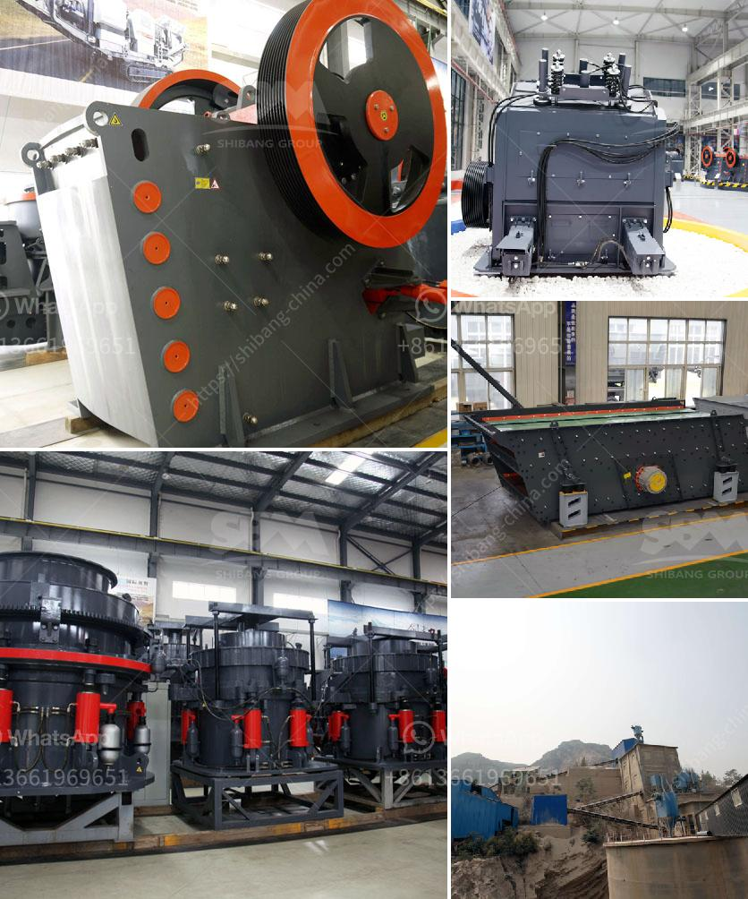

<h3>تقدير لعمليات تكسير الحجر</h3>
تعد عمليات تكسير الحجر هامة جدًا في مجال البناء والهندسة المدنية. يتم استخدام هذه العمليات لتكسير الصخور والحجارة الكبيرة إلى قطع صغيرة قابلة للتوزيع واستخدامها في البناء.

تقدير هذه العمليات يعتبر جزءًا أساسيًا من تخطيط وتنفيذ أي مشروع بناء. يلعب الحجم والكثافة والصلابة للمواد المراد تكسيرها دوراً هاماً في تحديد الأساليب والآلات المستخدمة في هذه العملية.

تكسير الحجر يتم عادة باستخدام معدات ميكانيكية مثل المطارق الهيدروليكية والكسارات الفكية والقواطع الهيدروليكية. يتم تثبيت هذه المعدات في آلات ثقيلة مثل الجرافات والحفارات واللوادر. عملية التكسير نفسها تتطلب رؤية جيدة ومهارات فنية من قبل العمال المشاركين.

تحظى عمليات تكسير الحجر بالعديد من المزايا. أولاً وقبل كل شيء، فإنها تسمح بتحويل الحجارة الكبيرة إلى قطع صغيرة وهذا يسهل ترتيبها وتوزيعها بشكل أفضل في نقل المواد وبناء المباني. ثانيًا، فإن تقدير الكسارات يحسن كفاءة العمل والإنتاجية، إذ يمكن توجيه الآلات بطريقة أفضل لتحقيق النتائج المطلوبة.

بالإضافة إلى ذلك، تعتبر عمليات تكسير الحجر مهمة بحكم قدرتها على الحد من حجم الحجارة ولكن بطريقة تحافظ على تركيبها الكيميائي الأصلي. هذا يعني أن قطع الحجر المكسّرة يمكن استخدامها بنفس الكفاءة والجودة المؤهلة للطبقات والحجارة الأصلية.

لا يمكن إغفال أهمية العناية والصيانة المطولة للآلات لضمان القدرة العالية والكفاءة. يجب تحديد فترات منتظمة لفحص الآلات وبذل الجهود اللازمة للحفاظ عليها في حالة صالحة للعمل.

في الختام، يمكن القول إن تقدير عمليات تكسير الحجر ضروري لتحقيق أقصى استفادة من المواد الأساسية في صناعة البناء. باستخدام التقنيات المناسبة والآلات المناسبة والصيانة الدورية، يمكن تنفيذ عمليات آمنة وفعالة لتحقيق أفضل النتائج.
<h3>Contact us</h3><ul><li><strong>Whatsapp:&nbsp;<a href="https://wa.me/8613661969651">+8613661969651</a></strong></li><li><a href="https://swt.shibang-china.com/?git&amp;zhl&amp;تقدير لعمليات تكسير الحجر"><strong>Online Service(chat now)</strong></a></li></ul><h3>Related</h3><ul><li><a href='مطحنة أسمنت صغيرة مستعملة في الإمارات.md'>مطحنة أسمنت صغيرة مستعملة في الإمارات</a></li><li><a href='أعمال تكسير الصخور في باكستان.md'>أعمال تكسير الصخور في باكستان</a></li><li><a href='كسارة الفك 100 طن في الساعة للبيع.md'>كسارة الفك 100 طن في الساعة للبيع</a></li><li><a href='سلاسل ناقلات للكسارات.md'>سلاسل ناقلات للكسارات</a></li><li><a href='كسارة تأثير صغيرة بشبكة 100.md'>كسارة تأثير صغيرة بشبكة 100</a></li></ul>