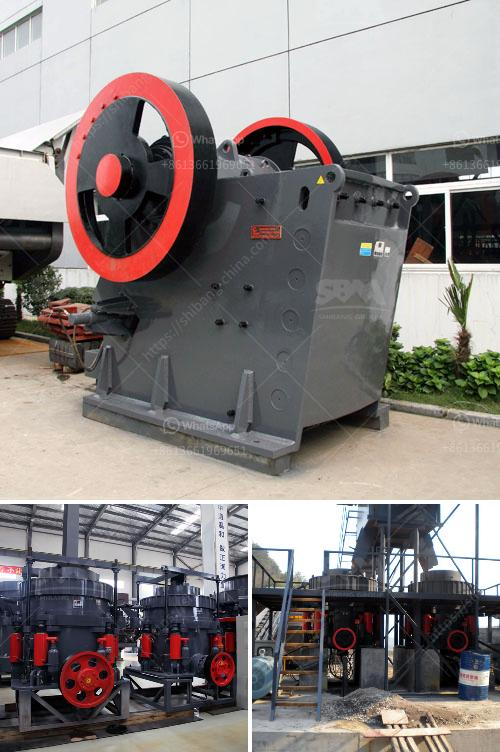

<h3>تقرير الجدوى لاستفادة من خام النحاس</h3>
تعد صناعة التعدين واستخراج المعادن من أهم الصناعات في العالم، ومن بين المعادن الهامة التي يتم استخراجها في عمليات التعدين هو النحاس. يعتبر النحاس معدناً قيمًا ولا غنى عنه في العديد من الصناعات، مثل صناعة الكابلات الكهربائية والأسلاك، وصناعة الأجهزة الإلكترونية والكهربائية، وصناعة السيارات والأجهزة المنزلية، وغيرها من الصناعات.

يهدف تقرير الجدوى لاستفادة من خام النحاس إلى تقييم فرص الاستثمار المتاحة في تعدين النحاس واستخلاصه بكفاءة وربحية عالية. يتضمن التقرير عدة عناصر أساسية تساعد المستثمرين والشركات في اتخاذ قراراتهم الاستثمارية المبنية على معطيات دقيقة ودراسات واقعية.

أحد هذه العناصر هو دراسة السوق وتحليل الطلب والعرض للنحاس. يتطلب الاستثمار في تعدين النحاس دراسة السوق بدقة لتقدير الطلب المتوقع على المعدن في الأسواق المحلية والعالمية، ومعرفة عرض النحاس المتوفر حاليًا وفي المستقبل القريب. يساعد هذا التحليل على توجيه الإنتاج بناءً على الطلب الفعلي، مما يزيد من فرص الربح والنجاح في هذا القطاع.

تشمل تحليلات تقرير الجدوى أيضًا تكلفة إقامة منجم النحاس وآليات الاستخراج. يتوجب على المستثمر تقدير تكاليف المعدات والآليات اللازمة لتعدين النحاس، بما في ذلك المعدات الثقيلة والماكينات والأدوات الخاصة بالعمليات التعدينية. كما يجب أخذ التكاليف الأخرى في الاعتبار، مثل تكاليف العمالة والطاقة الكهربائية وصيانة المعدات. يتيح تحليل التكلفة استنتاج ما إذا كانت العملية ستكون ربحية أم لا، ويمكن للمستثمرين تقديم تحسينات وإجراءات تقليل التكاليف إذا لزم الأمر.

بالإضافة إلى ذلك، توجد العديد من العوامل البيئية والاجتماعية التي يجب أخذها في الاعتبار عند استخراج النحاس. يجب أن يكون للشركات الرغبة في تنفيذ أعمالها بشكل مسؤول ومستدام، والالتزام بالمعايير البيئية وسياسات الحفاظ على البيئة والصحة والسلامة. يمكن أن يؤثر عدم احترام هذه العوامل على سمعة الشركة والتعامل معها من قبل الجمهور والسلطات المحلية.

بناءً على مقارنة التكاليف والفوائد المحتملة، يتعين على المستثمرين اتخاذ قرار الاستثمار في استخلاص خام النحاس بناءً على تقرير الجدوى. يقدم هذا التقرير نظرة شاملة عن فرص الاستثمار المتاحة والتحديات المحتملة، مما يساهم في اتخاذ قرار استثماري مبني على معطيات دقيقة وواقعية.
<h3>Contact us</h3><ul><li><strong>Whatsapp:&nbsp;<a href="https://wa.me/8613661969651">+8613661969651</a></strong></li><li><a href="https://swt.shibang-china.com/?git&amp;zhl&amp;تقرير الجدوى لاستفادة من خام النحاس"><strong>Online Service(chat now)</strong></a></li></ul><h3>Related</h3><ul><li><a href='كسارة الصخور المحمولة.md'>كسارة الصخور المحمولة</a></li><li><a href='أسعار مصنع كسارة الحجر.md'>أسعار مصنع كسارة الحجر</a></li><li><a href='تمييز كسارة الصدم في سحق المواد الرطبة.md'>تمييز كسارة الصدم في سحق المواد الرطبة</a></li><li><a href='آلة معالجة الذهب في الصين.md'>آلة معالجة الذهب في الصين</a></li><li><a href='كسارة للحجر الجيري.md'>كسارة للحجر الجيري</a></li></ul>