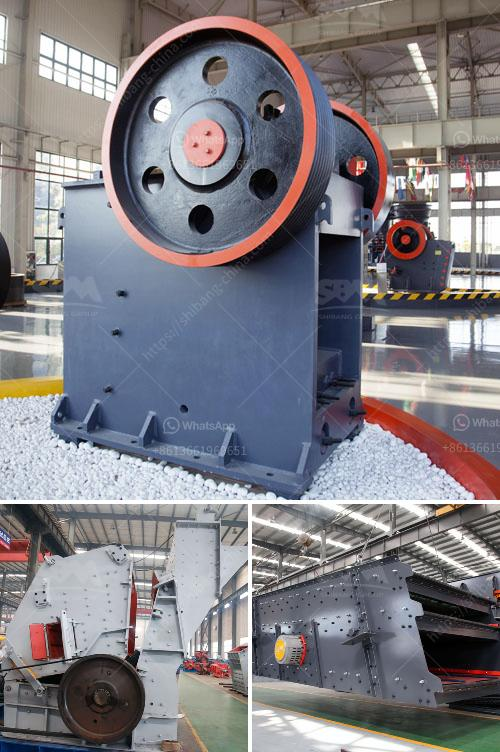

<h3>تقرير المشروع حول استخدام رمل السحق</h3>
يعتبر الرمل من المواد الأساسية في العديد من المشاريع الإنشائية والهندسية. ومن أجل تلبية الطلب المتزايد على الرمل، تم تطوير تقنية جديدة تسمى "رمل السحق". هذا التقرير يستكشف فوائد واستخدام رمل السحق في المشاريع الإنشائية، ويتحدث عن بعض الاعتبارات البيئية والاقتصادية المتعلقة بهذه التقنية.

1. توفير الموارد الطبيعية: يعتمد إنتاج الرمل التقليدي على التنقيب عن مناجم رملية طبيعية، مما يؤدي إلى استنزاف الموارد الطبيعية للرمال. ومع استخدام رمل السحق، يمكن استغلال الرمال المستخدمة مسبقاً وإعادة تدويرها، وبالتالي يتم الحفاظ على الموارد الطبيعية.

2. الحد من التلوث البيئي: عملية سحق الرمال المستعملة تقلل من حجم الرمل وتزيل الشوائب والمواد العضوية. وبالتالي، يتم تحسين نوعية الرمل المنتج ويمكن تجهيزه للاستخدام في المشاريع الإنشائية دون أي تأثير سلبي على البيئة المحيطة.

3. توفير التكاليف: يعتبر رمل السحق بديلاً رخيصًا عن الرمل التقليدي. إذ يتم إنتاجه من الرمال المستخدمة مسبقًا، لذا فإن تكاليف إعادة التدوير أقل من التكاليف اللازمة لإنتاج الرمل التقليدي من الصفر.

تواجه تقنية رمل السحق بعض التحديات البيئية. على سبيل المثال، قد يكون للرمل المسحوق تأثير على جودة الهواء عند التعامل معه بشكل غير آمن. ومع ذلك، يمكن تجنب هذه التأثيرات باتباع إجراءات السلامة والتشغيل السليمة. وباستخدام المعدات والتقنيات المناسبة، يمكن التحكم في الانبعاثات والتلوث الناجم عن عمليات سحق الرمال.

يمكن تحقيق فوائد اقتصادية كبيرة من استخدام رمل السحق. فبفضل توفير التكاليف والموارد، يمكن تقليل تكلفة المشاريع الإنشائية. وبالإضافة إلى ذلك، يمكن استخدام الرمل المسحوق في العديد من التطبيقات مثل إنتاج الخرسانة وتصنيع الركام الصناعي. وهذا يفتح أبوابًا جديدة أمام صناعات البناء والهندسة المدنية.

رمل السحق هو تقنية حديثة ومبتكرة تساهم في تلبية الطلب المتزايد على الرمل في المشاريع الإنشائية. إن استخدامه يوفر موارد طبيعية ويقلل من التلوث البيئي. وعلاوة على ذلك، يمكن تحقيق فوائد اقتصادية كبيرة من هذه التقنية. ومع اتخاذ الاعتبارات البيئية والاقتصادية اللازمة، يمكن أن يصبح رمل السحق حلاً فعالاً في صناعة البناء والهندسة.
<h3>Contact us</h3><ul><li><strong>Whatsapp:&nbsp;<a href="https://wa.me/8613661969651">+8613661969651</a></strong></li><li><a href="https://swt.shibang-china.com/?git&amp;zhl&amp;تقرير المشروع حول استخدام رمل السحق"><strong>Online Service(chat now)</strong></a></li></ul><h3>Related</h3><ul><li><a href='كسارة حجر محمولة من تايوان.md'>كسارة حجر محمولة من تايوان</a></li><li><a href='شركة تصنيع الكسارات في الصين.md'>شركة تصنيع الكسارات في الصين</a></li><li><a href='مصانع طحن الكرات.md'>مصانع طحن الكرات</a></li><li><a href='سعر أحزمة الناقلات.md'>سعر أحزمة الناقلات</a></li><li><a href='كسارة حجرية للبيع.md'>كسارة حجرية للبيع</a></li></ul>