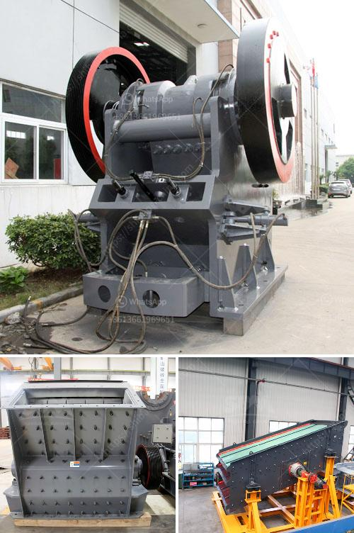

<h3>تقرير المشروع حول وحدة تكسير الحجر</h3>
تكسير الحجر هو عملية تحويل الصخور الصلبة إلى قطع أصغر تستخدم في مجموعة متنوعة من التطبيقات المختلفة. قد تحتاج العديد من الصناعات مثل صناعة البناء والبناء وصناعة الطرق وصناعة الإنشاءات الأخرى إلى مصدر موثوق لتكسير الحجر. وحدة تكسير الحجر هي جهاز ميكانيكي يتم استخدامه في هذه العملية.

يركز مشروعنا على تصميم وتطوير وحدة تكسير الحجر ذات القدرة على تكسير قطع الحجر ذات الحجم 200-400 ميلمتر. تتكون الوحدة من ماكينة كسارة أساسية تحتوي على غرفة كسارة ومخروط وهاوية. يعمل المواد المعدنية على تغذية الحجر إلى الغرفة من أعلى وتكسيره إلى قطع صغيرة. تم تجهيز الوحدة أيضًا بناقل لنقل الحجارة المكسورة إلى محطة التعبئة أو المؤسسة القادمة.

يتميز مشروعنا بالعديد من المميزات الهامة. أولًا، فإن الوحدة لديها قدرة عالية على تكسير الحجر بشكل فعال وسريع. يتم تحسين هيكل الوحدة لتحسين كفاءة التكسير وفحص المواد. هذا يتيح لنا تحقيق إنتاجية أعلى وتوفير الوقت والجهد في عملية التكسير. يعمل الناقل أيضًا بشكل سلس وفعال لضمان نقل الحجارة المكسورة بطريقة آمنة.

ثانيًا، تعتبر الوحدة سهلة الاستخدام والصيانة. يتم تجهيز الوحدة بنظام تحكم بسيط يسمح للمشغلين بضبط سرعة التغذية ونسبة التخفيض وفحص المواد. يسهل تنظيف الوحدة أيضًا بفضل تصميم الهيكل الذي يمكن فكه وتجميعه بسهولة. هذا يساعد في الحفاظ على أداء الوحدة وتمديد عمرها الافتراضي.

أخيرًا، يعتبر المشروع اقتصادياً ومربحاً. يتطلب قطاع البناء والصناعة حجارة مستدامة للاستخدام في المشاريع المختلفة. بفضل وحدتنا، يمكن تحقيق إنتاجية أعلى وتوفير تكاليف التكسير للمؤسسات. هذا يزيد من فرص نجاح المشروع واستدامته.

باختصار، يعتبر مشروع وحدة تكسير الحجر ذات القدرة على تكسير قطع الحجر 200-400 ميلمتر مهما وهاماً. يساهم في تلبية احتياجات الصناعات المختلفة لحجارة مكسورة عالية الجودة. يعزز تقريرنا الصناعة المحلية ويوفر فرص عمل جديدة. حتى نستفيد من هذا المشروع بشكل أكبر، يجب أن تركز الجهود على توطين التكنولوجيا وتطوير المهارات في هذا المجال.
<h3>Contact us</h3><ul><li><strong>Whatsapp:&nbsp;<a href="https://wa.me/8613661969651">+8613661969651</a></strong></li><li><a href="https://swt.shibang-china.com/?git&amp;zhl&amp;تقرير المشروع حول وحدة تكسير الحجر"><strong>Online Service(chat now)</strong></a></li></ul><h3>Related</h3><ul><li><a href='مصنعي آلات المحجر.md'>مصنعي آلات المحجر</a></li><li><a href='مطاحن للبيع في هراري.md'>مطاحن للبيع في هراري</a></li><li><a href='عملية غسيل الرمل.md'>عملية غسيل الرمل</a></li><li><a href='مصنع كبير للكسارة بسعة ١٠٠٠ حجر.md'>مصنع كبير للكسارة بسعة ١٠٠٠ حجر</a></li><li><a href='آلة مطحنة الأسطوانة في فرنسا.md'>آلة مطحنة الأسطوانة في فرنسا</a></li></ul>