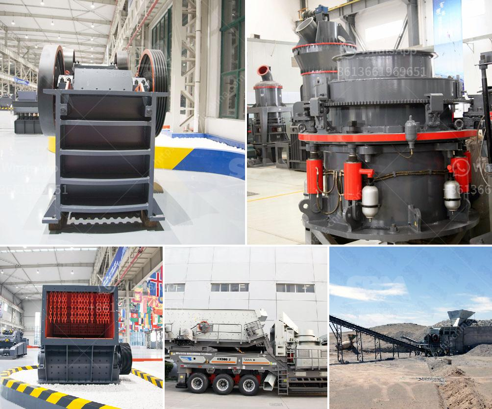

<h3>تقرير المشروع على كسارة الخرسانة pdf</h3>
يتعلق تقرير المشروع على كسارة الخرسانة بوثيقة تعرض بيانات ومعلومات عن المشروع بشكل مفصل وشامل. هذه الوثيقة تحتوي على مجموعة من الأقسام التي تهدف إلى وصف المشروع وتحليله وتقييمه. وتعد هذه الوثيقة أداة هامة للإدارة والاستشارة وتكون ضرورية لاتخاذ القرارات الصحيحة وتخطيط المشروع بشكل فعال.

يبدأ التقرير عادة بملخص يلخص المشروع وأهدافه بشكل موجز، ثم يتحدث عن المشروع نفسه والتفاصيل المتعلقة به. يمكن أن يتضمن التقرير معلومات مثل مكان المشروع ونطاقه والمعدات والمواد التي سيتم استخدامها، بالإضافة إلى جدول زمني للعمل والتكاليف المتوقعة.

يجب أيضًا تضمين تحليل لأوضاع وسيناريوهات محتملة تؤثر على المشروع، بما في ذلك التغييرات المحتملة في التشريعات المحلية أو التوقعات الاقتصادية العامة. يتم تقديم هذا التحليل للتأكد من أن المشروع مستدام وقابل للتطبيق في المستقبل.

بعد ذلك، يقوم التقرير بتقييم المشروع وتحليل أداءه المالي والتقني. يشمل هذا التحليل دراسة تكلفة-فائدة للمشروع والتوقعات المالية لفترة زمنية محددة. يهدف هذا التقييم إلى توضيح مدى جدوى المشروع وقدرته على تحقيق العوائد المالية المتوقعة.

لتكون هذه الوثيقة قوية وفعالة، يجب أن يكون لديها بيانات دقيقة واعتماد على أبحاث ودراسات واضحة. يجب أن تكون البيانات ذات صلة ومنسقة بشكل جيد لتساعد في فهم المشروع واتخاذ القرارات.

في النهاية، يجب أن يحتوي التقرير على استنتاجات نهائية وتوصيات للإجراءات المستقبلية. يتم استنتاجات المشروع عادة من خلال تحليل البيانات والاستنتاجات التي تم جمعها من المشروع والتوصيات تقدم نصائح حول كيفية تحسين العمل أو الالتزام بالمعايير الدولية.

في الختام، تقرير مشروع كسارة الخرسانة هو وثيقة مهمة تعرض وتحليل المشروع بشكل شامل. يجب أن تتميز بالتفصيل والموثوقية والدقة لتوفير معلومات قيمة للفرق المشرفة على المشروع والجهات المعنية.
<h3>Contact us</h3><ul><li><strong>Whatsapp:&nbsp;<a href="https://wa.me/8613661969651">+8613661969651</a></strong></li><li><a href="https://swt.shibang-china.com/?git&amp;zhl&amp;تقرير المشروع على كسارة الخرسانة pdf"><strong>Online Service(chat now)</strong></a></li></ul><h3>Related</h3><ul><li><a href='سعر آلة طحن في الهند.md'>سعر آلة طحن في الهند</a></li><li><a href='مطحنة طحن في ألمانيا.md'>مطحنة طحن في ألمانيا</a></li><li><a href='كسارات VSI بسعة 25 طن في الساعة.md'>كسارات VSI بسعة 25 طن في الساعة</a></li><li><a href='مطحنة الكرة مع محول mercadolibre.md'>مطحنة الكرة مع محول mercadolibre</a></li><li><a href='تكلفة تشغيل الكسارة في لاس فيغاس.md'>تكلفة تشغيل الكسارة في لاس فيغاس</a></li></ul>