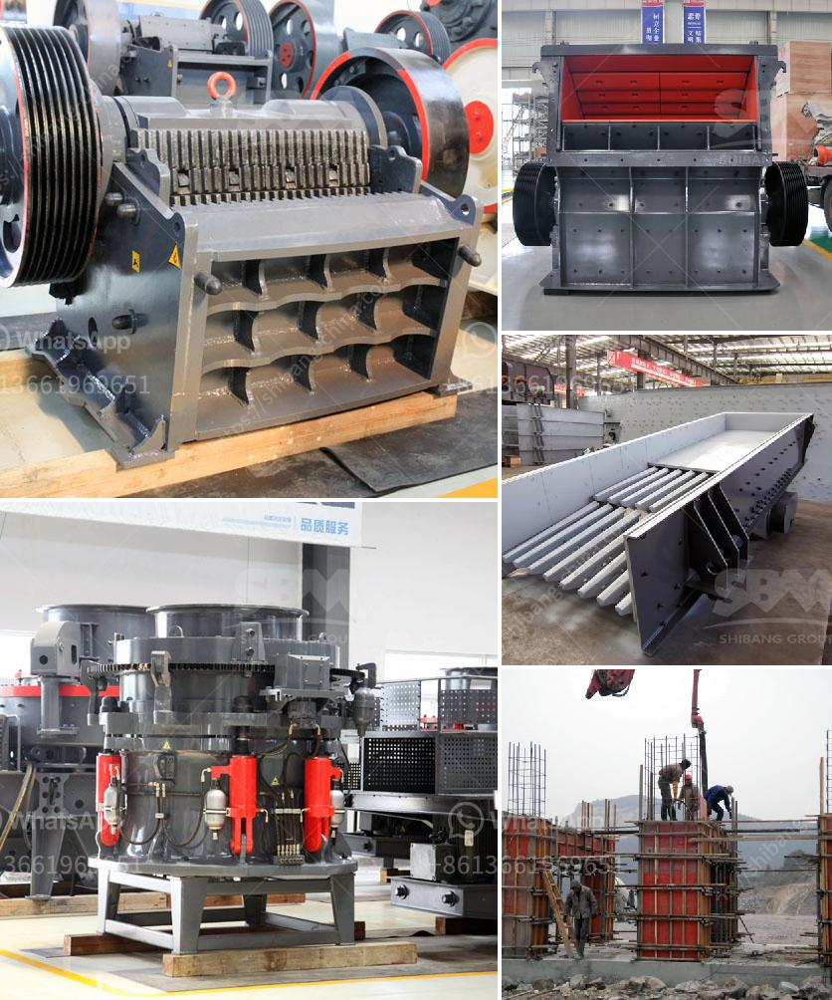

<h3>تقرير المشروع لمصنع تكسير الحجر</h3>
يشكل مصنع تكسير الحجر جزءًا أساسيًا من صناعة البناء والتشييد، حيث يقوم بتحويل الصخور الضخمة إلى حجارة صغيرة وقابلة للاستخدام في مختلف المشاريع. وتعتبر هذه الصناعة حيوية للاقتصاد، حيث توفر فرص عمل وتعزز تنمية المجتمع.

يهدف هذا التقرير إلى تسليط الضوء على مشروع مصنع تكسير الحجر وعناصره الأساسية. يتضمن المشروع إقامة مصنع يتكون من معدات تكسير الحجر ومواد تجهيز الحجارة، بالإضافة إلى المكونات الأخرى الضرورية مثل قاعدة التشغيل والأجهزة الفرعية (الناقلات، الكسارات، الشاشات) والصوامع لتخزين الحجر المكسر والشحن ونقله.

سيتم تشغيل المصنع على مدار الساعة لضمان استقرار الإنتاج وتلبية الطلب المتزايد. وسيعتمد المصنع على مصادر الحجارة المحلية بالقرب منه لتحقيق كفاءة تكاليف النقل والإمداد.

من بين المزايا الرئيسية لهذا المشروع هو الطلب المحلي والعالمي على مواد البناء، والذي يعكس احتياجات السوق المتزايدة بشكل مستمر. إضافة إلى ذلك، سيسهم المشروع أيضًا في توفير فرص للتوظيف وتحسين الأوضاع الاقتصادية للمجتمع المحلي.

ومع ذلك، توجد تحديات متعلقة بالمشروع على مستوى البيئة والاستدامة، حيث يجب مراعاة استخدام أفضل الممارسات البيئية للحد من التأثيرات السلبية المحتملة. يتطلب ذلك مراقبة مستمرة للانبعاثات والتلوث الناتج عن عمليات التكسير، واتباع إرشادات السلامة والصحة المهنية للحفاظ على سلامة العمال والمجتمع المحلي.

بالنظر إلى الجوانب الاقتصادية والبيئية والاجتماعية المترابطة، يمكن أن يكون مشروع مصنع تكسير الحجر ناجحًا ومربحًا في ذات الوقت. يجب توفير استثمارات ضخمة في شراء المعدات اللازمة وتأهيل الموقع والبنية التحتية. ومع ذلك، يمكن أن يتحقق العائد المادي من هذا المشروع على المدى الطويل بفضل التوسع الصناعي وزيادة الطلب على مواد البناء في الأسواق.

في الختام، يُعد مشروع مصنع تكسير الحجر فرصة استثمارية جيدة في قطاع البناء والتشييد ويتطلب المزيد من الدراسات والتخطيط لضمان نجاحه والمحافظة على حماية البيئة وسلامة العمال والمجتمع المحلي.
<h3>Contact us</h3><ul><li><strong>Whatsapp:&nbsp;<a href="https://wa.me/8613661969651">+8613661969651</a></strong></li><li><a href="https://swt.shibang-china.com/?git&amp;zhl&amp;تقرير المشروع لمصنع تكسير الحجر"><strong>Online Service(chat now)</strong></a></li></ul><h3>Related</h3><ul><li><a href='شراء كسارة الحجر sbm في الفلبين.md'>شراء كسارة الحجر sbm في الفلبين</a></li><li><a href='كسارة الصدم PF لآلة تكسير الحجر للبيع.md'>كسارة الصدم PF لآلة تكسير الحجر للبيع</a></li><li><a href='محطات الكسارات للبيع في باكستان.md'>محطات الكسارات للبيع في باكستان</a></li><li><a href='كسارات الحجر للتأجير في شمال ويلز.md'>كسارات الحجر للتأجير في شمال ويلز</a></li><li><a href='إنتاج الكاولين في إثيوبيا بتنسيق PDF.md'>إنتاج الكاولين في إثيوبيا بتنسيق PDF</a></li></ul>