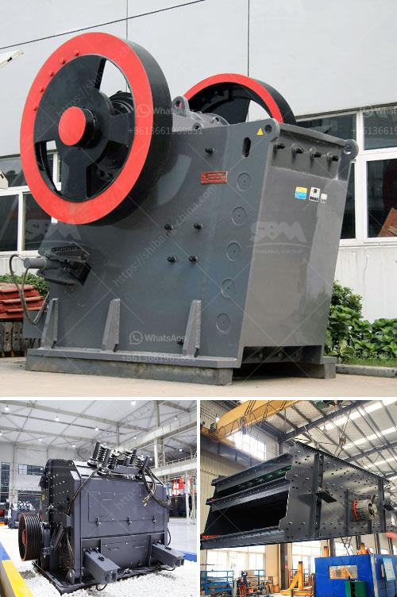

<h3>تقرير تفصيلي حول مصنع مسحوق الكوارتز</h3>
مصنع مسحوق الكوارتز هو منشأة صناعية يتم فيها إنتاج وتصنيع مسحوق الكوارتز بطريقة تفصيلية ومتقنة. وعند الحديث عن مصانع مسحوق الكوارتز، فإن العوامل المهمة لاستخدامه تشمل المواصفات الدقيقة والخصائص الميكانيكية والكيميائية التي يحتاجها العملاء في مجالات مختلفة مثل الصناعة الزجاجية، الصناعات الكيماوية والبلاستيكية.

تعد مواد الكوارتز من المواد الخام الهامة في العديد من الصناعات التي تحتاج إلى خصائص عالية مثل الشفافية، ومقاومة الحرارة، وعزل الكهرباء، ومقاومة التآكل، والصلابة. وتتم معالجة الكوارتز في المصنع لإنتاج مسحوق الكوارتز النقي بإزالة الشوائب الزائدة وتحويله إلى جزيئات صغيرة ومتناسقة.

يتألف المصنع عادة من عدة عمليات تكنولوجية. تبدأ بعملية التعدين حيث يتم استخراج خام الكوارتز من المناجم، ومن ثم يتم نقله إلى وحدة المعالجة. يتم تفتيت الخام في كسارات خاصة ومن ثم يتم غسله لإزالة الشوائب الأخرى مثل الأتربة والجسيمات الكبيرة.

ثم يتم تجفيف الخام وتحويله إلى جزيئات صغيرة بواسطة عمليات طحن. يتم استخدام مطاحن مختلفة لتحقيق درجة النعومة المطلوبة، حيث يتم طحن الخام بالتدريج حتى الحصول على حجم الجسيم المرغوب، ويعتمد هذا الحجم على المتطلبات النهائية للعملاء.

بعد عملية الطحن، يتم فصل العناصر المشوشة عن طريق عمليات الترشيح والطين والفصل الجاذبية. ثم يتم طحن المسحوق النهائي إلى درجة نعومة نسبية قبل تعبئته وتعبئته ليكون جاهزًا للتسليم.

من الجدير بالذكر أن معالجة مسحوق الكوارتز تحتاج إلى معدات خاصة وتكنولوجيا متقدمة لضمان تحقيق الجودة والدقة المطلوبة. وبالإضافة إلى ذلك، يجب اتخاذ تدابير صارمة للحفاظ على الصحة والسلامة في المصنع والحد من التلوث البيئي.

في الختام، يعد مصنع مسحوق الكوارتز مثالًا جيدًا لنجاح الصناعة التحويلية وتحقيق الجودة العالية في إنتاج مواد ذات خصائص خاصة. إن توفير مسحوق الكوارتز النقي والمتطور يسهم في تدعيم العديد من الصناعات الحديثة وتحقيق التطور التكنولوجي.
<h3>Contact us</h3><ul><li><strong>Whatsapp:&nbsp;<a href="https://wa.me/8613661969651">+8613661969651</a></strong></li><li><a href="https://swt.shibang-china.com/?git&amp;zhl&amp;تقرير تفصيلي حول مصنع مسحوق الكوارتز"><strong>Online Service(chat now)</strong></a></li></ul><h3>Related</h3><ul><li><a href='معدات معالجة مسحوق الجرافيت.md'>معدات معالجة مسحوق الجرافيت</a></li><li><a href='سعر آلة طحن الرخام في الهند.md'>سعر آلة طحن الرخام في الهند</a></li><li><a href='مصنع لطحن الحجر الجيري والجبس للإسمنت.md'>مصنع لطحن الحجر الجيري والجبس للإسمنت</a></li><li><a href='خط إنتاج مواد الجص الخام مع التعبئة.md'>خط إنتاج مواد الجص الخام مع التعبئة</a></li><li><a href='شركات تصنيع آلات الكسارة في باكستان.md'>شركات تصنيع آلات الكسارة في باكستان</a></li></ul>