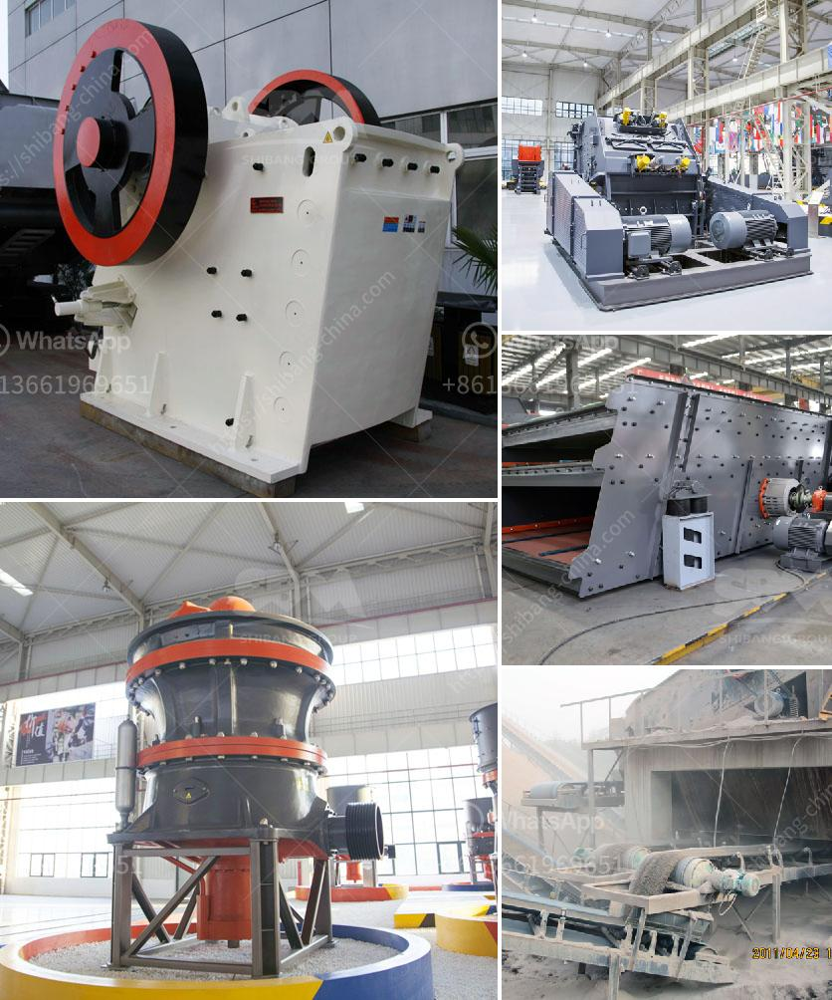

<h3>تقرير جدوى المشروع حول كسارة الحجر</h3>
تعتبر كسارة الحجر من المشاريع الاستثمارية الهامة في قطاع التعدين والبناء، حيث تقوم بكسر الأحجار الكبيرة إلى حجم أصغر يمكن استخدامه في العديد من الأغراض المختلفة. وعند إعداد تقرير الجدوى لمشروع كسارة الحجر، يتم تحليل العوامل المختلفة لتحديد مدى إمكانية نجاح المشروع من الناحية الاقتصادية والتجارية.

تبدأ مقابلة التكاليف في تقرير جدوى المشروع بتحديد الاستثمارات الرأسمالية، والتي تشمل شراء المعدات والآلات اللازمة لتشغيل الكسارة، وتأجير الأرض، وشراء المواد الخام، وتكاليف العمالة. بالإضافة إلى ذلك، يتم تقدير تكاليف الصيانة والإصلاح والكهرباء والمياه والوقود. يجب أيضًا أخذ في الاعتبار تكاليف الضرائب والرخص والتأمين.

من ناحية أخرى، يتم دراسة المدخلات الأخرى المتوقعة في تقرير الجدوى هذا، مثل الإيرادات المتوقعة والمبيعات المحتملة للحصص المكسورة. ومن المهم أيضًا تحديد سعر البيع الأمثل للمنتج المحطوم، وفحص الأسواق المستهدفة وتقييم المنافسة. يجب أيضًا تقدير الطلب المحتمل وفحص الاتجاهات السائدة في السوق. يعتبر توقع المبيعات والإيرادات الأساسية في تقرير الجدوى عاملًا مهمًا لتحديد ربحية المشروع ونجاحه على المدى الطويل.

علاوة على ذلك، يتضمن التقرير دراسة تقنية تفصيلية للعمليات الإنتاجية والتشغيلية للمشروع. وتشمل هذه العملية مراحل الكسر والغربلة والتخزين والتوزيع، وأي أنظمة السيور الناقلة أو الماكينات الأخرى المستخدمة في العملية. يتم أيضًا دراسة التكنولوجيا المستخدمة في عملية الكسارة وتقييم أداء المعدات واستهلاك الطاقة.

نقطة أيضًا يجب النظر فيها هي الجوانب البيئية والصحية المتعلقة بمشروع كسارة الحجر. يتم تقييم التأثيرات البيئية المحتملة للمشروع ومدى الامتثال للمعايير البيئية. بالإضافة إلى ذلك، يجب مراجعة السياسات البيئية المحلية والوطنية والالتزام بها.

لتحقيق أهداف المشروع والحفاظ على جدواه ونجاحه، يجب وضع خطة إدارية فعالة. تشمل هذه الخطة التعيينات الهيكلية وتوزيع المهام وتدريب الموظفين وتطوير استراتيجيات التسويق والترويج وإدارة المخزون والمالية.

باختصار، إعداد تقرير جدوى المشروع حول كسارة الحجر يتطلب تحليل شامل للعوامل المتعلقة بالتكاليف والإيرادات والإدارة والتشغيل والجوانب البيئية والتنظيمات. يمكن استخدام هذا التقرير كأداة قيمة لاتخاذ القرار المناسب بشأن استثمار المال في مشروع كسارة الحجر وتحقيق النجاح الاقتصادي والتجاري.
<h3>Contact us</h3><ul><li><strong>Whatsapp:&nbsp;<a href="https://wa.me/8613661969651">+8613661969651</a></strong></li><li><a href="https://swt.shibang-china.com/?git&amp;zhl&amp;تقرير جدوى المشروع حول كسارة الحجر"><strong>Online Service(chat now)</strong></a></li></ul><h3>Related</h3><ul><li><a href='كسارة محمولة في السويد.md'>كسارة محمولة في السويد</a></li><li><a href='شاشة جريزلي للبيع نيوزيلندا.md'>شاشة جريزلي للبيع نيوزيلندا</a></li><li><a href='تكلفة طاحونة الكوارتز.md'>تكلفة طاحونة الكوارتز</a></li><li><a href='كسارة الحجر في المملكة المتحدة.md'>كسارة الحجر في المملكة المتحدة</a></li><li><a href='مطحنة طحن الحجر الصناعي.md'>مطحنة طحن الحجر الصناعي</a></li></ul>