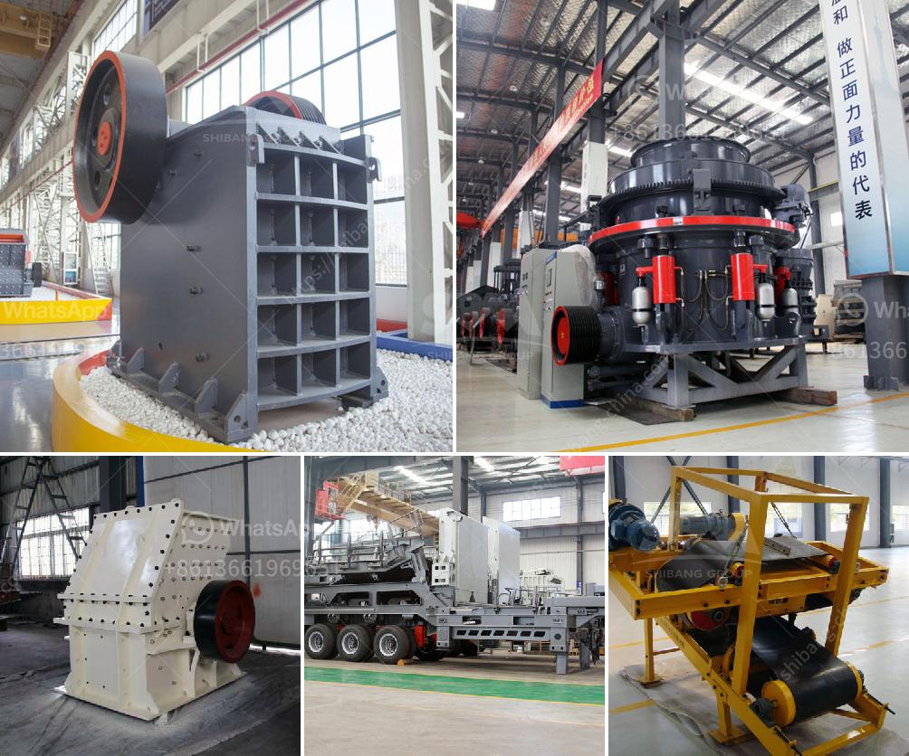

<h3>تقرير جدوى مصنع الأسمنت</h3>
مصنع الأسمنت هو مشروع صناعي يهدف إلى إنتاج الأسمنت من الخامات المناسبة، مثل الحجر الجيري والسيليكات، والتي تستخدم في البناء والهندسة المدنية. واحدة من أهم العوامل التي تؤثر في جدوى مصنع الأسمنت هي الطلب السوقي على المنتج النهائي.

في تقرير جدوى مصنع الأسمنت، يجب تحليل العديد من العوامل المالية والتسويقية لتحديد إمكانية نجاح المشروع. أحد الأمور التي يجب مراعاتها هو حجم الاستثمار المطلوب لإقامة المصنع، حيث يتطلب ذلك شراء المعدات والآلات اللازمة لعملية الإنتاج، وتأمين مكان مناسب لإقامة المصنع، بالإضافة إلى تكلفة المواد الأولية.

تحديد الطاقة الإنتاجية للمصنع أيضًا يعتبر جزءًا هامًا في التقرير، إذ يتعين حساب الطاقة الإنتاجية المطلوبة لتلبية الطلب السوقي المتوقع. يجب أيضًا وضع خطة للتسويق والتوزيع، فمن المهم أن يتم تحديد فئة المستهلكين المستهدفة ومدى احتياجهم للأسمنت، مثل شركات البناء والمقاولين.

من الجوانب الأخرى التي ينبغي اعتبارها في تقرير جدوى مصنع الأسمنت هي تكلفة العمالة المطلوبة ومهارتها. يلزم توفير فريق عمل متخصص في عملية الإنتاج والصيانة، مما يتطلب تكاليف إضافية لدفع الرواتب وتقديم التدريب والمزايا الاجتماعية.

يجب أيضًا وضع دراسة للجوانب البيئية والصحية، حيث يجب توفير جميع التراخيص والتصاريح اللازمة لتشغيل المصنع وضمان استيفاء جميع المعايير المحلية والدولية.

يمكن اعتبار مصنع الأسمنت استثمارًا مربحًا في العديد من الأسواق، لكنه يتطلب دراسة متأنية لجميع العوامل المطلوبة. ينبغي أيضًا مراعاة التوقعات المستقبلية للسوق وسعر الأسمنت، حيث يمكن أن تؤثر التقلبات السعرية في ربحية المشروع.

في النهاية، تقرير جدوى مصنع الأسمنت يساعد في تقييم الفرص والمخاطر الاستثمارية للمشروع وتوضيح ما إذا كان يستحق الاستثمار فيه أم لا. يجب الاعتماد على تحليل دقيق لجميع العوامل المعقدة المرتبطة بإجراء هذا التقرير لتحقيق النجاح في هذا النوع من المشاريع الصناعية.
<h3>Contact us</h3><ul><li><strong>Whatsapp:&nbsp;<a href="https://wa.me/8613661969651">+8613661969651</a></strong></li><li><a href="https://swt.shibang-china.com/?git&amp;zhl&amp;تقرير جدوى مصنع الأسمنت"><strong>Online Service(chat now)</strong></a></li></ul><h3>Related</h3><ul><li><a href='مطاحن هامر زراعية مستعملة.md'>مطاحن هامر زراعية مستعملة</a></li><li><a href='مطحنة صغيرة.md'>مطحنة صغيرة</a></li><li><a href='آلة طحن الكرة في الهند.md'>آلة طحن الكرة في الهند</a></li><li><a href='مطحنة عمودية للأسمنت.md'>مطحنة عمودية للأسمنت</a></li><li><a href='آلة طحن صناعية في نيجيريا.md'>آلة طحن صناعية في نيجيريا</a></li></ul>