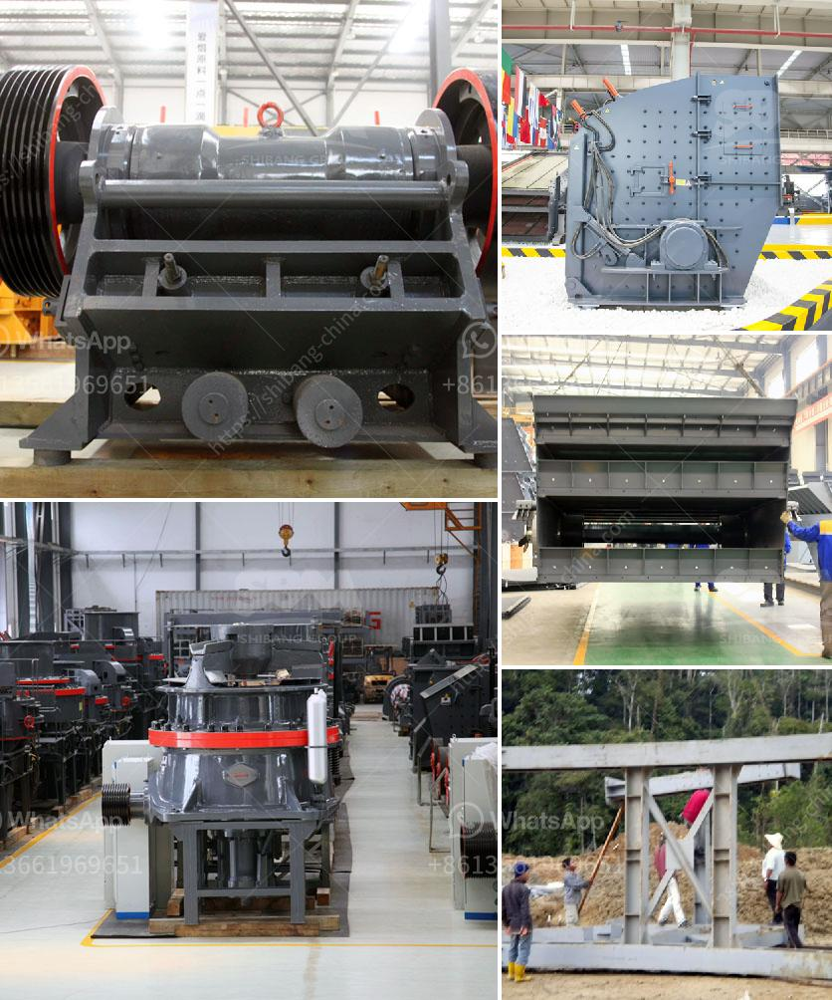

<h3>تقرير مشروع التعدين الكاولين المصغر</h3>
يعد التعدين من النشاطات الاقتصادية المربحة والهامة في العديد من الدول حول العالم، حيث يتم استخراج المعادن والموارد الطبيعية من الأرض للاستفادة منها في العديد من الصناعات. واحدة من المعادن التي يتم استخراجها عن طريق عمليات التعدين هي الكاولين.

الكاولين هو نوع من أنواع الرواسب المعدنية الطينية، وهو مركب يحتوي على الكاولينيت وهو معدن ترابي يتميز بلونه الأبيض وقدرته على الانعكاس الجيد للضوء، مما يجعله مادة مثالية للاستخدام في العديد من الصناعات مثل الأدوية والألوان والمستحضرات الجمالية والورق والسيراميك. ويعد التعدين الكاولين المصغر من الاستثمارات الصغيرة التي يمكن للأفراد الاستفادة منها بشكل كبير.

يتم تنفيذ مشروع التعدين الكاولين المصغر عن طريق استخراج الكاولين من خلال حفر الأرض واستخدام آلات التعدين والمعدات الأخرى المتاحة لهذا الغرض. وعادة ما يتم تشغيل هذه المشاريع في المناطق الريفية أو النائية حيث يتوفر المعدن بكميات كبيرة وتكون تكاليف التشغيل والصيانة أقل.

تتطلب عملية التعدين الكاولين المصغر التخطيط والدراسة المسبقة للمشروع، حيث يجب تحديد موقع المشروع وتجهيزه بالمعدات والأدوات اللازمة. كما يجب على العاملين في المشروع أن يكونوا على علم بسلامة التعدين وحماية البيئة، حيث يجب اتباع الإجراءات والتدابير اللازمة لمنع التلوث والحفاظ على الأرض والمياه المحيطة بالمشروع.

بعد استخراج الكاولين من الأرض، يتم نقله إلى مصانع التحضير حيث يتم تكريره وتنقيته. يتم غسل الكاولين وإزالة الشوائب والمواد العضوية منه، وبعدها يتم تجفيفه وطحنه للحصول على صفات معينة تتماشى مع احتياجات الصناعات المختلفة.

يعد مشروع التعدين الكاولين المصغر فرصة استثمارية ممتازة، حيث يمكن للشخص البسيط الذي يرغب في الدخول في هذا المجال الاستفادة منها وتحقيق الربح. بالإضافة إلى ذلك، يعتبر التعدين الكاولين المصغر مهماً للتنمية المستدامة، حيث يمكن تشغيل هذه المشاريع في المناطق النائية وخلق فرص عمل جديدة وتحسين المعيشة للسكان المحليين.

بشكل عام، يمكن القول إن مشروع التعدين الكاولين المصغر يعتبر إحدى الفرص الواعدة في مجال التعدين، حيث يمكن تحقيق الربح من خلال استخراج هذا المعدن الثمين واستغلاله في العديد من الصناعات الحديثة. كما يمكن أن يساهم هذا المشروع في التنمية المستدامة وتحسين الظروف المعيشية للسكان المحليين.
<h3>Contact us</h3><ul><li><strong>Whatsapp:&nbsp;<a href="https://wa.me/8613661969651">+8613661969651</a></strong></li><li><a href="https://swt.shibang-china.com/?git&amp;zhl&amp;تقرير مشروع التعدين الكاولين المصغر"><strong>Online Service(chat now)</strong></a></li></ul><h3>Related</h3><ul><li><a href='مطرقة إندونيسيا للبيع.md'>مطرقة إندونيسيا للبيع</a></li><li><a href='مبدأ عمل حزام النقل.md'>مبدأ عمل حزام النقل</a></li><li><a href='مصنع كسارة الحصى الجرانيت.md'>مصنع كسارة الحصى الجرانيت</a></li><li><a href='معدات جص صنع الجدار الخرساني في ألمانيا.md'>معدات جص صنع الجدار الخرساني في ألمانيا</a></li><li><a href='مصنعين محطم في جنوب أفريقيا.md'>مصنعين محطم في جنوب أفريقيا</a></li></ul>