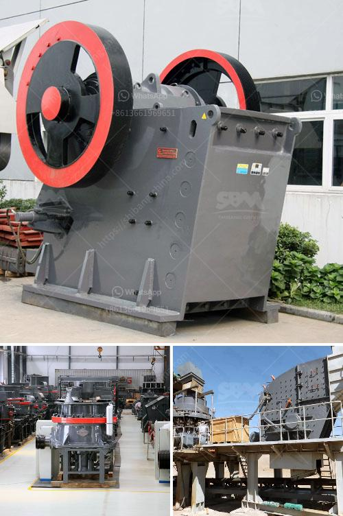

<h3>تقرير مشروع الكسارة 100 tph</h3>
يتناول هذا المقال تقرير مشروع الكسارة بقدرة 100 tph والذي يهدف إلى تكسير وتكسير الصخور الكبيرة إلى أحجام أصغر قابلة للاستخدام في مختلف الصناعات. يعد هذا المشروع أمرًا حيويًا لقطاع التعدين والبناء والإنشاءات، حيث تصبح الكسارة اللازمة لتوفير المواد الخام المطلوبة للمشاريع الضخمة.

مشروع الكسارة 100 tph يستهدف إنتاج 100 طن من المواد الخام في الساعة، مما يعتبر معدلًا عاليًا بالنسبة للكسارات. تعتمد هذه الكسارة على قوة الضغط والصدمة لتحطيم الصخور بواسطة مطرقة عالية السرعة، مما يؤدي إلى تفتيتها إلى أجزاء أصغر.

إحدى مزايا هذا المشروع هي الاعتماد على أحدث التقنيات في مجال التكسير وإدارة البيئة. يتم استخدام نظام الفحص والفصل لمنع المواد الغير مطلوبة من دخول الكسارة والتأكد من أن المنتجات النهائية متناسقة وعالية الجودة.

تتألف الكسارة ذات القدرة 100 tph من مكونات مختلفة مثل السور المحيط والنقالات والسير الناقل وفاصل المعادن والآلات الأخرى. يتم تصميم الكسارة بطريقة تفي بمتطلبات السلامة والصحة المهنية، مما يضمن استخدامها بشكل آمن وفعال.

تحتاج الكسارة الكهرباء لتشغيلها، وتتطلب كمية كبيرة من الطاقة الكهربائية لإدارة المعدات والأجهزة الموجودة فيها. قد يشكل الاستهلاك العالي للكهرباء تحديًا للمشروع، ومن المهم التفكير في استخدام مصادر الطاقة المتجددة والتقنيات الحديثة لتحسين الكفاءة الطاقوية وتقليل التكاليف العامة.

يعد مشروع الكسارة 100 tph فرصة استثمارية واعدة في القطاعات المعدنية والبناء والإنشاءات. إن إقامة كسارة قوية وفعالة يمكن أن تسهم في تلبية احتياجات المواد الخام في السوق المحلية وتخفيف الاعتماد على الواردات. كما يضمن استغلال المواد الخام المحلية وخفض التكاليف وزيادة الاستدامة البيئية لقطاع البناء والإنشاءات.

باختصار، يعد مشروع الكسارة بقدرة 100 tph تحديًا هامًا لتوفير المواد الخام في الصناعات المختلفة. يعتمد على التكنولوجيا المتقدمة في مجال تكسير الصخور ويعتبر فرصة استثمارية واعدة لتحسين الاعتماد المحلي وتعزيز الاستدامة البيئية.
<h3>Contact us</h3><ul><li><strong>Whatsapp:&nbsp;<a href="https://wa.me/8613661969651">+8613661969651</a></strong></li><li><a href="https://swt.shibang-china.com/?git&amp;zhl&amp;تقرير مشروع الكسارة 100 tph"><strong>Online Service(chat now)</strong></a></li></ul><h3>Related</h3><ul><li><a href='آلة كسارة الحجر للبيع في الإمارات.md'>آلة كسارة الحجر للبيع في الإمارات</a></li><li><a href='مصانع غسيل الكروم في جنوب أفريقيا.md'>مصانع غسيل الكروم في جنوب أفريقيا</a></li><li><a href='آلة كسارة في الإمارات.md'>آلة كسارة في الإمارات</a></li><li><a href='سعر كسارة الحجر المحمولة في.md'>سعر كسارة الحجر المحمولة في</a></li><li><a href='عملية تعدين الكوارتز في ولاية أندرا براديش.md'>عملية تعدين الكوارتز في ولاية أندرا براديش</a></li></ul>