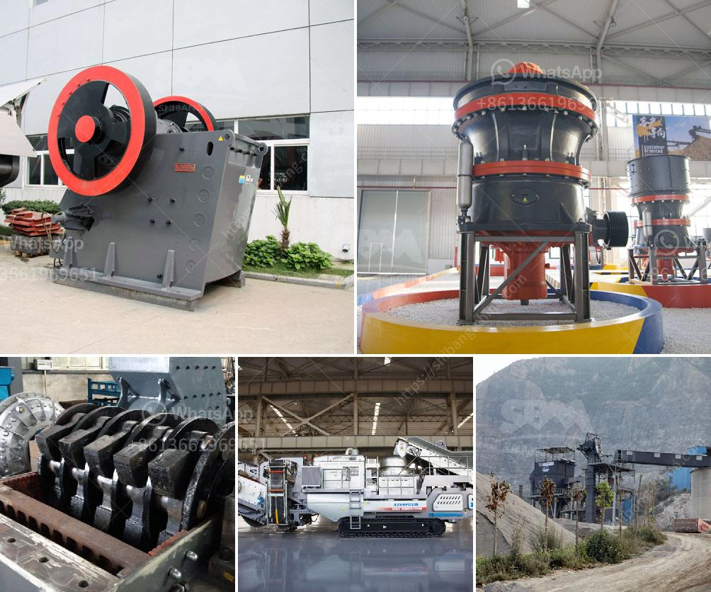

<h3>تقرير مشروع تصنيع الطوب الرملي</h3>
يُعَدّ مشروع تصنيع الطوب الرملي من الأعمال الحرفية التي تتطلب مهارات فنية وتقنية لإنتاج منتجات عالية الجودة. يتم استخدام الطوب الرملي في العديد من المجالات المختلفة مثل البناء والديكور والتطوير العقاري، وبسبب متانته وقدرته على تحمل الظروف البيئية المختلفة، يعد الطوب الرملي خيارًا مثالياً للعديد من المشاريع.

يهدف هذا التقرير إلى تقديم ملخص عن مشروع تصنيع الطوب الرملي، تحتوي هذه المقالة على معلومات عن عملية الإنتاج والخطوات الأساسية المتبعة في صنع الطوب الرملي.

تتألف عملية التصنيع من عدة خطوات، وأحد أهمها هو تحضير المواد الخام التي تتضمن الرمل، والأسمنت، والماء، وأحيانًا بعض الإضافات لمنح الطوب خصائص خاصة. يتم خلط هذه المواد معًا في نسب محددة داخل ماكينة تشكيل الطوب ويتم تشكيلها بواسطة قوالب معدنية.

تعتبر عملية تشكيل الطوب هي المرحلة الأساسية في عملية الإنتاج، ويتم ضغط المزيج المعدني بواسطة مكبس هيدروليكي لمنح الطوب شكله النهائي وتحقيق الكثافة والصلابة المطلوبة. بعد الانتهاء من التشكيل، يتم تجفيف الطوب في غرف خاصة لفترة زمنية تتراوح بين 24 إلى 48 ساعة.

بعد تجفيف الطوب، يتم إجراء عملية الحرق في فرن خاص. تتم هذه العملية عند درجة حرارة مرتفعة لتصل إلى 1000 درجة مئوية، وتتم بغرض تصلب الطين ورمل السيليكا لزيادة متانة وصلابة الطوب.

بعد انتهاء عملية الحرق، يتم تبريد الطوب قبل الشحن والتوزيع. ولضمان الجودة والمتانة، يتم فحص الطوب وفقًا للمعايير المحددة من قبل المشتري قبل توزيعه.

يجب مراعاة عدة عوامل أثناء إعداد مشروع تصنيع الطوب الرملي مثل تحديد الموقع المناسب، ومصادر المواد الخام، ومتطلبات المعدات اللازمة، وكذلك تحديد السوق المستهدفة وغيرها من العوامل الاقتصادية والتجارية.

في الختام، يمثل مشروع تصنيع الطوب الرملي فرصة جيدة للتجارة الحرفية في مجال البناء والتطوير العقاري. يتطلب هذا المشروع استثمارًا بسيطًا لشراء المعدات والتدريب المهني لإنتاج طوب ذو جودة عالية والتسويق له في الأسواق المختلفة.
<h3>Contact us</h3><ul><li><strong>Whatsapp:&nbsp;<a href="https://wa.me/8613661969651">+8613661969651</a></strong></li><li><a href="https://swt.shibang-china.com/?git&amp;zhl&amp;تقرير مشروع تصنيع الطوب الرملي"><strong>Online Service(chat now)</strong></a></li></ul><h3>Related</h3><ul><li><a href='مطحنة الكرة لمسحوق الألمنيوم.md'>مطحنة الكرة لمسحوق الألمنيوم</a></li><li><a href='مصنع غسيل الكروم الطبيعي.md'>مصنع غسيل الكروم الطبيعي</a></li><li><a href='آلة طحن الكرة في الهند.md'>آلة طحن الكرة في الهند</a></li><li><a href='مورد آلة صنع الرمل.md'>مورد آلة صنع الرمل</a></li><li><a href='صورة خط إنتاج الكلنكر الاسمنتي.md'>صورة خط إنتاج الكلنكر الاسمنتي</a></li></ul>