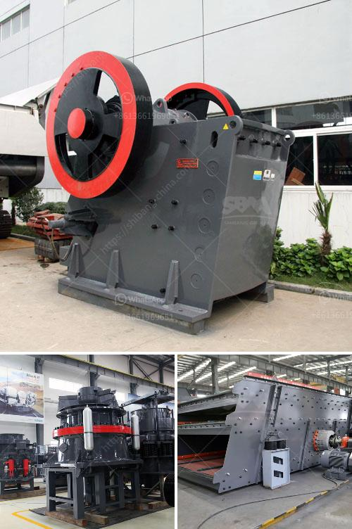

<h3>تقرير مشروع تعدين الكاولين الصغير</h3>
يعد تعدين الكاولين من النشاطات الاقتصادية الهامة في قطاع التعدين الصناعي. يتم استخراج الكاولين من الصخور الرسوبية المتكونة بفعل التفاعلات الطبيعية للأحواض المائية المتواجدة في الطبيعة. يستخدم الكاولين بشكل أساسي في صناعة الأدوات الخزفية والصناعات الكيميائية.

تمثل الأسواق الصناعية المتنوعة الفرص الكبيرة لتطوير مشاريع تعدين الكاولين الصغيرة. يتم تصنيف مشاريع تعدين الكاولين الصغيرة بأنها مشروعات صغيرة أو متوسطة الحجم. ويعتمد تصنيف المشروع على الكمية المستهدفة من الكاولين المستخرج والمبلغ المالي المستثمر في المشروع ومستوى الإنتاج المرجو تحقيقه.

يتطلب مشروع تعدين الكاولين الصغير إجراء دراسة جدوى متأنية تشمل عدة عوامل مهمة. أولاً وقبل كل شيء، يتعين أن يتم التحقق من وجود الكمية المستهدفة من الكاولين في المنطقة المراد استخراجها. عادةً ما يتم ذلك من خلال عمليات التنقيب والحفريات المتعددة. بعد تحديد وجود الكاولين في المنطقة، يجب تقييم جودة العينات والتأكد من توفر المعايير الصحية والبيئية اللازمة لاستخراج الكاولين.

ثانيًا، يجب الحصول على التراخيص والتصاريح اللازمة لتشغيل مشروع تعدين الكاولين. يتعين التواصل مع السلطات المحلية والبيئية والتعدينية لضمان التزام المشروع بالقوانين والتشريعات المحلية.

ثالثًا، يتعين توفير المعدات والتقنيات المطلوبة لاستخراج الكاولين بكفاءة وجودة عالية. يتطلب ذلك تخطيطًا جيدًا لعملية التعدين وتحديد الآلات والمعدات المطلوبة والتعاقد مع الموردين الموثوق بهم.

رابعًا، يجب تخطيط عملية تجهيز الكاولين وتحضيره للاستخدام المستقبلي. يوجد العديد من العمليات المحتملة لتجهيز الكاولين، وتشمل فصل المواد الغرينية والشوائب والترشيح والطحن والطحن الرطب.

أخيرًا، يتعين تسويق الكاولين المستخرج بفاعلية. يجب تحديد الأسواق المحلية والعالمية المحتملة للكاولين وإقامة شبكة توزيع فعالة. يمكن استخدام الوكلاء والتجار والمستوردين في عملية التسويق.

في الختام، يعتبر مشروع تعدين الكاولين الصغير فرصة استثمارية مربحة، خاصة عند ارتفاع الطلب على الكاولين في الصناعات المختلفة. ومع التخطيط المناسب والتنفيذ الجيد، يمكن لمشروع تعدين الكاولين الصغير أن يكون ناجحًا ومربحًا على المدى الطويل.
<h3>Contact us</h3><ul><li><strong>Whatsapp:&nbsp;<a href="https://wa.me/8613661969651">+8613661969651</a></strong></li><li><a href="https://swt.shibang-china.com/?git&amp;zhl&amp;تقرير مشروع تعدين الكاولين الصغير"><strong>Online Service(chat now)</strong></a></li></ul><h3>Related</h3><ul><li><a href='مطحنة الأسطوانة العمودية في الهند.md'>مطحنة الأسطوانة العمودية في الهند</a></li><li><a href='وكيل كسارة الفحم في إندونيسيا.md'>وكيل كسارة الفحم في إندونيسيا</a></li><li><a href='آلة سحق جوز الهند.md'>آلة سحق جوز الهند</a></li><li><a href='تقرير تفصيلي حول مصنع مسحوق الكوارتز.md'>تقرير تفصيلي حول مصنع مسحوق الكوارتز</a></li><li><a href='رسم توضيحي لآلة الطحن.md'>رسم توضيحي لآلة الطحن</a></li></ul>