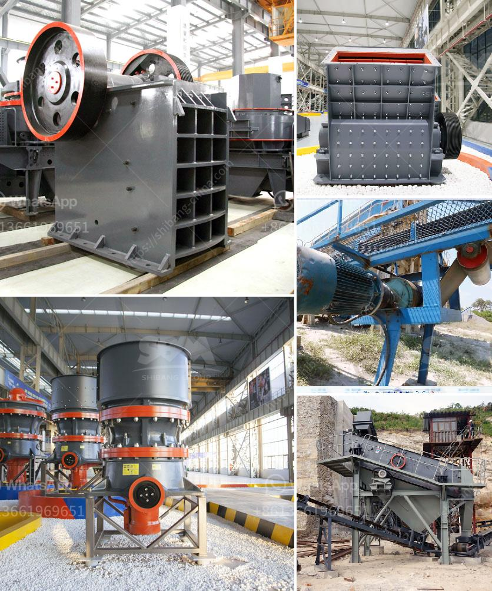

<h3>تقرير مشروع كسارة الحجر في كارناتاكا</h3>
تعد كارناتاكا واحدة من الولايات الهندية الرائدة في صناعة الحجر، حيث تشهد توافد المستثمرين وإقامة الكسارات في العديد من المناطق. تعتبر صناعة الحجر من الأنشطة الاقتصادية الرئيسية في الولاية، حيث تسهم في توفير فرص عمل وزيادة النمو الاقتصادي.

يهدف مشروع كسارة الحجر في كارناتاكا إلى تطوير البنية التحتية لصناعة الحجر وتحسين العمليات، وتوفير منتجات عالية الجودة للسوق المحلية والعالمية. يعد هذا المشروع فرصة استثمارية مهمة للمستثمرين، حيث تتوفر أراضي بأسعار منخفضة ويمكن الاستفادة من الموقع الجغرافي المميز.

تعد حجر الجرانيت والرخام والحجر الجيري من الأنواع الرئيسية التي يتم استخراجها في كارناتاكا. يتم تكسير وغربلة الحجر الخام في الموقع، ثم يتم نقله إلى المصنع للمعالجة والتصنيع. يتم استخدام آلات حديثة وتقنيات متقدمة في عمليات التصنيع لضمان الجودة والكفاءة.

تساهم مشاريع كسارات الحجر في توفير فرص عمل مباشرة وغير مباشرة للعديد من العمال المحليين، وتعزز النمو الاقتصادي للمنطقة. كما أن صناعة الحجر تسهم في تحقيق الاكتفاء الذاتي للولاية في مجال البنية التحتية، وتقليل الاعتماد على واردات الحجر من الخارج.

ومع ذلك، يجب مراعاة الأثر البيئي لمشاريع كسارات الحجر واتخاذ التدابير اللازمة للحد من التلوث الناجم عن هذه الأنشطة. يجب تنفيذ العمليات بطرق صديقة للبيئة والالتزام بالقوانين واللوائح المحلية والوطنية فيما يخص المحافظة على البيئة.

بالإضافة إلى ذلك، يجب توفير التوعية للعمال والعاملين في صناعة الحجر حول أهمية السلامة المهنية وضرورة اتخاذ تدابير الوقاية اللازمة أثناء العمل. يجب توفير المعدات الواقية اللازمة وتوجيه العمال حول طرق الاستخدام الآمن للماكينات والأدوات.

باختصار، يعد مشروع كسارة الحجر في كارناتاكا فرصة استثمارية مثيرة ومجدية في صناعة الحجر. يسهم تطوير هذا المشروع في تشجيع النمو الاقتصادي وتوفير فرص العمل، مع الحفاظ على البيئة وضمان سلامة العمال. يجذب هذا المشروع المستثمرين بفضل التجهيزات الحديثة والإمكانات الكبيرة في صناعة الحجر في كارناتاكا.
<h3>Contact us</h3><ul><li><strong>Whatsapp:&nbsp;<a href="https://wa.me/8613661969651">+8613661969651</a></strong></li><li><a href="https://swt.shibang-china.com/?git&amp;zhl&amp;تقرير مشروع كسارة الحجر في كارناتاكا"><strong>Online Service(chat now)</strong></a></li></ul><h3>Related</h3><ul><li><a href='مورد معدات كسارة الفك.md'>مورد معدات كسارة الفك</a></li><li><a href='قائمة أسعار كسارة الجرانيت.md'>قائمة أسعار كسارة الجرانيت</a></li><li><a href='مخططات تدفق لتصنيع الحديد الزهر.md'>مخططات تدفق لتصنيع الحديد الزهر</a></li><li><a href='موردي خط إنتاج الحبر.md'>موردي خط إنتاج الحبر</a></li><li><a href='سعر طاحونة المطرقة.md'>سعر طاحونة المطرقة</a></li></ul>