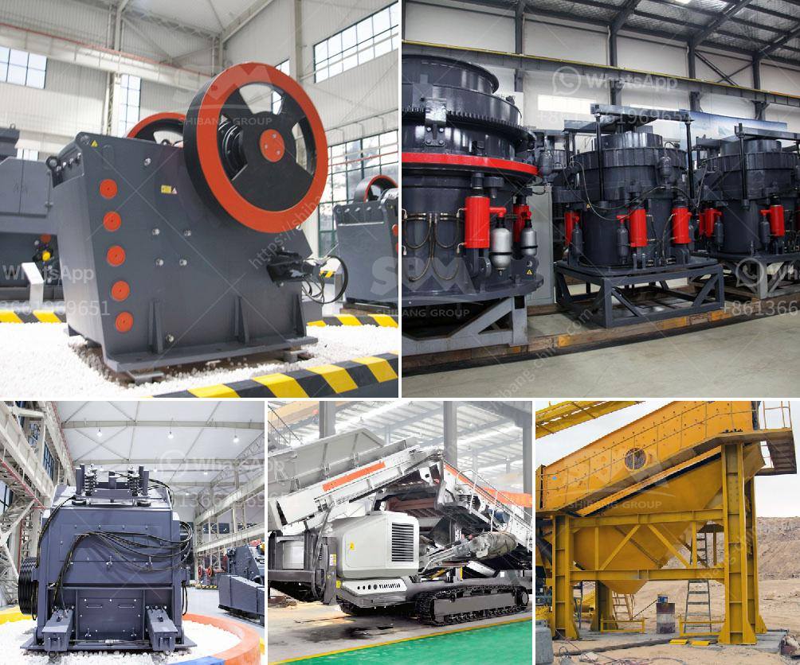

<h3>تقرير مشروع مصنع الأسمنت الصغير</h3>
يعتبر مشروع مصنع الأسمنت الصغير فرصة استثمارية مثيرة للاهتمام في عالم الأعمال. يستهدف هذا المشروع تلبية الطلب المتزايد على الأسمنت في السوق المحلية وتوفير فرص عمل جديدة.

يعد الأسمنت من المواد الأساسية التي تستخدم في مجال البناء والتشييد، وبالتالي فإن طلبه يزداد بشكل مستمر. يعتبر إقامة مصنع أسمنت صغير أمرًا استراتيجيًا حيث يمنح المستثمر فرصة للاستفادة من الطلب على الأسمنت وتحقيق أرباح مجزية.

تختلف الطاقة الإنتاجية لمصنع الأسمنت الصغير بين 200 و 400 طن في اليوم الواحد. تتطلب المصانع الصغيرة مناشئ أرضية محدودة وتكلفة استثمارية أقل مقارنة بالمصانع الكبيرة، مما يجعلها خيارًا مثاليًا للمستثمرين ذوي الامتيازات المحدودة.

أهمية مشروع مصنع الأسمنت الصغير لا تقتصر فقط على تلبية الطلب المحلي، بل يوفر أيضًا الأسمنت الذي يمكن تصديره للأسواق العالمية. يعزز التصدير فرص الأرباح ويسهم في تعزيز الاقتصاد المحلي.

بالإضافة إلى ذلك، يتميز مصنع الأسمنت الصغير بقدرته على توفير فرص عمل للعديد من العمال المحليين. يمكن توظيف مجموعة متنوعة من المهن الخاصة بالإنتاج والصيانة والتخطيط والإدارة، مما يعزز التنمية المحلية ويساهم في تحسين مستوى المعيشة للسكان المحليين.

ومن الجوانب الأخرى التي يجب النظر فيها عند تنفيذ مشروع مصنع الأسمنت الصغير تشمل اختيار الموقع المناسب وتوافر الموارد الأساسية المطلوبة مثل المياه والكهرباء والوقود. يجب أيضًا نصب جميع الآلات والمعدات اللازمة لانتاج الأسمنت بكفاءة عالية.

علاوة على ذلك، يجب مراعاة الجوانب البيئية والاستدامة في مشروع مصنع الأسمنت الصغير. يجب الالتزام بالمعايير البيئية وتطبيق أفضل الممارسات فيما يتعلق بإدارة النفايات وتخفيض انبعاثات الغازات الضارة.

لخلاصة القول، مشروع مصنع الأسمنت الصغير هو فرصة للاستثمار الواعدة تلبي الطلب المحلي وتعزز الاقتصاد المحلي، بالإضافة إلى توفير فرص عمل جديدة. يجب مراعاة العديد من العوامل المهمة لنجاح المشروع والالتزام بالمعايير البيئية والاستدامة.
<h3>Contact us</h3><ul><li><strong>Whatsapp:&nbsp;<a href="https://wa.me/8613661969651">+8613661969651</a></strong></li><li><a href="https://swt.shibang-china.com/?git&amp;zhl&amp;تقرير مشروع مصنع الأسمنت الصغير"><strong>Online Service(chat now)</strong></a></li></ul><h3>Related</h3><ul><li><a href='مصنع تكسير الحصى في جنوب أفريقيا.md'>مصنع تكسير الحصى في جنوب أفريقيا</a></li><li><a href='كسارة صخور محمولة مستعملة في كندا.md'>كسارة صخور محمولة مستعملة في كندا</a></li><li><a href='كسارات مخروط متنقلة.md'>كسارات مخروط متنقلة</a></li><li><a href='شركة تصنيع آلة كسارة الحجر.md'>شركة تصنيع آلة كسارة الحجر</a></li><li><a href='مطحنة رايموند في بورور.md'>مطحنة رايموند في بورور</a></li></ul>