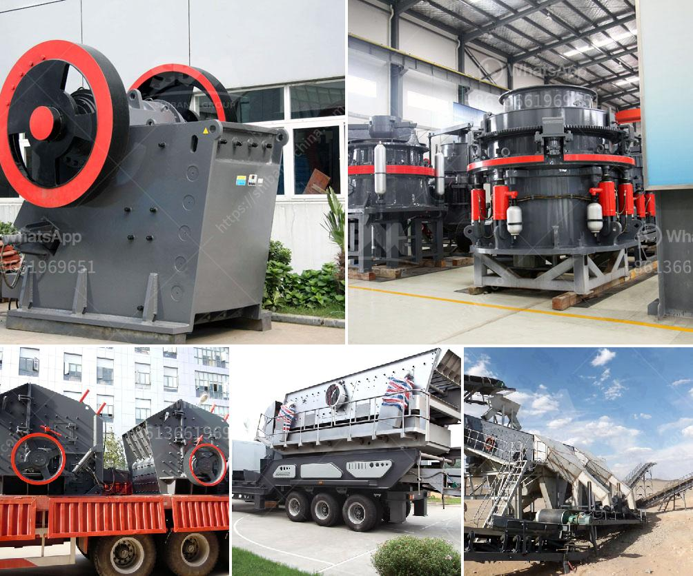

<h3>تقرير مشروع مصنع الرخام بتنسيق PDF</h3>
يعتبر مشروع مصنع الرخام فرصة مثالية للاستثمار في صناعة البناء والديكور، حيث يحظى الرخام بشعبية كبيرة في الأسواق المحلية والعالمية. تهدف هذه المقالة إلى تقديم تقرير موجز حول مشروع مصنع الرخام وفوائده المحتملة.

يعتبر مشروع مصنع الرخام فرصة رائعة للاستفادة من موارد الحجر الطبيعي المتاحة بكثرة في العديد من الدول. يقوم المصنع بتحويل قطع الحجر الطبيعي إلى صفائح رخامية وبلاطات وأشكال أخرى منتجة بطريقة متقنة وفقًا لمعايير الجودة العالمية. يتطلب هذا المشروع استثمارًا مبدئيًا لشراء معدات وآلات متخصصة لعملية التصنيع وتوظيف عمالة ذات خبرة في هذا المجال.

تتيح هذه الصناعة العديد من المزايا الاقتصادية والعائد المادي. فعلى سبيل المثال، يعتبر الرخام مادة بناء أساسية تستخدم في التشطيبات الداخلية والخارجية للمباني، وبالتالي يوجد طلب مستمر ومتزايد على المنتجات المصنعة من الرخام. يمكن تسويق المنتجات في الأسواق المحلية والخارجية، وبالتالي زيادة فرص الصادرات وتحقيق مزيد من الأرباح.

بالإضافة إلى الفرص الاقتصادية، تقدم هذه الصناعة فرص عمل مباشرة وغير مباشرة للمجتمعات المحلية، حيث يتطلب عمل المصنع تعاونًا محليًا وتوظيف العمالة المحلية. يمكن أيضًا تحقيق إضافة للقيمة المحلية عن طريق استغلال الموارد الطبيعية المتاحة في التطوير المستدام للمصنع، مثل استخدام تقنيات معالجة النفايات وتوليد الطاقة المتجددة.

على الرغم من شعبية الرخام، يوجد تحدي في المنافسة مع الشركات المصنعة الموجودة في الأسواق العالمية. يجب أن يقوم المشروع بتوفير منتجات متفوقة من حيث الجودة والتشكيلة والسعر لكسب حصة سوقية. يجب أيضًا توفير خدمات ذات قيمة مضافة مثل التصميم المخصص وتنفيذ المشاريع الكبيرة. لذلك، يمكن تحقيق نجاح المشروع من خلال الاستراتيجيات السليمة للتسويق والترويج وبناء سمعة طيبة في السوق.

باختصار، يعتبر مشروع مصنع الرخام فرصة استثمارية رائعة في صناعة البناء والديكور. ومع تطور السوق وزيادة الطلب على المنتجات المصنعة من الرخام، فإن هذا المشروع يمكن أن يحقق مردودًا ماليًا جيدًا ويساهم في توفير فرص عمل وتنمية مستدامة للمجتمعات المحلية.
<h3>Contact us</h3><ul><li><strong>Whatsapp:&nbsp;<a href="https://wa.me/8613661969651">+8613661969651</a></strong></li><li><a href="https://swt.shibang-china.com/?git&amp;zhl&amp;تقرير مشروع مصنع الرخام بتنسيق PDF"><strong>Online Service(chat now)</strong></a></li></ul><h3>Related</h3><ul><li><a href='سعر حزام النقل.md'>سعر حزام النقل</a></li><li><a href='كاولين مورد كسارة محمولة في أنغولا.md'>كاولين مورد كسارة محمولة في أنغولا</a></li><li><a href='كسارة الصخور بوسطن.md'>كسارة الصخور بوسطن</a></li><li><a href='مصنع غسيل الكروم للبيع في جنوب أفريقيا.md'>مصنع غسيل الكروم للبيع في جنوب أفريقيا</a></li><li><a href='سعر كسارة مخروطية هيدروليكية.md'>سعر كسارة مخروطية هيدروليكية</a></li></ul>