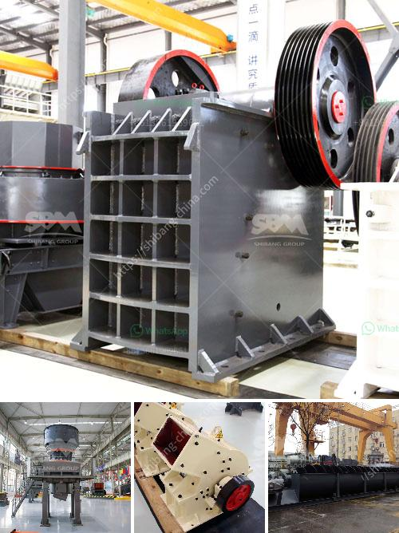

<h3>تقرير مشروع مصنع الكرة الصغيرة بتنسيق PDF</h3>
يهدف هذا التقرير إلى تقديم نظرة عامة عن مشروع مصنع الكرة الصغيرة، وهو نشاط صناعي يهدف إلى إنتاج الكرات الصغيرة المستخدمة في مجموعة متنوعة من الألعاب الرياضية مثل كرة القدم وكرة السلة وكرة التنس وغيرها. يتطلب هذا المشروع استثماراً مادياً وفنياً قوياً، ولكنه يعتبر فرصة تجارية واعدة نظراً للطلب المستمر على هذه الكرات.

يتضمن مشروع مصنع الكرة الصغيرة عدة خطوات رئيسية. أولاً، يجب توفير موقع مناسب للمصنع يتضمن مساحة كافية لوضع أجهزة الإنتاج والمعدات اللازمة. يجب أن يكون الموقع قريبًا من المناطق الرياضية والتجارية لتسهيل التوزيع والتسويق.

ثانياً، يتطلب المشروع شراء وتركيب أجهزة ومعدات الإنتاج المختلفة المطلوبة لتصنيع الكرات. يتضمن ذلك آلات القطع والخياطة والتشكيل والتجميع. يجب أن تكون هذه الأجهزة عالية الجودة وتوفر دقة وكفاءة عالية للعملية الإنتاجية.

ثالثاً، ينبغي توفير المواد الخام اللازمة لإنتاج الكرات، مثل الجلد الاصطناعي أو القماش المطاطي واللدائن. يتعين أن تكون المواد عالية الجودة وتلبي المعايير والمواصفات الصناعية المطلوبة.

رابعاً، يجب أيضاً تكوين فريق عمل مهرة ومتخصصة في إدارة المصنع وسير الإنتاج. يتضمن ذلك فنيين وعمال مهرة لتشغيل الأجهزة والمعدات وضمان عملية إنتاج سلسة وجودة منتج عالية.

أخيراً، ينبغي إنشاء خطة تسويقية قوية للترويج للكرات المصنعة. يُنصح بإنشاء علاقات تعاون مع المتاجر الرياضية والأندية الرياضية والمدارس وغيرها من الزبائن المحتملين. بالإضافة إلى ذلك، يمكن الترويج للكرات عبر وسائل التواصل الاجتماعي وتصميم موقع إلكتروني لعرض المنتجات وميزاتها.

باختصار، مشروع مصنع الكرة الصغيرة يعد فرصة تجارية مثيرة واعدة. إلا أنه يتطلب تخطيطاً جيداً واستثمارات مالية وجهوداً مستمرة للوصول إلى نجاح مستدام. من خلال توفير المعدات المناسبة والمواد الخام والعمالة الماهرة وخطة تسويقية فعالة، يمكن لمشروع مصنع الكرة الصغيرة أن يحقق أرباحاً جيدة ويلبي الطلب المتزايد على الكرات الرياضية.
<h3>Contact us</h3><ul><li><strong>Whatsapp:&nbsp;<a href="https://wa.me/8613661969651">+8613661969651</a></strong></li><li><a href="https://swt.shibang-china.com/?git&amp;zhl&amp;تقرير مشروع مصنع الكرة الصغيرة بتنسيق PDF"><strong>Online Service(chat now)</strong></a></li></ul><h3>Related</h3><ul><li><a href='مصنع كسارة الحجر التلقائي.md'>مصنع كسارة الحجر التلقائي</a></li><li><a href='كسارة فك محمولة.md'>كسارة فك محمولة</a></li><li><a href='تكلفة مطحنة الخام ٢٠٠ شبكة.md'>تكلفة مطحنة الخام ٢٠٠ شبكة</a></li><li><a href='خط إنتاج مصنع كسارة الحجر في الهند.md'>خط إنتاج مصنع كسارة الحجر في الهند</a></li><li><a href='سحق وفحص خام المنجنيز.md'>سحق وفحص خام المنجنيز</a></li></ul>