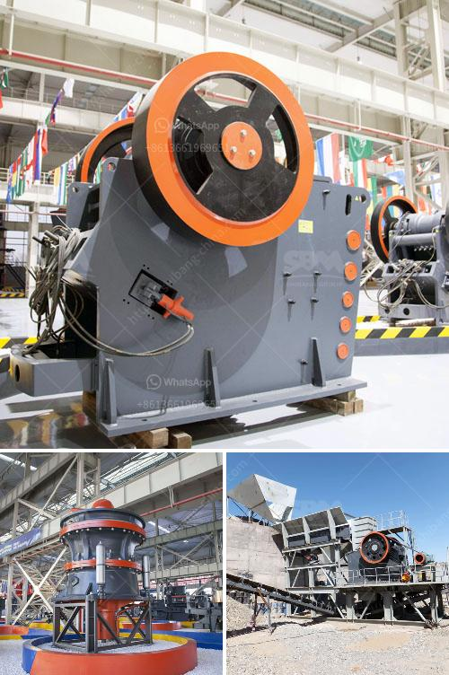

<h3>تقرير مشروع مصنع كسارة الحجر بتنسيق PDF</h3>
تم تنفيذ مشروع مصنع كسارة الحجر بنجاح في منطقة (اسم المنطقة)، وذلك بهدف تلبية الطلب المتزايد على المواد الخام في صناعة البناء والتشييد. يقدم هذا التقرير نظرة عامة عن المشروع وتفاصيل تنفيذه وأثره المتوقع على الاقتصاد المحلي والبيئة.

يهدف مشروع مصنع كسارة الحجر إلى استخراج وتكسير الصخور الكبيرة وتحويلها إلى حجارة مرغوب فيها بأحجام مختلفة. يعد استخدام كسارة الحجر في الإنتاج الحجري أمرًا ضروريًا في صناعة البناء، حيث تستخدم هذه الحجارة في تشييد المباني والطرق والجسور.

تم تصميم المصنع بعناية لضمان تنفيذ عمليات التكسير بكفاءة وبطريقة صحية وآمنة. كما تم تجهيز المصنع بمعدات متطورة وتقنيات عالية للحد من العوامل البيئية السلبية وتشجيع التنمية المستدامة. تم توظيف فريق ذو خبرات عالية في إدارة المشروع وتشغيل المصنع لضمان تحقيق الأهداف المرجوة.

من المتوقع أن يكون لمصنع كسارة الحجر تأثير اقتصادي واسع النطاق على المنطقة المحيطة به. سيوفر المشروع فرص عمل جديدة للسكان المحليين، وسيساهم في تعزيز النشاط الاقتصادي والاستثمار في المنطقة. بالإضافة إلى ذلك، ستستفيد الحكومة المحلية من الرسوم والضرائب المحصلة على المشروع، وهذا يمكن أن يساهم في تحسين الخدمات العامة وتطوير المشاريع الأخرى.

مع ذلك، يجب الإشارة إلى أن هذا المشروع له تأثير بيئي يجب الاهتمام به. يجب تطبيق معايير الانبعاثات وإدارة النفايات الصلبة والسائلة بعناية للحد من التأثير السلبي على البيئة المحيطة. يجب أيضًا الاهتمام بأمور الحفاظ على المياه والتربة وتقييم التأثير البيئي في جميع مراحل عمل المصنع.

باختصار، يمكن القول إن مشروع مصنع كسارة الحجر هو مشروع حيوي يلبي حاجة السوق المتزايدة في صناعة البناء والتشييد. يشكل المصنع فرصة للتنمية الاقتصادية وخلق فرص عمل جديدة، مع الالتزام الجاد بالاهتمام بالبيئة وتنفيذ المعايير الصحية والأمنية.

الختام: يجب على المشغلين والمستثمرين في مشروعات مثل هذه الكسارات أن يكونوا حريصين ومسؤولين وأن يلتزموا بالتشريعات والقوانين البيئية وإدارة المخاطر لضمان تحقيق التوازن المثلى بين الاحتياجات الاقتصادية والبيئية للمنطقة.
<h3>Contact us</h3><ul><li><strong>Whatsapp:&nbsp;<a href="https://wa.me/8613661969651">+8613661969651</a></strong></li><li><a href="https://swt.shibang-china.com/?git&amp;zhl&amp;تقرير مشروع مصنع كسارة الحجر بتنسيق PDF"><strong>Online Service(chat now)</strong></a></li></ul><h3>Related</h3><ul><li><a href='سعر كسارة الزحف المتنقلة.md'>سعر كسارة الزحف المتنقلة</a></li><li><a href='بيع كسارة الحجر للبيع.md'>بيع كسارة الحجر للبيع</a></li><li><a href='كسارة للإيجار في نيو جيرسي.md'>كسارة للإيجار في نيو جيرسي</a></li><li><a href='مصنعي معدات تعدين الذهب في الدنمارك.md'>مصنعي معدات تعدين الذهب في الدنمارك</a></li><li><a href='شاشة اهتزاز عالية التردد.md'>شاشة اهتزاز عالية التردد</a></li></ul>