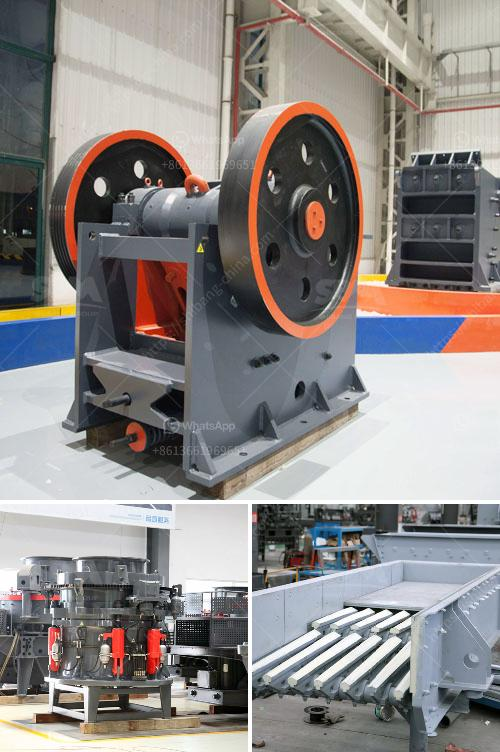

<h3>تقرير مشروع وحدات كسارة الحجر</h3>
تعتبر وحدات كسارة الحجر أحد المشاريع الهامة في مجال صناعة البناء والتشييد، حيث تعمل على تصنيع الركام اللازم لإنشاء الطرق والجسور والمباني. وتهدف هذه الوحدات إلى تكسير الحجارة وفصلها عن الرمال والغبار، لتحصيل قطع الركام ذات الأحجام المختلفة وفقًا للمواصفات المطلوبة.

مشروع وحدات كسارة الحجر يشتمل على عدة مراحل، حيث يتم في المرحلة الأولى تجهيز الموقع والتخطيط للمشروع، بما في ذلك دراسة الجدوى الاقتصادية والبيئية للمشروع، وتحديد المساحة المناسبة والتراخيص اللازمة.

ثم يتم في المرحلة التالية توريد المعدات اللازمة للوحدات، مثل الكسارات والمناخل والناقلات وغيرها، وتثبيتها في الموقع بشكل صحيح. كما يتم تجهيز الموقع بشبكة للمياه والكهرباء والمرافق الأخرى الضرورية.

عندما يتم الانتهاء من الإعدادات والتجهيزات، يبدأ تشغيل الوحدات، حيث تتم إدخال الحجارة الخام إلى الكسارة لتتم عملية التكسير. وبعد تكسير الحجارة، تتم عملية الفصل حيث يتم فصل الركام عن الرمال والغبار باستخدام المناخل المختلفة.

يُعتبر إنتاج الركام ذات جودة عالية من أهم مزايا هذا المشروع، حيث يتم ضمان حصول المشترين على ركام مطابق للمواصفات المستهدفة ومناسب للاستخدام المطلوب. كما يتم استغلال الرمال والغبار الناتجين من عملية الفصل بشكل منفصل في إنتاج خرسانة ذات جودة عالية.

يتطلب مشروع وحدات كسارة الحجر متابعة دقيقة وإجراءات صارمة للحفاظ على جودة الركام وضمان سلامة العملية. ويتم أيضًا الاهتمام بالبيئة المحيطة وتخفيف التأثيرات السلبية للمشروع بشكل عام، من خلال تنفيذ إجراءات للتحكم في الغبار وإعادة تدوير المياه وتقليل الضوضاء.

للخاتمة، فإن مشروع وحدات كسارة الحجر يعتبر فرصة استثمارية ممتازة في مجال صناعة البناء والتشييد، حيث يلبي الطلب المتزايد على الركام ذات الجودة العالية. وعلى الرغم من تحديات العمل في هذا المشروع، فإن الاهتمام بالجودة والبيئة يضمن نجاح المشروع واستدامته على المدى الطويل.
<h3>Contact us</h3><ul><li><strong>Whatsapp:&nbsp;<a href="https://wa.me/8613661969651">+8613661969651</a></strong></li><li><a href="https://swt.shibang-china.com/?git&amp;zhl&amp;تقرير مشروع وحدات كسارة الحجر"><strong>Online Service(chat now)</strong></a></li></ul><h3>Related</h3><ul><li><a href='آلات إنتاج الكالسيوم.md'>آلات إنتاج الكالسيوم</a></li><li><a href='شركة تصنيع آلات رمل السيليكا في الهند.md'>شركة تصنيع آلات رمل السيليكا في الهند</a></li><li><a href='كسارة مستعملة للبيع في تنزانيا.md'>كسارة مستعملة للبيع في تنزانيا</a></li><li><a href='كسارة الخرسانة للبيع في نيجيريا.md'>كسارة الخرسانة للبيع في نيجيريا</a></li><li><a href='محطة سحق تينوفا.md'>محطة سحق تينوفا</a></li></ul>