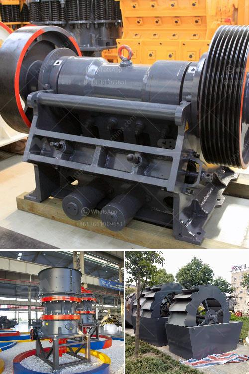

<h3>تقليل حجم مطحنة المطرقة</h3>
تعتبر مطاحن المطرقة من الأدوات الهامة في صناعة الغذاء والعلف، حيث تستخدم لطحن المواد الصلبة الى قطع غرضية أصغر. ومع ذلك، قد يواجه البعض صعوبة في الحفاظ على مطاحن المطرقة بحجم صغير تتسع إلى الأماكن المحدودة المتاحة. في هذا المقال، سنلقي نظرة على كيفية تقليل حجم مطحنة المطرقة.

1. استخدام تكنولوجيا التصنيع المتقدمة: يمكن تقليل حجم المطحنة من خلال استخدام التكنولوجيا المتقدمة في عملية التصنيع، مثل استخدام آلات قطع عالية الدقة والروبوتات لتقليل حجم الأجزاء الميكانيكية.

2. تخفيض حجم الهيكل: يمكن تقليل حجم المطحنة عن طريق تصميم هيكل أكثر كفاءة وتحسين مساحة الاستخدام، مثل استخدام تقنية التجميع المباشر للتجميع الميكانيكي وتقليل عدد الأجزاء.

3. استخدام المواد الخفيفة: يمكن استخدام المواد الخفيفة والمتينة في تصنيع المطاحن مثل الألمنيوم والبلاستيك المقوى بالألياف، وذلك لتقليل الوزن الكلي للمطحنة وبالتالي تقليل حجمها.

4. تحسين الأتمتة: يمكن تحسين حجم المطاحن المطرقة من خلال تحسين التأتؤ التلقائي والتحكم في العملية بدقة عالية، مما يسمح بتقليل حجم الأجهزة المتحكمة وتحسين كفاءة العمل.

تضيف تقليل حجم مطحنة المطرقة قيمة كبيرة بالنسبة للمستخدمين الذين يواجهون قيوداً مكانية أو يرغبون في تحقيق كفاءة عالية في عمليات الطحن. ومع ذلك، يجب مراعاة الجوانب الفنية والاقتصادية لتقليل حجم مطحنة المطرقة، فقد يؤثر ذلك على أداء المطحنة وتكلفتها الإجمالية.

وفي الختام، يمكن القول بأن تقليل حجم مطحنة المطرقة هو تطوير هام في مجال صناعة الغذاء والعلف، حيث يمكن تحقيق مزيج مثالي بين الكفاءة وتوفير المساحة. ومع استمرار التطور التكنولوجي، سيستمر تطوير هذا المجال لتحقيق مزيد من التحسينات في المستقبل.
<h3>Contact us</h3><ul><li><strong>Whatsapp:&nbsp;<a href="https://wa.me/8613661969651">+8613661969651</a></strong></li><li><a href="https://swt.shibang-china.com/?git&amp;zhl&amp;تقليل حجم مطحنة المطرقة"><strong>Online Service(chat now)</strong></a></li></ul><h3>Related</h3><ul><li><a href='مصانع طحن الكرات.md'>مصانع طحن الكرات</a></li><li><a href='مصنع تكسير الجرانيت 200 طن في الساعة للبيع.md'>مصنع تكسير الجرانيت 200 طن في الساعة للبيع</a></li><li><a href='طحن مطحنة الاسمنت.md'>طحن مطحنة الاسمنت</a></li><li><a href='موردين لمصانع سحق ld slag في الهند.md'>موردين لمصانع سحق ld slag في الهند</a></li><li><a href='مصنع فصل وتركيز المعادن في نيجيريا.md'>مصنع فصل وتركيز المعادن في نيجيريا</a></li></ul>