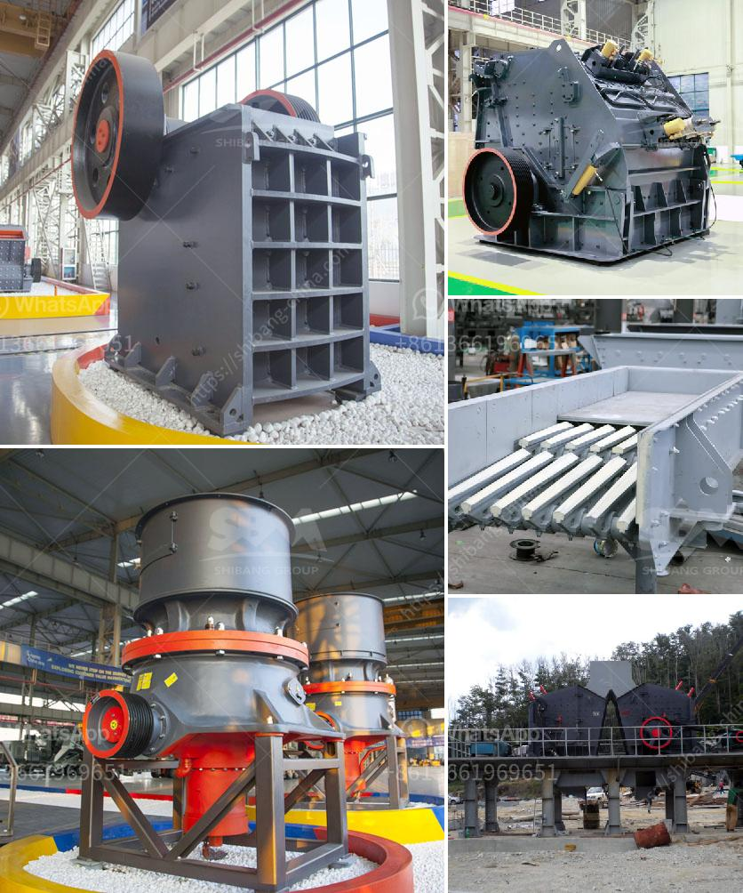

<h3>تقنيات معالجة الطين</h3>
تعد تقنيات معالجة الطين من العمليات المهمة في صناعات متنوعة مثل البناء، والسيراميك، والزجاج. يتم استخدام هذه التقنيات لتحسين الخواص الفيزيائية والكيميائية للطين، مما يتيح الاستفادة القصوى من هذا المواد الطبيعية.

تعود تقنيات معالجة الطين إلى العصور القديمة، حيث استخدمها الإنسان في تكوين السيراميك والطين المصبوب. غير أنها قد تطورت لاحقًا لتتناسب مع احتياجات العصر الحديث ولتعزيز العمليات الصناعية.

من بين التقنيات المستخدمة في معالجة الطين، يمكن ذكر ثلاثة منها:

1. التجفيف: يتم استخدام تقنيات التجفيف المختلفة لإزالة الرطوبة من الطين. يمكن أن يتم تجفيف الطين باستخدام الهواء الساخن، أو الأشعة تحت الحمراء، أو أفران الطين. تُعزَّز عملية التجفيف بواسطة توفير تدفق هواء جيد والتحكم في درجة الحرارة والرطوبة بدقة. يعتبر التجفيف ضروريًا للتحكم في صلابة ومعامل تمدد الطين.

2. المعالجة الحرارية: تعتمد هذه التقنية على تسخين الطين إلى درجات حرارة عالية لتحسين خواصه الفيزيائية. تعمل هذه العملية على تفعيل المواد اللاعضوية في الطين وتسهم في تغيير هيكله الكيميائي. يتم استخدام المعالجة الحرارية لإنتاج المواد الخزفية والأصباغ والزجاج والسيراميك.

3. المعالجة الكيميائية: يستخدم الطين في العديد من التطبيقات الصناعية، ولكن في بعض الأحيان يكون لا يلبي المتطلبات المحددة للتطبيق المطلوب. لذا يتم استخدام التقنيات الكيميائية لتحسين الخواص الكيميائية والفيزيائية للطين، مثل استخدام المواد الكيميائية لتثبيت وتقوية الطين ولغرض تحسين قابلية التشغيل والتصنيع.

باستخدام هذه التقنيات، يمكن الحصول على طين ذو خواص محسنة لمختلف الاستخدامات الصناعية. وبالتالي، فإن تقنيات معالجة الطين تلعب دورًا حاسمًا في تحقيق الكفاءة والاستدامة في العديد من الصناعات الحديثة.
<h3>Contact us</h3><ul><li><strong>Whatsapp:&nbsp;<a href="https://wa.me/8613661969651">+8613661969651</a></strong></li><li><a href="https://swt.shibang-china.com/?git&amp;zhl&amp;تقنيات معالجة الطين"><strong>Online Service(chat now)</strong></a></li></ul><h3>Related</h3><ul><li><a href='طاحونة الحجر إلى النانوجسيمات.md'>طاحونة الحجر إلى النانوجسيمات</a></li><li><a href='تجار الكسارات المحمولة في جنوب أفريقيا.md'>تجار الكسارات المحمولة في جنوب أفريقيا</a></li><li><a href='كسارة الأسطوانة للبيع.md'>كسارة الأسطوانة للبيع</a></li><li><a href='كسارة مخروطية.md'>كسارة مخروطية</a></li><li><a href='كسارة الحجر في بيرو.md'>كسارة الحجر في بيرو</a></li></ul>