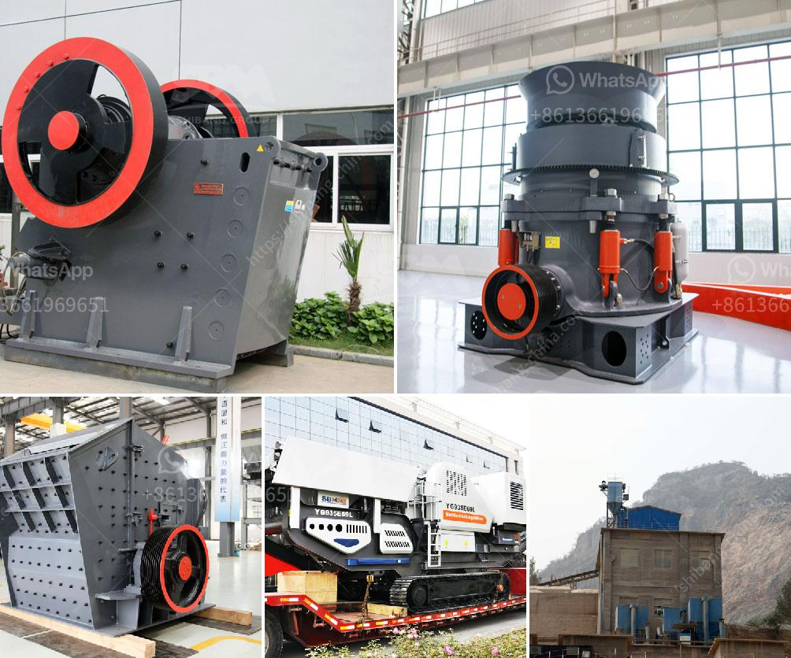

<h3>تكاليف مطاحن الكرة</h3>
تُعتبر مطاحن الكرة من الأجهزة التي تُستخدم في صناعة الطحن وتكسير المواد الخام، وتشمل العديد من التطبيقات مثل تكسير الخامات، وطحن المواد النهائية في صناعة الأسمنت. وبالتالي، يتطلب تشغيل مطاحن الكرة تكاليف عالية للحفاظ على كفاءتها وضمان عمر خدمة طويل.

إحدى التكاليف الرئيسية لمطاحن الكرة هي تكلفة الطاقة المستهلكة. فعملية الطحن تتطلب كمية كبيرة من الطاقة لتحريك الكرات المعدنية داخل المطحنة وتكسير المواد الصلبة. وتعتبر تكاليف الطاقة ذات أهمية كبيرة للمصانع، حيث يجب على المصنع الاستثمار في مصادر طاقة مستدامة وفعالة، مثل الطاقة الشمسية أو الرياح، للتقليل من تكاليف استهلاك الكهرباء.

بالإضافة إلى ذلك، تحتاج مطاحن الكرة إلى عناية وصيانة منتظمة لضمان عملها بشكل مثالي وتجنب الأعطال. يتطلب ذلك توفير فريق صيانة مهرة واستخدام مواد تشحيم وتبريد ذات جودة عالية. ويجب تعيين فترات منتظمة لتوقف المطحنة للصيانة والإصلاح، مما يؤدي إلى توقف الإنتاج وبالتالي تكاليف فقدان العمل. ولتجنب ذلك، ينبغي للشركات أن تسعى جاهدة لتنفيذ برنامج صيانة وإصلاح مناسب بناءً على أفضل الممارسات والتقنيات.

تكاليف المواد الاستهلاكية أيضًا تؤثر على تكاليف مطاحن الكرة. غالبًا ما تكون الكرات المعدنية المستخدمة في الطحن عبارة عن كرات صلبة مصنوعة من الصلب، وتتعرض هذه الكرات المعدنية للتآكل والتلف بمرور الوقت. لذلك، يجب استبدال الكرات بانتظام لتجنب تأثير سلبي على جودة الطحن وكفاءة المطحنة. يجب على الشركات اقتناء الكرات ذات الجودة العالية والبحث عن الأسعار المناسبة للحد من تكاليف الاستبدال المستمر.

بشكل عام، تكلفة مطاحن الكرة تأتي من عدة عوامل مثل تكلفة الطاقة، والصيانة والإصلاح، والمواد الاستهلاكية. لذلك، يجب أن تنظر الشركات للتوازن بين تكلفة هذه العوامل وجودة المنتج النهائي وكفاءة الإنتاج. يعتبر اتخاذ القرار المناسب والتخطيط الجيد في استثمار مطحنة الكرة هو السبيل الأمثل لتحقيق العملية الإنتاجية الفعالة والاستدامة المالية للشركة.
<h3>Contact us</h3><ul><li><strong>Whatsapp:&nbsp;<a href="https://wa.me/8613661969651">+8613661969651</a></strong></li><li><a href="https://swt.shibang-china.com/?git&amp;zhl&amp;تكاليف مطاحن الكرة"><strong>Online Service(chat now)</strong></a></li></ul><h3>Related</h3><ul><li><a href='كسارة محمولة مستعملة للبيع في جنوب أفريقيا.md'>كسارة محمولة مستعملة للبيع في جنوب أفريقيا</a></li><li><a href='تجار الكسارات المحمولة في جنوب أفريقيا.md'>تجار الكسارات المحمولة في جنوب أفريقيا</a></li><li><a href='آلة تعبئة مسحوق الجير.md'>آلة تعبئة مسحوق الجير</a></li><li><a href='مطرقة الذهب المستخدمة للبيع في زيمبابوي.md'>مطرقة الذهب المستخدمة للبيع في زيمبابوي</a></li><li><a href='مورد آلة كسارة النفايات الفلبين.md'>مورد آلة كسارة النفايات الفلبين</a></li></ul>