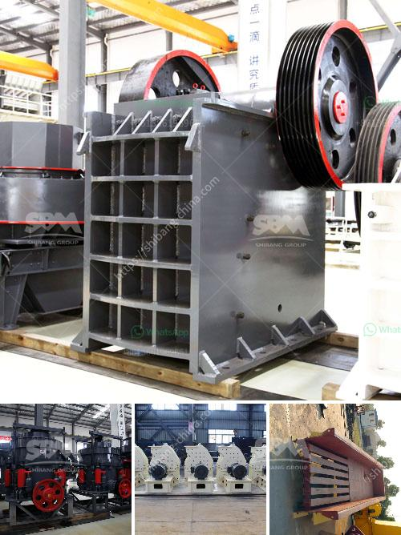

<h3>تكسير الحجر المصنوع في ألمانيا</h3>
يعتبر تكسير الحجر المصنوع في ألمانيا عملية حيوية وضرورية في صناعة البناء والبنية التحتية. يشير مصطلح "تكسير الحجر" إلى عملية تحويل الحجر الصلب إلى حجم أصغر وأكثر توزيعاً ليصبح مناسبًا للاستخدام في البناء والأعمال الإنشائية المختلفة. يعتمد التكسير على استخدام معدات وآلات متخصصة لتحقيق هذا الهدف.

تتكون صناعة تكسير الحجر في ألمانيا من عدة مراحل وعمليات مهمة. الحجر الصلب يتم جمعه من المحاجر والمناجم ، ثم يتم نقله إلى موقع التكسير. من ثم، يتم تفريغ الحجر في الآلات المخصصة التي تقوم بتكسير الحجر بواسطة ضغط قوي، أو ضربة قوية، أو احتكاك مكثف. تختلف طرق التكسير تبعًا للغرض المرجو من استخدام الحجر، سواء كان للبناء العام أو الطرق أو الأنفاق أو غيرها من المشاريع.

تعد المعدات المستخدمة في عملية تكسير الحجر في ألمانيا من العوامل الرئيسية في تحقيق جودة عالية وكفاءة في العمل. تستخدم آلات التكسير الحديثة والمتطورة التي تتميز بالقوة والمتانة والدقة في العملية. تشمل هذه الآلات الكسارات الفكية والكسارات المخروطية وكسارات الصدم والكسارات الأفقية وغيرها من الأجهزة التكسيرية.

تتميز صناعة تكسير الحجر في ألمانيا بالتزامها بالمعايير البيئية والجودة. تهدف الشركات المصنعة إلى تطبيق أعلى معايير الأداء البيئي للمحافظة على البيئة والحد من التأثير السلبي لعملية التكسير على الطبيعة المحيطة. تستخدم التقنيات الحديثة للحد من الغبار والضوضاء والانبعاثات الضارة. كما يتم توفير الحفاضات والمرشحات لامتصاص الغبار الناتج عن عملية التكسير.

تكسير الحجر المصنوع في ألمانيا يلعب دورًا حاسمًا في تكوين البنية التحتية المتينة والمستدامة. يتم استخدامه في تشييد المباني والجسور والطرق والأنفاق وغيرها من الهياكل الحضرية. يعتبر الحجر الناتج عن التكسير مادة قابلة لإعادة الاستخدام والتدوير، مما يعزز الاستدامة البيئية ويقلل من استغلال الموارد الطبيعية.

في الختام، يعتبر تكسير الحجر المصنوع في ألمانيا عملية ضرورية ومكملة لصناعة البناء. يتمتع القطاع بتكنولوجيا متقدمة وخبرة عالية في تحقيق أفضل النتائج بأعلى مستويات الجودة والاستدامة. تكسير الحجر يلعب دورًا حاسمًا في تحسين البنية التحتية للأماكن التي يستخدم فيها ويسهم في التنمية الاقتصادية والتقدم الشامل للمجتمع.
<h3>Contact us</h3><ul><li><strong>Whatsapp:&nbsp;<a href="https://wa.me/8613661969651">+8613661969651</a></strong></li><li><a href="https://swt.shibang-china.com/?git&amp;zhl&amp;تكسير الحجر المصنوع في ألمانيا"><strong>Online Service(chat now)</strong></a></li></ul><h3>Related</h3><ul><li><a href='كسارة VSI لسحق الرمل.md'>كسارة VSI لسحق الرمل</a></li><li><a href='عملية غسيل الرمل.md'>عملية غسيل الرمل</a></li><li><a href='آلة مطحنة الطحن المستخدمة.md'>آلة مطحنة الطحن المستخدمة</a></li><li><a href='كسارة الحجر للبيع الفلبين.md'>كسارة الحجر للبيع الفلبين</a></li><li><a href='سعر كسارة الفك.md'>سعر كسارة الفك</a></li></ul>