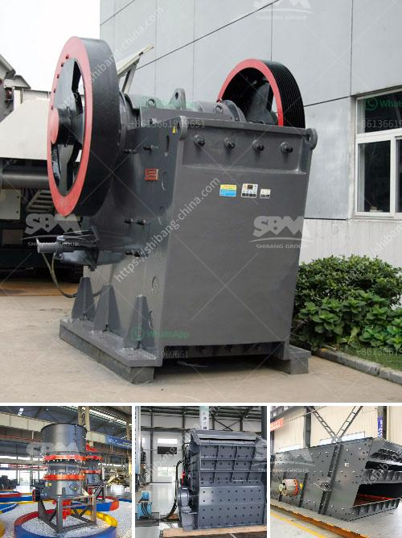

<h3>تكسير النبات بتنسيق PDF</h3>
تعد عملية تكسير النبات أحد الأساليب الهامة في مجال البحث النباتي والصناعات الغذائية. يهدف تكسير النبات إلى تحطيم النباتات إلى جزيئات أصغر قابلة للاستخدام في عمليات المعالجة والاستخلاص. في هذه المقالة سنناقش أهمية تكسير النبات وتأثيره على العديد من المجالات المتعلقة بالنباتات.

يهدف تكسير النبات إلى تخفيض حجم النباتات، مما يسهل تعاملها واستخدامها في العديد من الصناعات. يتم ذلك عن طريق استخدام معدات خاصة لتمزيق النباتات بفعالية عالية. تكسير النبات يتطلب استخدام طرق متنوعة تعتمد على نوع النبات المراد تكسيره والغرض من هذه العملية. يمكن استخدام الطحن أو الكسر أو الضغط لتكسير النباتات وتفتيتها إلى أحجام أصغر.

تعتبر عملية تكسير النبات ضرورية في العديد من المجالات. على سبيل المثال، في مجال الأغذية، يمكن استخدام تكسير النبات لخلط المكونات وتحضير العصائر والشوربات والمخفوقات. كما يسهل تكسير النبات استخلاص الزيوت والمستخلصات المختلفة من النباتات، مثل زيت الزيتون وزيت عباد الشمس والمستخلصات المستخدمة في صناعة الأدوية والعطور.

بالإضافة إلى ذلك، تكسير النبات يلعب دورًا هامًا في مجال البحوث النباتية. حيث يمكن استخدام النباتات المكسرة في دراسة تركيبها الكيميائي وتحليل المكونات النشطة ودراسة خصائصها البيولوجية. يمكن أيضًا استخدام النباتات المكسرة في تجارب علمية لفهم العمليات الحيوية للنباتات وتحديد طرق مكافحة الأمراض أو زيادة الإنتاجية الزراعية.

باختصار، تكسير النبات له تأثير كبير على العديد من المجالات المرتبطة بالنباتات. يساهم في توفير مواد خام للصناعات الغذائية والمستحضرات الدوائية وصناعة العطور. كما يمكن استخدامه في البحوث النباتية للتحليل الكيميائي والدراسات الحيوية. لذلك، يعتبر تكسير النبات عملية هامة تساهم في تطوير العديد من الصناعات والأبحاث المتعلقة بالنباتات.
<h3>Contact us</h3><ul><li><strong>Whatsapp:&nbsp;<a href="https://wa.me/8613661969651">+8613661969651</a></strong></li><li><a href="https://swt.shibang-china.com/?git&amp;zhl&amp;تكسير النبات بتنسيق PDF"><strong>Online Service(chat now)</strong></a></li></ul><h3>Related</h3><ul><li><a href='تكلفة كسارة الحجر في بيرو.md'>تكلفة كسارة الحجر في بيرو</a></li><li><a href='مصنع كربونات الكالسيوم المرسبة.md'>مصنع كربونات الكالسيوم المرسبة</a></li><li><a href='تكلفة الحزام الناقل لكل متر.md'>تكلفة الحزام الناقل لكل متر</a></li><li><a href='آلات سحق الركام.md'>آلات سحق الركام</a></li><li><a href='آلة مسحوق الدولوميت في سريلانكا.md'>آلة مسحوق الدولوميت في سريلانكا</a></li></ul>