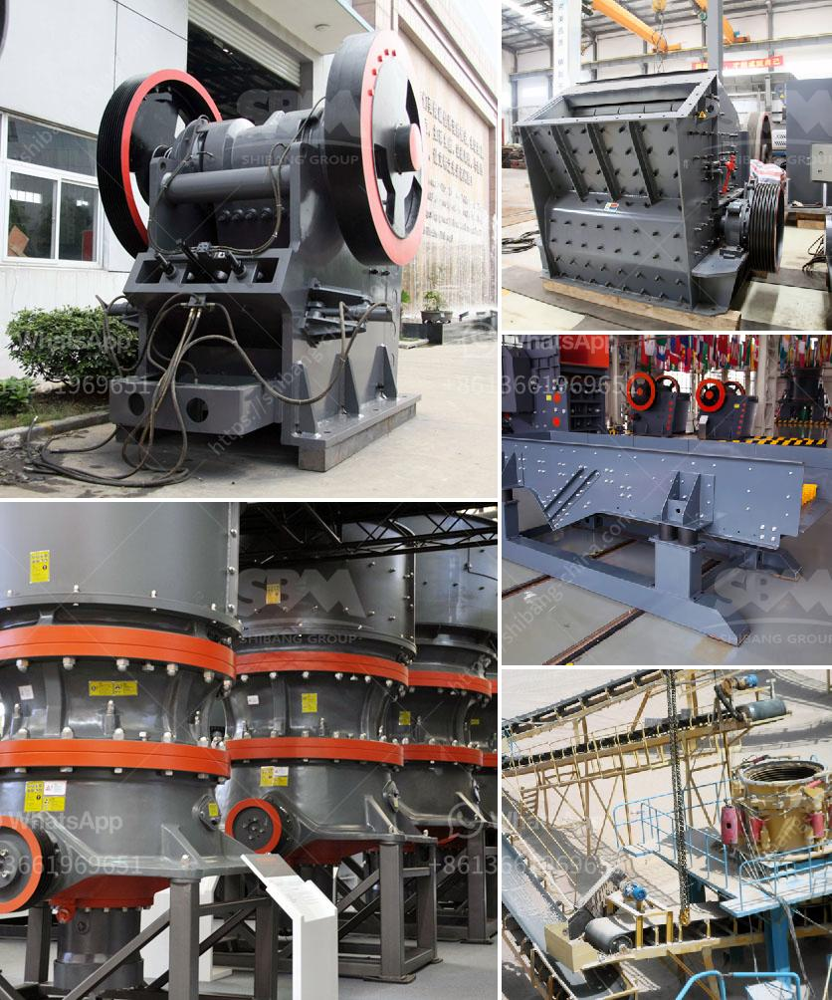

<h3>تكلفة آلات الحديد الاسفنجي 300 طن في اليوم</h3>
تعتبر آلات الحديد الإسفنجي من أهم الأدوات التي تستخدم في صناعة الحديد. توفر هذه الآلات تحويل الحديد الخام إلى حديد قوي ومتين يمكن استخدامه في العديد من التطبيقات الصناعية. ولكن مع تعقيد وتقنية هذا النوع من الآلات، فإنه يتطلب استثماراً هائلاً لتصنيعه وشرائه. سنتطرق في هذه المقالة إلى تكلفة آلات الحديد الإسفنجي التي تستخدم في إنتاج 300 طن من الحديد في اليوم.

تكلفة هذه الآلات تختلف تبعاً للعديد من العوامل، بما في ذلك الحجم والمواصفات المطلوبة والسوق العالمي للمعدات وكذلك تقنيات التصنيع المستخدمة. ولكن عموماً، يمكن تقدير تكلفة آلات الحديد الإسفنجي بين 200 إلى 400 دولار للطن الواحد من الحديد المنتج. بالتالي، إذا كنا نرغب في إنتاج 300 طن من الحديد في اليوم، فسيبلغ تكلفة الآلات حوالي 60,000-120,000 دولار في اليوم.

وصرف القليل من الوقت والجهد في البحث عن أفضل العروض والجودة الممتازة للآلات سيكون له تأثير كبير على تكلفة الاستثمار. يجب النظر في عوامل مثل الموثوقية والكفاءة والتكنولوجيا المستخدمة في الآلات. قد تجد أنه بالدفع للحصول على جهاز أغلى قليلاً في البداية، يمكن أن يؤدي ذلك إلى توفير تكاليف التشغيل والصيانة على المدى الطويل.

كما يجب مراعاة التكاليف الأخرى المتعلقة بآلات الحديد الإسفنجي. على سبيل المثال، قد تحتاج إلى استئجار مساحة كبيرة للمعدات وتخزين المواد الخام والإنتاج النهائي. قد تحتاج أيضاً إلى توظيف فريق من العمل المهرة لتشغيل وصيانة الآلات.

بالإضافة إلى ذلك، يجب النظر في تكاليف المواد الخام المستخدمة في عملية تصنيع الحديد الإسفنجي. يتطلب العملية استخدام خامات حديدية مثل خام الحديد، الكوك، والحجر الجيري. وتكلفة هذه المواد الخام قد تؤثر أيضاً على التكلفة الإجمالية لانتاج الحديد.

باختصار، يتطلب إنتاج 300 طن من الحديد الإسفنجي في اليوم آلات تكلف بين 60,000 إلى 120,000 دولار في اليوم. يجب دراسة السوق والعروض المتاحة والتفكير في عوامل مثل الموثوقية والكفاءة وتكاليف التشغيل والصيانة وتكاليف المواد الخام المستخدمة لتحقيق أفضل النتائج والعائد على الاستثمار.
<h3>Contact us</h3><ul><li><strong>Whatsapp:&nbsp;<a href="https://wa.me/8613661969651">+8613661969651</a></strong></li><li><a href="https://swt.shibang-china.com/?git&amp;zhl&amp;تكلفة آلات الحديد الاسفنجي 300 طن في اليوم"><strong>Online Service(chat now)</strong></a></li></ul><h3>Related</h3><ul><li><a href='مطحنة صخرة الرخام.md'>مطحنة صخرة الرخام</a></li><li><a href='مصنع كسارة للبيع في المملكة العربية السعودية.md'>مصنع كسارة للبيع في المملكة العربية السعودية</a></li><li><a href='كسارة الحجر في هيماتشال براديش.md'>كسارة الحجر في هيماتشال براديش</a></li><li><a href='التدفق النموذجي لمحجر الجرانيت.md'>التدفق النموذجي لمحجر الجرانيت</a></li><li><a href='مطحنة الأسطوانة الرأسية.md'>مطحنة الأسطوانة الرأسية</a></li></ul>