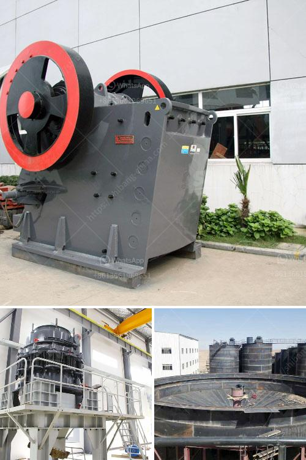

<h3>تكلفة آلة الطحن</h3>
تعتبر آلة الطحن أحد الأدوات المهمة في عملية تحضير الأغذية، سواء في المنازل أو المطاعم أو المصانع. وتتفاوت تكلفة آلة الطحن بناءً على العديد من العوامل، مثل حجم الآلة وعلامة التجارية ومستوى الجودة.

في البداية، يجب أن نعرف أن هناك عدة أنواع من آلات الطحن، مثل آلة طحن الحبوب وآلة طحن القهوة وآلة طحن التوابل. وقد تختلف تكلفة الآلة بناءً على النوع والاستخدام المطلوب منها.

تتراوح تكلفة آلة الطحن بين 200-400 دولار. يمكن للأشخاص ذوي الدخل المحدود العثور على آلات طحن بسعر منخفض تتراوح حوالي 200 دولار، وهذه الآلات عادة ما تكون صغيرة الحجم وتستخدم في المنازل لطحن القهوة أو البهارات.

ومع ذلك، إذا كنت تبحث عن آلة طحن أكبر الحجم وذات جودة عالية للاستخدام التجاري أو الصناعي، فيمكن أن تجد آلات في نطاق 400 دولار. وتحتوي هذه الآلات على محركات أقوى وشفرات أكثر صلابة، مما يجعلها قادرة على طحن كميات كبيرة من الحبوب أو البهارات بشكل فعال.

يجب أن يتوافق سعر آلة الطحن مع جودتها وأدائها المتوقع. فعند شراء آلة الطحن، يجب أن تأخذ في الاعتبار الدقة والسرعة والمتانة وسهولة الصيانة.

ينصح بشراء آلة الطحن ذات الجودة العالية حتى تحصل على أداء أفضل وتستدام لفترة أطول. إذ نجد أن آلات الطحن ذات الأسعار المنخفضة قد تتعطل بسهولة وليس لها قدرة على طحن الأغذية بشكل جيد.

باختصار، تختلف تكلفة آلة الطحن بناءً على النوع والحجم والاستخدام المطلوب. وعلى الرغم من وجود آلات طحن بأسعار منخفضة، إلا أن الجودة والأداء يجب أن تكون في اعتبارك الأول. إذا كنت تهتم بجودة الطحن والاستدامة، فيجب أن تختار آلة طحن ذات سعر أعلى لتلبية احتياجاتك وتحقيق أفضل نتائج.
<h3>Contact us</h3><ul><li><strong>Whatsapp:&nbsp;<a href="https://wa.me/8613661969651">+8613661969651</a></strong></li><li><a href="https://swt.shibang-china.com/?git&amp;zhl&amp;تكلفة آلة الطحن"><strong>Online Service(chat now)</strong></a></li></ul><h3>Related</h3><ul><li><a href='سعر آلة كسارة الحجر العملاقة.md'>سعر آلة كسارة الحجر العملاقة</a></li><li><a href='بيع كسارة مخروط قديمة.md'>بيع كسارة مخروط قديمة</a></li><li><a href='موردين مطحنة الأسطوانة الرأسية.md'>موردين مطحنة الأسطوانة الرأسية</a></li><li><a href='مصنع مسحوق لوح الجبس في إثيوبيا.md'>مصنع مسحوق لوح الجبس في إثيوبيا</a></li><li><a href='إنتاج مصنع الطحن للأسمنت.md'>إنتاج مصنع الطحن للأسمنت</a></li></ul>