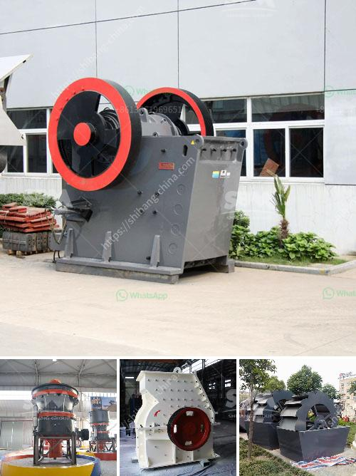

<h3>تكلفة آلة الكسارة</h3>
تعد آلة الكسارة من الآلات الهامة في صناعة البناء والتعدين، وتستخدم لكسر وطحن المواد الخام مثل الحجارة والصخور والمعادن. توجد العديد من أنواع الكسارات المختلفة، وكل نوع يختلف في وظائفه وأدائه وتكنولوجيته، مما يؤثر على تكلفتها.

عندما نتحدث عن تكلفة آلة الكسارة، يجب أن نأخذ في الاعتبار عدة عوامل. أولاً، يجب أن ننظر إلى تكلفة الشراء الأساسية للكسارة نفسها. قد تتراوح تلك التكلفة بين 200 إلى 400 ألف دولار، وذلك يعتمد على حجم الكسارة ونوعها. يمكن أن تكون الكسارات صغيرة الحجم ومحمولة أو كبيرة الحجم وثابتة، مما يؤثر على سعرها.

ثم يجب أن نأخذ في الاعتبار أيضًا تكلفة التشغيل والصيانة للكسارة. يتضمن ذلك تكلفة الطاقة الكهربائية المستهلكة لتشغيل الكسارة وتشغيلها بشكل صحيح. كما يتطلب استخدام الكسارة تشغيلها بواسطة عمال مدربين، الذين يحتاجون إلى دورات تدريبية ورواتبهم ستكون جزءًا من تكلفة التشغيل.

بالإضافة إلى ذلك، يجب أن نأخذ في الاعتبار تكلفة قطع الغيار والصيانة الدورية للكسارة. ففي حالة حدوث أعطال أو تلف في الكسارة، يجب استبدال الأجزاء المعطوبة أو إجراء عمليات صيانة تحتاج إلى تكلفة. قد تختلف تلك التكاليف بناءً على نوع الكسارة وتقنيتها وقوة المواد المستخدمة في صناعتها.

علاوة على ذلك، يجب أن نأخذ في الاعتبار تكلفة النقل والتركيب للكسارة في موقع العمل. فقد يتطلب نقل الكسارة استخدام شاحنات خاصة أو رافعات ثقيلة، وهو ما قد يرتبط بتكاليف أضافية. كما يحتاج تركيب الكسارة إلى خبرة وأدوات خاصة، وهذا قد يؤثر على تكلفة التثبيت.

بشكل عام، فإن تكلفة آلة الكسارة تختلف بناءً على العديد من العوامل المذكورة أعلاه. قد يكون سعر الشراء للكسارة نفسها عاليًا، ولكن يجب أن ننظر أيضًا إلى تكاليف التشغيل والصيانة والنقل والتركيب. يجب على الشركات أن تحسب تلك التكاليف بعناية قبل اتخاذ قرار بشراء آلة الكسارة وتثبيتها، ويمكنها الاستعانة بالمتخصصين والموردين للحصول على مزيد من المعلومات حول التكاليف المتوقعة.
<h3>Contact us</h3><ul><li><strong>Whatsapp:&nbsp;<a href="https://wa.me/8613661969651">+8613661969651</a></strong></li><li><a href="https://swt.shibang-china.com/?git&amp;zhl&amp;تكلفة آلة الكسارة"><strong>Online Service(chat now)</strong></a></li></ul><h3>Related</h3><ul><li><a href='كسارات متنقلة في أبوجا.md'>كسارات متنقلة في أبوجا</a></li><li><a href='مصنع إسمنت مربح للبيع في تاميل نادو.md'>مصنع إسمنت مربح للبيع في تاميل نادو</a></li><li><a href='كسارة تأثير صغيرة بشبكة 100.md'>كسارة تأثير صغيرة بشبكة 100</a></li><li><a href='معالجة الذهب بنطاق صغير باستخدام طريقة CIP.md'>معالجة الذهب بنطاق صغير باستخدام طريقة CIP</a></li><li><a href='شركات تصنيع أحزمة الناقل في بنغلاديش.md'>شركات تصنيع أحزمة الناقل في بنغلاديش</a></li></ul>