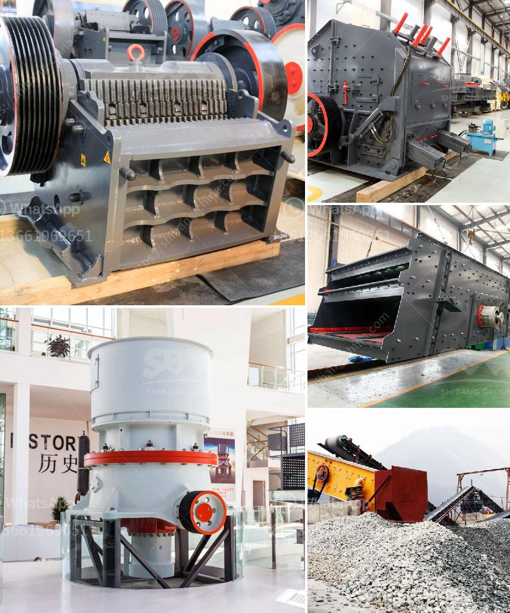

<h3>تكلفة آلة سحق الحجر كسارة الحجر</h3>
تعتبر آلة سحق الحجر (كسارة الحجر) من المعدات الأساسية في صناعة البناء والتعدين. تهدف هذه الآلة إلى سحق وتحويل الحجارة الكبيرة إلى قطع صغيرة مناسبة للاستخدام في بناء المباني والطرق والجسور والسكك الحديدية والمزيد. تعد تكلفة آلة سحق الحجر عاملاً مهمًا عندما يتعلق الأمر بشراء هذه الآلة.

تتفاوت تكلفة آلة سحق الحجر بناءً على العديد من العوامل المختلفة. من بين هذه العوامل: حجم الماكينة، سعة الإنتاج، نوع الحجر المراد سحقه، المواصفات الفنية، المبرمجة والعوامل الأخرى. 

أحد العوامل الرئيسية التي تؤثر في تكلفة آلة سحق الحجر هو حجم الماكينة. تعتمد حجم الآلة على سعة الإنتاج المطلوبة وأبعاد الحجر المراد سحقه. كلما كانت السعة أكبر والحجم أكبر، كلما زادت تكلفة الآلة. يجب على المشتري أن يحدد بدقة سعة الإنتاج المطلوبة وأبعاد الحجر قبل اتخاذ القرار بشأن شراء هذه الآلة.

نوع الحجر المراد سحقه أيضًا يؤثر في تكلفة الآلة. يتطلب سحق بعض الحجارة الصلبة المزيد من القوة والطاقة، وبالتالي قد تكون آلة أكبر حجمًا وتكلفة أعلى. بينما بعض الحجارة الناعمة لا تتطلب قدرًا كبيرًا من القوة، ويمكن استخدام آلات أصغر حجمًا وبالتالي تكلفة أقل.

بالإضافة إلى ذلك، تكلفة آلة سحق الحجر تعتمد أيضًا على المواصفات الفنية للآلة. قد تحتوي بعض الآلات على ميزات خاصة مثل الشاشة الاهتزازية والناقل اللولبي وأنظمة التحكم الأوتوماتيكية، مما يجعلها أكثر تكلفة. بينما قد تكون الآلات البسيطة تكلف أقل.

بناءً على جميع هذه العوامل المختلفة، لا يوجد سعر ثابت لآلة سحق الحجر. ومع ذلك، فإن الآلات الصغيرة ذات السعة الصغيرة عادةً ما تكلف حوالي 10،000 إلى 50،000 دولارًا، بينما تصل تكلفة الآلات الكبيرة ذات السعة العالية إلى مئات الآلاف من الدولارات.

يرجى ملاحظة أن هذه التكاليف هي تقديرية فقط ويجب على المشتري أن يتصل بالشركة المصنعة ويحصل على اقتباس دقيق قبل اتخاذ قرار الشراء.

اختيار آلة سحق الحجر المناسبة لاحتياجاتك يمكن أن يوفر لك الكثير من المال على المدى الطويل. يجب على المشتري أخذ جميع العوامل المذكورة في الاعتبار عند اتخاذ القرار بشأن شراء آلة سحق الحجر. من الأفضل أن يتم الاستشارة مع مهندسين متخصصين في هذا المجال للحصول على المشورة المناسبة.
<h3>Contact us</h3><ul><li><strong>Whatsapp:&nbsp;<a href="https://wa.me/8613661969651">+8613661969651</a></strong></li><li><a href="https://swt.shibang-china.com/?git&amp;zhl&amp;تكلفة آلة سحق الحجر كسارة الحجر"><strong>Online Service(chat now)</strong></a></li></ul><h3>Related</h3><ul><li><a href='مطاحن للبيع في هراري.md'>مطاحن للبيع في هراري</a></li><li><a href='طاحونة الكرة الرطبة في الصين.md'>طاحونة الكرة الرطبة في الصين</a></li><li><a href='إنتاج خام الحديد حسب الولاية في الهند.md'>إنتاج خام الحديد حسب الولاية في الهند</a></li><li><a href='كسارة كونيكا في إثيوبيا.md'>كسارة كونيكا في إثيوبيا</a></li><li><a href='مصنع كسارة الحجر بسعة 100 طن.md'>مصنع كسارة الحجر بسعة 100 طن</a></li></ul>