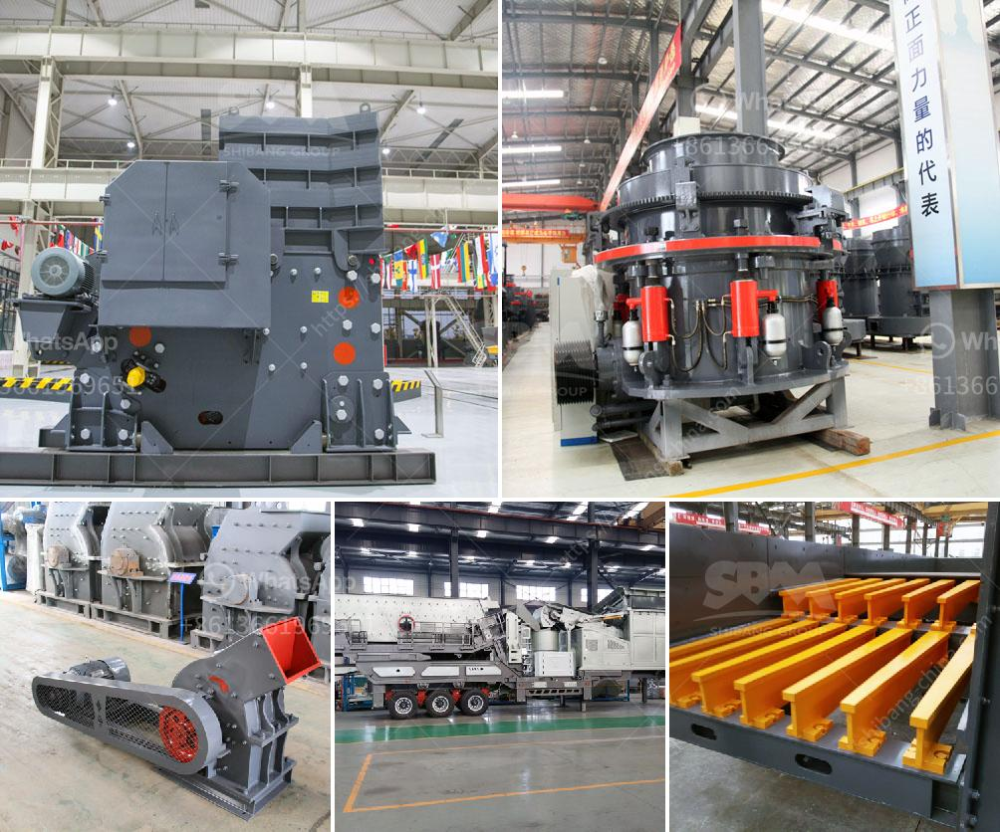

<h3>تكلفة آلة طحن الرمال السيليكا</h3>
تتعدد استخدامات الرمال السيليكا في العديد من الصناعات، مثل الزجاج، والصباغة، والإلكترونيات، والمواد الكيميائية، والبناء، والمعادن، وغيرها. ولذلك، فإن الحاجة إلى آلات طحن الرمال السيليكا مرتفعة بين كل هذه الصناعات المختلفة.

تعتبر آلة طحن الرمال السيليكا من الأجهزة اللازمة في عملية تحضير الرمال السيليكا المستخدمة في تلك الصناعات. تستخدم الآلات المختلفة لطحن الرمال السيليكا في إزالة الشوائب منها وتفتيتها إلى حجم الحبيبات المطلوب. 

تنوعت أحجام آلات طحن الرمال السيليكا بشكل كبير بما يتناسب مع متطلبات الصناعة المختلفة. تتراوح تكلفة آلة طحن الرمال السيليكا من 200 إلى 400 دولار، وذلك بحسب حجمها وقدرتها الإنتاجية. فمثلاً، يمكن العثور على آلات طحن الرمال السيليكا في الحجم الصغير بتكلفة حوالي 200 دولار، وتكون قادرة على طحن كميات صغيرة من الرمال.

أما بالنسبة للآلات ذات الحجم الأكبر وقدرة إنتاجية أكبر، فقد تصل تكلفتها إلى 400 دولار أو أكثر. هذه الآلات عادة ما تكون مزودة بمحركات قوية وميكانيزم يساعد في تحسين عملية الطحن وتنقية الرمال السيليكا.

تحديد التكلفة الدقيقة لآلة طحن الرمال السيليكا يعتمد على العوامل المذكورة، بالإضافة إلى أي ميزات إضافية قد تكون موجودة في الآلة. بعض الآلات قد تأتي مع شاشة لفصل الحجم بعد الطحن، أو مع مروحة للتهوية وإزالة الغازات الضارة، أو مع جهاز تنظيف لتسهيل عملية صيانتها.

بصفة عامة، يرغب المستخدمون في شراء آلة طحن الرمال السيليكا بأفضل جودة وبأقل تكلفة ممكنة. لذلك، ينصح بالبحث ومقارنة الأسعار والمواصفات المختلفة المتوفرة في السوق لضمان اختيار الآلة المناسبة وفقاً لاحتياجات الإنتاج المحددة.

باختصار، تتعدد تكلفة آلة طحن الرمال السيليكا باتساع، وتتأثر بمجموعة من العوامل مثل الحجم، والقدرة الإنتاجية، والميزات الإضافية الموجودة في الجهاز. ينصح بعمل دراسة جيدة للسوق قبل شراء هذه الآلات لتحقيق أفضل قدر من الأداء والجودة بأقل تكلفة ممكنة.
<h3>Contact us</h3><ul><li><strong>Whatsapp:&nbsp;<a href="https://wa.me/8613661969651">+8613661969651</a></strong></li><li><a href="https://swt.shibang-china.com/?git&amp;zhl&amp;تكلفة آلة طحن الرمال السيليكا"><strong>Online Service(chat now)</strong></a></li></ul><h3>Related</h3><ul><li><a href='مصنع غسيل رمل الميكا.md'>مصنع غسيل رمل الميكا</a></li><li><a href='كسارات محمولة في السعودية.md'>كسارات محمولة في السعودية</a></li><li><a href='كم تكلفة بناء مصنع الأسمنت بسعة 100 طن.md'>كم تكلفة بناء مصنع الأسمنت بسعة 100 طن</a></li><li><a href='مصانع الكسارات الصينية.md'>مصانع الكسارات الصينية</a></li><li><a href='إنتاج مطحنة الأسمنت في أفريقيا.md'>إنتاج مطحنة الأسمنت في أفريقيا</a></li></ul>