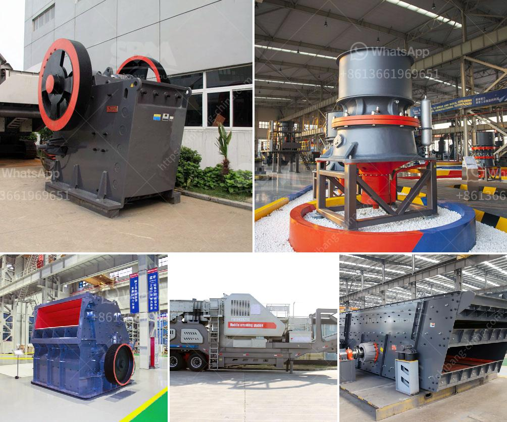

<h3>تكلفة آلة معالجة الفلدسبار</h3>
تعتبر آلة معالجة الفلدسبار من الآلات المهمة في صناعة الأحجار الكريمة والسيراميك والزجاج. يتم استخدام الفلدسبار كخام رئيسي في تصنيع هذه المنتجات، ولذلك فإن تكلفة آلة معالجة الفلدسبار مهمة للغاية.

تتفاوت تكلفة آلة معالجة الفلدسبار بناءً على عدة عوامل. تشمل هذه العوامل حجم الآلة، وقدرتها الإنتاجية، وتقنية المعالجة المستخدمة، وملحقات الآلة الأخرى المطلوبة. 

يبلغ متوسط تكلفة آلة معالجة الفلدسبار من 200 إلى 400 ألف دولار. ولكن يجب ملاحظة أن هذه الأرقام قابلة للتغيير بناءً على احتياجات ومتطلبات العميل، والشركة المصنعة للآلة.

تتوفر العديد من التقنيات الحديثة في آلات معالجة الفلدسبار. تشمل هذه التقنيات الطحن، والتجفيف، والفصل المغناطيسي. قد تحتاج بعض الآلات إلى تكوينات معقدة ومتقدمة لتحقيق جودة المنتج المطلوبة.

بالإضافة إلى تكلفة الآلة، يجب أيضًا مراعاة تكلفة الصيانة والتشغيل المستمرة للآلة. يتطلب تشغيل آلات معالجة الفلدسبار الصيانة الدورية لضمان أداء مستمر وفعال. قد تشمل تكلفة الصيانة قطع الغيار والمواد الاستهلاكية والأجور الفنية. 

بالنظر إلى العوامل المذكورة أعلاه، يجب أن يقوم العملاء بإجراء دراسة تكلفة متأنية قبل شراء آلة معالجة الفلدسبار. يجب مراعاة حجم الإنتاج المستهدف والجودة المطلوبة وقدرات الاستثمار للتحقق من أن تكلفة الآلة معقولة ومستدامة في المدى الطويل.

باختصار، تتراوح تكلفة آلة معالجة الفلدسبار من 200 إلى 400 ألف دولار. تختلف التكلفة حسب الحجم والقدرة والتقنية المستخدمة. يجب على العملاء دراسة التكلفة المتوقعة ومتطلباتهم قبل اتخاذ قرار الشراء. كما يجب مراعاة تكلفة الصيانة والتشغيل المستمرة للآلة.
<h3>Contact us</h3><ul><li><strong>Whatsapp:&nbsp;<a href="https://wa.me/8613661969651">+8613661969651</a></strong></li><li><a href="https://swt.shibang-china.com/?git&amp;zhl&amp;تكلفة آلة معالجة الفلدسبار"><strong>Online Service(chat now)</strong></a></li></ul><h3>Related</h3><ul><li><a href='سعر كسارة الحجر pe 600 900.md'>سعر كسارة الحجر pe 600 900</a></li><li><a href='كسارة الحجر بوزولانا 100 طن في الساعة.md'>كسارة الحجر بوزولانا 100 طن في الساعة</a></li><li><a href='مورد معدات كسارة الفك.md'>مورد معدات كسارة الفك</a></li><li><a href='آلات وتجهيزات تسمين الجير.md'>آلات وتجهيزات تسمين الجير</a></li><li><a href='مصانع التعدين في مصر.md'>مصانع التعدين في مصر</a></li></ul>