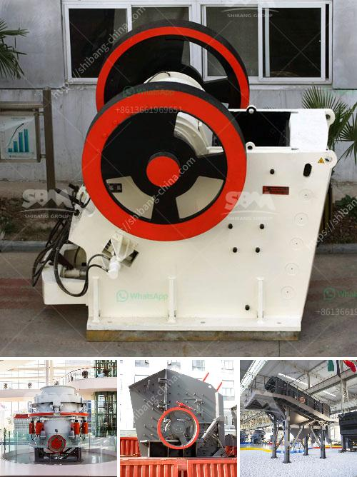

<h3>تكلفة أعمال المحجر في الهند</h3>
تعتبر صناعة المحاجر من القطاعات الهامة في الهند، حيث توفر فرص عمل للكثير من السكان المحليين وتسهم في تعزيز الاقتصاد المحلي. ومع ذلك، فإنها تواجه تحديات عديدة بما في ذلك تكلفة أعمال المحجر.

تعتبر التكلفة الرأسمالية لإنشاء وتشغيل المحاجر من أعلى التكاليف في هذه الصناعة. فعادة ما يكون لبناء محجر نفسه تكلفة باهظة تتطلب استثمارات كبيرة في الأراضي والمعدات والآلات وتدريب العمال. وتستمر هذه التكاليف في الازدياد نتيجة ارتفاع أسعار الأراضي وتكاليف المعدات والوقود.

وبالإضافة إلى ذلك، فإن تكاليف التشغيل اليومية للمحجر، مثل تكاليف الكهرباء والماء والوقود والأجور العمالية، تعتبر عبئاً مالياً آخر. فعلى سبيل المثال، يتطلب تشغيل المعدات الثقيلة طاقة كهربائية كبيرة ويستهلك الإنتاج المستمر كميات هائلة من الماء. ومع ارتفاع أسعار الوقود، فإن تكاليف الوقود تشمل جزءًا كبيرًا من تكلفة الإنتاج.

علاوة على ذلك، هناك أيضًا تكاليف قانونية وبيئية ترتبط بأعمال المحجر. فقد تتطلب المحاجر الامتثال للتشريعات واللوائح البيئية المحلية والدولية، مما يتطلب موارد مالية وبشرية إضافية. وقد يجب على المشغلين دفع غرامات إذا لم يلتزموا بالتشريعات البيئية أو إجراءات ترميم المناظر الطبيعية بعد انتهاء فترة التشغيل.

بالإضافة إلى ذلك، يتعين على المحاجر أن تواجه تحديات تتعلق بتخزين النفايات وإعادة التأهيل. فتحتاج إلى تخزين النفايات بطرق بيئية مستدامة وإعادة تأهيل المناطق التي تم استخراج المواد منها. هذه التكاليف ليست فقط مالية، ولكنها تتطلب أيضاً معرفة تقنية وخبرة.

بالختام، يمكن القول إن تكلفة أعمال المحجر في الهند تتأثر بالعديد من العوامل، منها تكلفة الاستثمار الأولي وتكلفة التشغيل اليومية وتكاليف الامتثال للتشريعات القانونية والبيئية. وعلى الرغم من هذه التحديات، فإن هذه الصناعة لا تزال مهمة للاقتصاد الهندي وتعزز التنمية المحلية وتوفر فرص عمل للمجتمعات المحلية.
<h3>Contact us</h3><ul><li><strong>Whatsapp:&nbsp;<a href="https://wa.me/8613661969651">+8613661969651</a></strong></li><li><a href="https://swt.shibang-china.com/?git&amp;zhl&amp;تكلفة أعمال المحجر في الهند"><strong>Online Service(chat now)</strong></a></li></ul><h3>Related</h3><ul><li><a href='كسارة مخروطية الصين.md'>كسارة مخروطية الصين</a></li><li><a href='قائمة أسعار كسارات الفك.md'>قائمة أسعار كسارات الفك</a></li><li><a href='مطاحن الطحن للبيع في باكستان.md'>مطاحن الطحن للبيع في باكستان</a></li><li><a href='آلة كسارة محمولة.md'>آلة كسارة محمولة</a></li><li><a href='كسارة مخروط في أمريكا.md'>كسارة مخروط في أمريكا</a></li></ul>