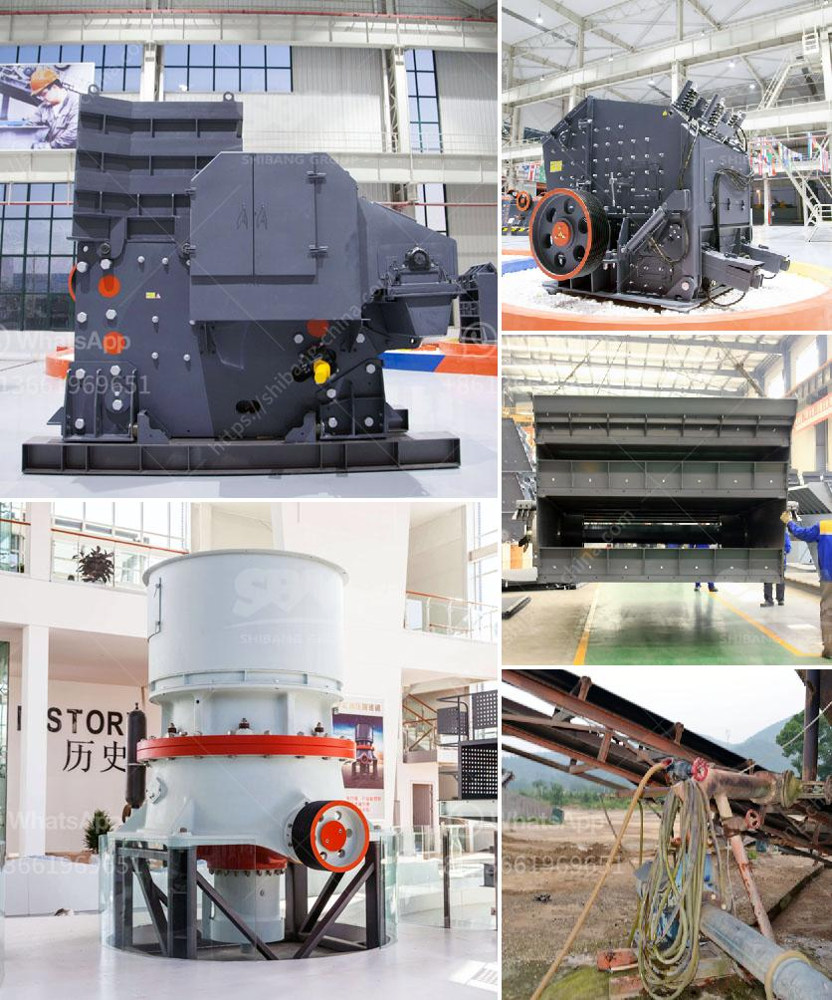

<h3>تكلفة أنظمة حزام النقل للتعدين</h3>
تعتبر أنظمة حزام النقل من الوسائل الشائعة والمهمة في صناعة التعدين، حيث تستخدم لنقل المواد والمنتجات الثقيلة والكتل الصلبة عبر مسافات طويلة. يعتبر حزام النقل إحدى التقنيات التي تعتمد على الجاذبية والانزلاق لنقل المواد، حيث يعتمد على حركة الحزام المستمرة لنقل الكتل الثقيلة.

تتفاوت تكلفة أنظمة حزام النقل للتعدين بين 200-400 كلمة ويتأثر ذلك بعدة عوامل، بما في ذلك:

1- طول الحزام: كلما زاد طول الحزام، زادت تكلفته. فعلى سبيل المثال، يتطلب تركيب حزام نقل طوله 1 كيلومتر تكلفة أكبر من حزام نقل طوله 100 متر.

2- قوة التحميل: تختلف تكلفة الحزام وفقًا لقدرته على تحمل الحمولة. كلما زادت قدرة التحميل المطلوبة، زادت تكلفة تصميم وتركيب الحزام.

3- الخامات المستخدمة: يعتمد تكلفة أنظمة حزام النقل أيضًا على نوعية المواد التي تستخدم في صناعته. فحزام النقل المصنوع من المطاط يكون أكثر تكلفة من حزام النقل المصنوع من النايلون.

4- التركيب والصيانة: يجب أن يؤخذ في الاعتبار تكلفة تركيب حزام النقل والتدقيق الدوري لصيانته لضمان عمله السليم. تلك التكاليف يمكن أن تشمل التصميم الهندسي، والعمالة، واستبدال الأجزاء التالفة، والمستلزمات الأخرى.

5- الاعتبارات البيئية: قد يتطلب تركيب أنظمة حزام النقل للتعدين تدابير خاصة لحماية البيئة، مثل استخدام أنظمة تعدين أقل ضوضاء أو تقليل تأثيرها البيئي بما يتوافق مع المعايير البيئية.

باختصار، يتفاوت سعر أنظمة حزام النقل للتعدين وفقًا للمتطلبات الفردية والعوامل المذكورة أعلاه. من الجدير بالذكر أن تكلفة الاستثمار الأولية لتكنولوجيا حزام النقل تعتبر مرتفعة، ولكنها في المقابل تعتبر استثمارًا عائدًا على المدى الطويل نظرًا لكفاءتها العالية واستخدامها الواسع في صناعة التعدين ونقل المواد ذات الوزن الثقيل.
<h3>Contact us</h3><ul><li><strong>Whatsapp:&nbsp;<a href="https://wa.me/8613661969651">+8613661969651</a></strong></li><li><a href="https://swt.shibang-china.com/?git&amp;zhl&amp;تكلفة أنظمة حزام النقل للتعدين"><strong>Online Service(chat now)</strong></a></li></ul><h3>Related</h3><ul><li><a href='أسعار آلات المحجر.md'>أسعار آلات المحجر</a></li><li><a href='شركة كسارة في دبي.md'>شركة كسارة في دبي</a></li><li><a href='استيراد كسارة الفك الصين في باكستان.md'>استيراد كسارة الفك الصين في باكستان</a></li><li><a href='مصنع لوحات الجبس الجديد في الهند.md'>مصنع لوحات الجبس الجديد في الهند</a></li><li><a href='طاحونة الحجر إلى النانوجسيمات.md'>طاحونة الحجر إلى النانوجسيمات</a></li></ul>