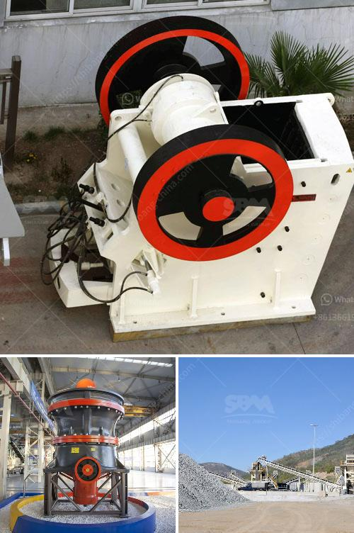

<h3>تكلفة إعداد مصنع طحن الكلنكر في الهند</h3>
تُعتبر صناعة الأسمنت من الصناعات الحيوية التي تلبي احتياجات العديد من القطاعات الأخرى في الاقتصاد، والتي لا يمكن الاستغناء عنها في البناء والتشييد. تعد الهند واحدة من أكبر مُصنعي الأسمنت في العالم، مما يعزز أهمية إعداد مصانع جديدة لطحن الكلنكر في هذا البلد النامي والمتقدم في نفس الوقت.

تكلفة إعداد مصنع طحن الكلنكر في الهند تتفاوت بشكل كبير وتعتمد على عدة عوامل. في العادة، يُعد تحديد المكان أمرًا بالغ الأهمية، فالانتقال من منطقة إلى أخرى يُمكن أن يؤثر بشكل كبير على التكلفة. علاوة على ذلك، تتأثر التكلفة أيضًا بالأبعاد والقدرة الإنتاجية المرغوبة للمصنع، فكلما ازدادت القدرة الإنتاجية، زادت التكلفة. بالإضافة إلى ذلك، يتعين أخذ مصدر التمويل المحتمل في الاعتبار، حيث يمكن الحصول على التمويل من البنك أو الاستثمار الخاص، وذلك قد يؤثر على التكلفة الإجمالية.

عندما يتعلق الأمر بإعداد مصنع طحن الكلنكر، فإن الهند تقدم العديد من المزايا. تعتبر الهند مصدرًا رئيسيًا للكلنكر والمواد الخام اللازمة لصناعة الأسمنت، مما يدعم استدامة العملية الإنتاجية للمصنع ويقلل من تكاليف الشحن. بالإضافة إلى ذلك، تتوفر في الهند العمالة ذات الكفاءة العالية وبتكلفة منخفضة مقارنةً بالدول الأخرى، مما يقلل من تكاليف العمالة ويساهم في تحقيق الكفاءة الاقتصادية.

علاوة على ذلك، يُمكن لإعداد مصنع طحن الكلنكر في الهند توفير فوائد اقتصادية هامة. من بين هذه الفوائد، يمكن أن تتيح استغلال الطاقة الكهربائية بشكل أكبر وبتكلفة أقل، نظرًا لانخفاض تكلفة الكهرباء في الهند مقارنةً بالعديد من الدول الأخرى. كما يمكن لهذا النشاط الاقتصادي أن يسهم في تشغيل العديد من العاملين المحليين، مما يُحفز النمو الاجتماعي ويقلل من معدلات البطالة.

لكن يجب أن يتوخى المستثمرون الحذر وأن يقوموا بدراسة جدوى دقيقة لإعداد مصنع طحن الكلنكر في الهند قبل اتخاذ أي قرار. يجب على المستثمرين أن ينظروا في طلب الحصول على الموافقات الرسمية والتراخيص، وأن يحددوا الحالة القانونية والتشغيلية للمنطقة التي يرغبون في إنشاء المصنع فيها. ينبغي أيضًا أن يأخذوا في الاعتبار الاتجاهات الاقتصادية المستقبلية وتوقعات سوق الأسمنت، وذلك لضمان الاستفادة القصوى من الاستثمار.

في النهاية، إعداد مصنع طحن الكلنكر في الهند يمكن أن يكون فرصة جذابة للمستثمرين الذين يبحثون عن الاستفادة من النمو المتوقع في صناعة الأسمنت. يمكن أن توفر تكاليف الإعداد والفوائد الاقتصادية المحتملة دعمًا قويًا لذلك الاستثمار، ويُمكن للهند أن تشهد تنمية اقتصادية كبيرة من خلال إنشاء المصانع وتوفير فرص عمل للسكان المحليين.
<h3>Contact us</h3><ul><li><strong>Whatsapp:&nbsp;<a href="https://wa.me/8613661969651">+8613661969651</a></strong></li><li><a href="https://swt.shibang-china.com/?git&amp;zhl&amp;تكلفة إعداد مصنع طحن الكلنكر في الهند"><strong>Online Service(chat now)</strong></a></li></ul><h3>Related</h3><ul><li><a href='كرات كربونات الكالسيوم.md'>كرات كربونات الكالسيوم</a></li><li><a href='محطات غسيل الذهب المحمولة.md'>محطات غسيل الذهب المحمولة</a></li><li><a href='مطحنة كرات صغيرة للبيع.md'>مطحنة كرات صغيرة للبيع</a></li><li><a href='مطحنة طحن الحجر من ألمانيا.md'>مطحنة طحن الحجر من ألمانيا</a></li><li><a href='مصنع معالجة الذهب المحمول مع السعر.md'>مصنع معالجة الذهب المحمول مع السعر</a></li></ul>