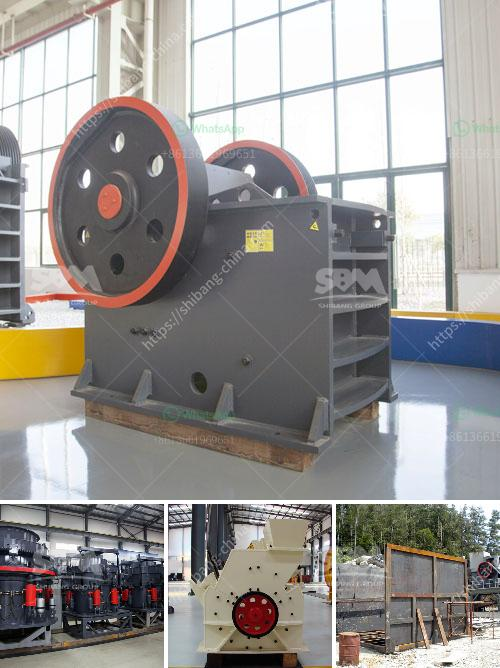

<h3>تكلفة إنشاء مصنع إنتاج الكاولين</h3>
يُعَدُّ الكاولين من الموارد الطبيعية الهامة التي يتم استخدامها في عدة صناعات، مثل صناعة الورق، ومعالجة البلاستيك، وتصنيع الطين. وبالتالي، فإن إنشاء مصنع لإنتاج الكاولين هو استثمار قيم جدًا.

تعتمد تكلفة إنشاء مصنع إنتاج الكاولين على عدة عوامل، بما في ذلك الطاقة الإنتاجية المرغوبة والتكنولوجيا المستخدمة في عملية الإنتاج، وموقع المصنع، والتكاليف المتعلقة بالبنية التحتية والتراخيص والشهادات، وأجور العمالة، وتكاليف المواد الخام، والتكاليف المرتبطة بالصيانة والإدارة.

من أهم المكونات التي تؤثر في تكلفة إنشاء المصنع هي التكنولوجيا المستخدمة. تحتاج صناعة الكاولين إلى عمليات معقدة لاستخلاص المعدن من الخامات الطبيعية وتنقيته. وبالتالي، فإن استخدام التكنولوجيا الحديثة التي تعتمد على معدات تكنولوجيا المعلومات والأتمتة يزيد كلفة الاستثمار. علاوة على ذلك، قد يلزم توظيف متخصصين ذوي خبرة في هذا المجال لتشغيل وصيانة المعدات المتطورة، مما يزيد من التكاليف العمالية.

بالإضافة إلى ذلك، تأتي تكلفة المواد الخام لاستخراج الكاولين أحد أهم العوامل المؤثرة في تكلفة إنشاء المصنع. يجب توفير مصدر موثوق ومستدام للخامات لضمان استمرارية سير الإنتاج. يجب أيضًا مراعاة تكلفة نقل الخامات من مناطق الاستخراج إلى المصنع، والتخزين المناسب للحفاظ على جودة الخامات.

لا يمكن التغاضي عن تأثير التكاليف الأخرى مثل التراخيص والشهادات اللازمة لتشغيل المصنع قانونيًا وتلبية معايير الجودة والبيئة والسلامة. علاوة على ذلك، قد يحتاج المصنع إلى بنية تحتية ملائمة مثل الأبنية والآلات والمعدات اللازمة للإنتاج والتخزين.

يجب أيضًا أخذ تكاليف الصيانة والإدارة في الاعتبار. تتطلب عمليات إنتاج الكاولين صيانة دورية للمعدات وتكاليف التشغيل والصيانة. بالإضافة إلى ذلك، يحتاج المصنع إلى فريق إداري متخصص لإدارة العمليات وضمان متابعة سير الإنتاج بكفاءة وجودة.

بالاعتماد على المعاملات المالية الحالية والتطلعات إلى السوق، يمكن تقدير تكلفة إنشاء مصنع إنتاج الكاولين بين 200 و 400 ألف دولار أمريكي. ولكن يجب ملاحظة أن هذه التكلفة هي تقدير عام وقد تختلف تبعًا للعوامل المحددة في كل حالة.

باختصار، يعد إنشاء مصنع لإنتاج الكاولين استثمارًا نوعيًا يعتمد على عدة عوامل. فإذا تم تنفيذه بشكل صحيح بناءً على دراسة تكلفة فعّالة، فإن الاستثمار في هذه الصناعة يمكن أن يكون مربحًا ويساهم في توفير المنتجات الضرورية لعدة صناعات.
<h3>Contact us</h3><ul><li><strong>Whatsapp:&nbsp;<a href="https://wa.me/8613661969651">+8613661969651</a></strong></li><li><a href="https://swt.shibang-china.com/?git&amp;zhl&amp;تكلفة إنشاء مصنع إنتاج الكاولين"><strong>Online Service(chat now)</strong></a></li></ul><h3>Related</h3><ul><li><a href='مصنعون لكسارات في أوروبا.md'>مصنعون لكسارات في أوروبا</a></li><li><a href='نماذج كسارات الحجر في ماليزيا.md'>نماذج كسارات الحجر في ماليزيا</a></li><li><a href='معدات تكسير خام الكروم المستخدمة.md'>معدات تكسير خام الكروم المستخدمة</a></li><li><a href='أسعار مطاحن الكرة الاسمنت.md'>أسعار مطاحن الكرة الاسمنت</a></li><li><a href='آلة ميكرونيزر الحجر الجيري مطحنة ميكرونيزر.md'>آلة ميكرونيزر الحجر الجيري مطحنة ميكرونيزر</a></li></ul>