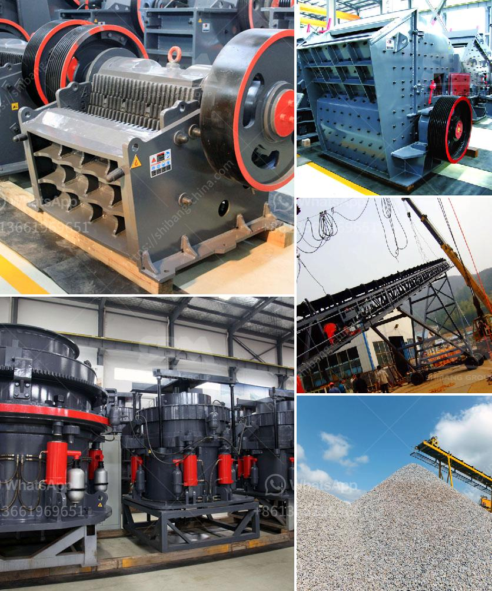

<h3>تكلفة إنشاء مصنع الأسمنت الصغير في الهند</h3>
يُعتبر قطاع الأسمنت من القطاعات الرئيسية في الهند ، والذي يهدف إلى تحقيق التنمية الاقتصادية وخلق فرص العمل للعديد من العمال المهرة وغير المهرة. إن إنشاء مصنع أسمنت صغير في الهند يعتبر استثمارًا مجديًا يمكن أن يكون له تأثير إيجابي كبير على الاقتصاد المحلي، ويساهم في توفير مصدر دخل مستدام.

تعتمد تكلفة إنشاء مصنع الأسمنت الصغير في الهند على عدد من العوامل. أحد هذه العوامل هو الحجم المقترح للمصنع. بالطبع ، يُعتبر مصنع أسمنت الصغير من المصانع الأقل تعقيدًا وتوفرًا للتكنولوجيا بالمقارنة مع المصانع الكبيرة. هذا يعني أنه يتطلب أقل استثمار مالي. ومع ذلك ، لا يزال هناك حاجة لاستبقاء رأس مال كافٍ لتبني آلات الإنتاج الأساسية وبنية المصنع.

تحتاج تكاليف إنشاء مصنع الأسمنت الصغير بين 200 و400 كلمة في الهند إلى تغطية العديد من العناصر. تشمل بعض هذه العناصر شراء الأرض وتأهيلها ، وتوفير الماء والطاقة اللازمة للإنتاج ، واقتناء الآلات والمعدات اللازمة لعملية الإنتاج ، وتأمين العمالة المهرة.

من الواضح أن تكلفة الأرض تختلف من منطقة إلى أخرى وفقًا للموقع والمساحة. يمكن أن تكلف توفير الماء والكهرباء والطاقة اللازمة أيضًا مبالغ مختلفة بناءً على الموقع وتكاليف الربط بالشبكة العامة.

تُعتبر التكاليف الرئيسية لمصنع الأسمنت الصغير في الهند هي آلات الإنتاج. تكلفة الآلات والمعدات يمكن أن تكون من أكبر المكونات التكلفة في هذا الاستثمار. وتشمل هذه التكاليف شراء آلة الطحن ومعدات المختبر وآلة تصنيع الأسمنت ومعدات التعبئة والتغليف وغيرها.

بالإضافة إلى ذلك، يجب أخذ في الاعتبار تكلفة توظيف وتدريب العمالة المهرة والغير مهرة، وتوريد المواد الأولية مثل الحجارة الجيرية والطين والحجر الجيري والطين الرطب والأملاح الذوابة.

وفي النهاية، لا يزال هناك تكاليف تشغيلية إضافية تتأتى من تطبيق القوانين البيئية والسلامة وشهادات الجودة.

باختصار، يمكن القول إن تكلفة إنشاء مصنع الأسمنت الصغير في الهند تتفاوت بناءً على عدة عوامل ، وتتراوح في العادة بين 200 إلى 400 كلمة. تشمل هذه التكاليف الأرض، والماء والكهرباء، والآلات والمعدات، والعمالة، وتكاليف المواد الأولية، والتكاليف التشغيلية الإضافية. يمكن أن يكون الاستثمار في مصنع الأسمنت الصغير مفيدًا للاقتصاد المحلي ويمكن أن يسهم في تنمية البنية التحتية وتوفير فرص عمل جديدة.
<h3>Contact us</h3><ul><li><strong>Whatsapp:&nbsp;<a href="https://wa.me/8613661969651">+8613661969651</a></strong></li><li><a href="https://swt.shibang-china.com/?git&amp;zhl&amp;تكلفة إنشاء مصنع الأسمنت الصغير في الهند"><strong>Online Service(chat now)</strong></a></li></ul><h3>Related</h3><ul><li><a href='مطحنة الكرة القديمة للبيع في الهند.md'>مطحنة الكرة القديمة للبيع في الهند</a></li><li><a href='كسارات VSI بسعة 25 طن في الساعة.md'>كسارات VSI بسعة 25 طن في الساعة</a></li><li><a href='طحن المطاحن الصناعية.md'>طحن المطاحن الصناعية</a></li><li><a href='تكلفة الحزام الناقل لكل متر.md'>تكلفة الحزام الناقل لكل متر</a></li><li><a href='سعر الشاشة الاهتزازية في الهند.md'>سعر الشاشة الاهتزازية في الهند</a></li></ul>