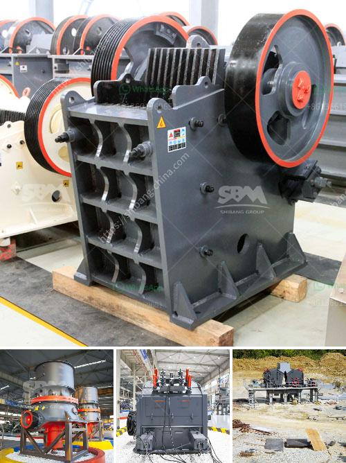

<h3>تكلفة إنشاء مصنع خام الحديد</h3>
إن إنشاء مصنع خام الحديد هو عملية معقدة تتطلب العديد من الأشياء المهمة، من توفير المواد اللازمة والمعدات اللازمة والعمال المهرة والتوجيه الفني الملائم. هذه العوامل وغيرها تؤثر بشكل كبير في تكلفة إنشاء مثل هذا المصنع.

أحد العوامل الرئيسية التي تؤثر على تكلفة إنشاء المصنع هو حجم المصنع المطلوب. مصنع خام الحديد يتضمن عادة مجموعة من المرافق مثل محطة التكسير والطحن وسلسلة من الأفران ومجموعة من المعدات الأخرى. تتوقف تكلفة هذه المرافق والمعدات على قدرتها وحجمها. ومع زيادة تكلفة المعدات والمرافق، سيزيد سعر بناء المصنع.

بجانب ذلك، تؤثر تكلفة المصنع أيضًا بشكل كبير على المواد اللازمة للإنشاء وصيانة المصنع، ومصادر توفر هذه المواد. مثلاً، قد يكون من الضروري توفير الحديد والصلب والخرسانة والمواد الأخرى اللازمة لبناء المصنع. وقد يحدث تفاوت كبير في تكلفة هذه المواد اعتمادًا على مواقع تواجدها والطرق المستخدمة لنقلها إلى الموقع وشحنها.

بالإضافة إلى ذلك، يجب أيضًا أخذ في الاعتبار التكاليف الأخرى مثل تكاليف العمالة والتوجيه الفني. فإن إنشاء مصنع خام الحديد يتطلب فريق عمل ماهر لتنفيذ الأعمال العديدة المطلوبة، مثل الهندسة والتصميم والبناء والصيانة وغيرها. قد يتطلب هذا العمل أيضا استخدام التكنولوجيا المتقدمة وآلات متطورة، وبالتالي يؤثر ذلك على تكاليف العمالة والتوجيه الفني.

باختصار، إنشاء مصنع خام الحديد هو عملية معقدة ومكلفة. تعتمد تكلفة المصنع على عدة عوامل بما في ذلك حجم المصنع ومصادر المواد ومتطلبات العمالة والتوجيه الفني المطلوب. لذا، ينبغي للشركات والمستثمرين أخذ هذه العوامل في الاعتبار عند التخطيط لإنشاء مصنع خام الحديد وتقدير التكاليف المرتبطة به.
<h3>Contact us</h3><ul><li><strong>Whatsapp:&nbsp;<a href="https://wa.me/8613661969651">+8613661969651</a></strong></li><li><a href="https://swt.shibang-china.com/?git&amp;zhl&amp;تكلفة إنشاء مصنع خام الحديد"><strong>Online Service(chat now)</strong></a></li></ul><h3>Related</h3><ul><li><a href='مصانع معدات مصانع رمال الفراك.md'>مصانع معدات مصانع رمال الفراك</a></li><li><a href='مصنع غسيل وفرز للتأجير في جنوب أفريقيا.md'>مصنع غسيل وفرز للتأجير في جنوب أفريقيا</a></li><li><a href='كسارة الفك 100 طن في الساعة للبيع.md'>كسارة الفك 100 طن في الساعة للبيع</a></li><li><a href='كسارة مخروطية قياسية قدم.md'>كسارة مخروطية قياسية قدم</a></li><li><a href='كسارة الحجر المستعملة للبيع في زيمبابوي.md'>كسارة الحجر المستعملة للبيع في زيمبابوي</a></li></ul>