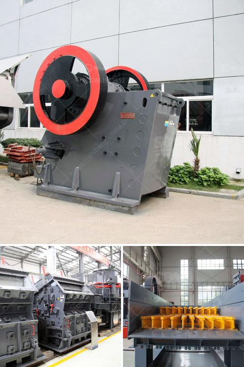

<h3>تكلفة إنشاء مصنع للأسمنت</h3>
تعتبر الصناعة الأسمنتية من أهم الصناعات الأساسية في العالم، حيث يعتمد الكثير من القطاعات الأخرى على الأسمنت في تطويرها ونموها. وتشهد الصناعة الأسمنتية نمواً مستمراً في مختلف أنحاء العالم نظراً للطلب المستمر على البنية التحتية والمشاريع العمرانية الجديدة.

تتأثر تكلفة إنشاء مصنع الأسمنت بعدة عوامل، بما في ذلك البنية التحتية المطلوبة، حجم المصنع، والتكنولوجيا المستخدمة في العملية الإنتاجية. وفيما يلي سنستعرض على نحو مفصل بعض هذه العوامل:

1. البنية التحتية: تتطلب عملية إنشاء مصنع الأسمنت مساحة واسعة وتجهيزات خاصة. يجب بناء مبانٍ للمصنع بما في ذلك المخازن والورش ومركز التحكم وغرف المعدات. كما يتطلب إنشاء الطرق والممرات وأنظمة توزيع المياه والكهرباء وأنظمة معالجة النفايات. قد يكون تأثير هذه العوامل على التكلفة أكبر في حالة إقامة المصنع في مناطق نائية أو غير متطورة من البنية التحتية.

2. حجم المصنع: يتوقف حجم المصنع على القدرة الإنتاجية المطلوبة. يكون المصنع الذي يتم بناءه لإنتاج أكثر من مليون طن من الأسمنت سنوياً أكبر وأكثر تعقيداً من المصانع التي تنتج أقل من هذا العدد. وبالتالي، يزداد الاستثمار المطلوب لبناء المصنع كلما زاد الحجم المطلوب.

3. التكنولوجيا: تختلف تكنولوجيا الإنتاج المستخدمة في المصانع الأسمنتية من مصنع لآخر. تستخدم المصانع التقليدية التكنولوجيا الأكثر تقليدية وتكون تكلفة بنائها أقل، بينما تستخدم المصانع الحديثة التكنولوجيات الأكثر تطوراً وتكون تكلفة بنائها أعلى. ويزداد استثمار المصانع الأسمنتية الحديثة أيضاً بسبب أعلى كفاءة الإنتاج وأقل استهلاك للطاقة.

وبالنظر إلى العوامل المذكورة، يمكن تقدير تكلفة إنشاء مصنع الأسمنت في نطاق يتراوح بين 200-400 مليون دولار أمريكي وفقاً لمعايير القطاع الأسمنتي الحالية. وبالطبع، يجب أخذ جميع العوامل الأخرى في الاعتبار لتحديد تكلفة إنشاء مصنع الأسمنت بدقة، بما في ذلك التكاليف الإدارية والتشغيلية وتكاليف الموظفين وتكلفة المواد الخام والوقود.

وبصفة عامة، يمكن القول أن إنشاء مصنع الأسمنت يتطلب استثماراً كبيراً، ولكن الصناعة الأسمنتية هي صناعة رابحة للمستثمرين طويلة الأجل بفضل الطلب المستمر على المنتجات الأسمنتية في جميع أنحاء العالم.
<h3>Contact us</h3><ul><li><strong>Whatsapp:&nbsp;<a href="https://wa.me/8613661969651">+8613661969651</a></strong></li><li><a href="https://swt.shibang-china.com/?git&amp;zhl&amp;تكلفة إنشاء مصنع للأسمنت"><strong>Online Service(chat now)</strong></a></li></ul><h3>Related</h3><ul><li><a href='سعر كسارة مخروطية هيدروليكية بتغذية 20 مم.md'>سعر كسارة مخروطية هيدروليكية بتغذية 20 مم</a></li><li><a href='أحزمة ناقلة الشيفرون في الفلبين.md'>أحزمة ناقلة الشيفرون في الفلبين</a></li><li><a href='كسارة الفك المحمولة في غرب أفريقيا تجار.md'>كسارة الفك المحمولة في غرب أفريقيا تجار</a></li><li><a href='كسارة صخور صغيرة.md'>كسارة صخور صغيرة</a></li><li><a href='تكلفة مشروع طحن التلك.md'>تكلفة مشروع طحن التلك</a></li></ul>