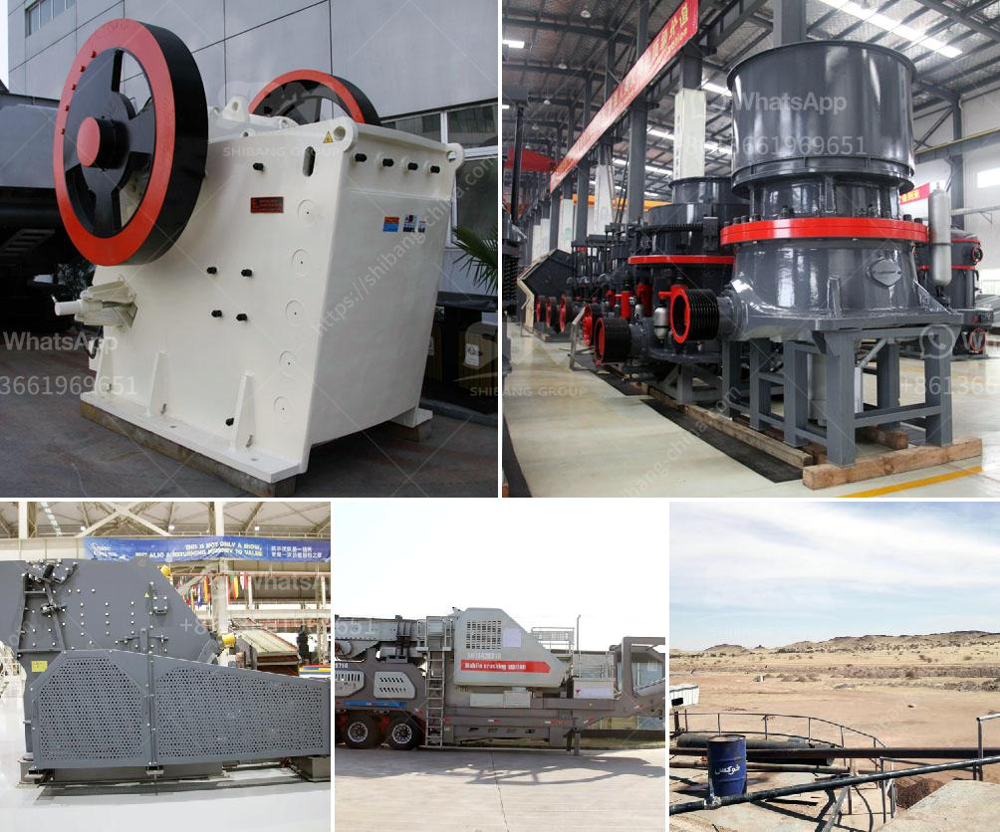

<h3>تكلفة الآلات لمصنع الأسمنت</h3>
تعد آلات الإنتاج الرئيسية في مصنع الأسمنت أحد العوامل الأساسية التي تؤثر على تكلفة الإنتاج وجودة المنتج النهائي. تتراوح تكلفة الآلات لمصنع الأسمنت عادةً بين 200 إلى 400 مليون دولار، وذلك يعتمد بشكل كبير على القدرة الإنتاجية وتكنولوجيا المصنع المراد إقامته.

1- الكسارة: وتعتبر الخطوة الأولى في عملية إنتاج الأسمنت، حيث تقوم بتكسير الحجارة والصخور الكبيرة إلى قطع صغيرة يمكن معالجتها.

2- المطحنة: تعمل على طحن المواد الخام المستخدمة في صنع الأسمنت إلى مسحوق ناعم يسمى الكلنكر.

3- الفرن الدوار: يتم فيه تسخين الكلنكر إلى درجة حرارة عالية (حوالي 1450 درجة مئوية) للحصول على الكلنكر المنصهر.

4- المبرد: يستخدم لتبريد الكلنكر المنصهر المخرج من الفرن الدوار بطريقة مناسبة، مما يساعد على تحسين جودته.

5- آلات الطحن والتعبئة والتغليف: تقوم بطحن الكلنكر المنصهر ومزجه مع مواد إضافية للحصول على أنواع مختلفة من الإسمنت، ثم تعبئته وتغليفه بشكل صحيح للتوزيع.

يجب أن نلاحظ أن هذه الآلات هي مجرد نموذج، وعادة ما تتطلب العديد من المكونات والتجهيزات الإضافية الأخرى مثل شبكة النقل الداخلي والتدفئة والأنظمة الكهربائية وغيرها. بالإضافة إلى ذلك، يمكن أن تكون للمصانع معدات إضافية مثل المخارط والعتاد والآلات الأخرى التي تستخدم لأغراض الصيانة والإصلاح.

عمومًا، ترتبط تكلفة آلات مصانع الأسمنت بالاستثمار في تكنولوجيا حديثة ومتطورة وسعة الإنتاج المرغوبة. كلما زادت القدرة الإنتاجية والتقنيات المستخدمة، زادت التكلفة. بالإضافة إلى ذلك، يمكن أن تتأثر التكلفة بعوامل أخرى مثل تكاليف العمالة والأراضي والتصميم الهندسي. توفير آلات عالية الكفاءة يساهم في زيادة الإنتاجية وتحسين الجودة، مما يعزز التنافسية العامة للمصنع ويؤثر بشكل إيجابي على العائد المالي للشركة.

بشكل عام، تلعب آلات مصانع الأسمنت دورًا حاسمًا في تحقيق الكفاءة وتحسين جودة المنتج النهائي. بالتالي، يجب أن يعتني المستثمرون والمشغلون بتوفير المبالغ المالية اللازمة لشراء وتركيب آلات عالية الأداء والفعالية لضمان النجاح والاستدامة في صناعة الأسمنت.
<h3>Contact us</h3><ul><li><strong>Whatsapp:&nbsp;<a href="https://wa.me/8613661969651">+8613661969651</a></strong></li><li><a href="https://swt.shibang-china.com/?git&amp;zhl&amp;تكلفة الآلات لمصنع الأسمنت"><strong>Online Service(chat now)</strong></a></li></ul><h3>Related</h3><ul><li><a href='أسعار كسارة الحجر في إندونيسيا.md'>أسعار كسارة الحجر في إندونيسيا</a></li><li><a href='طاحونة حديثة للكربونات.md'>طاحونة حديثة للكربونات</a></li><li><a href='آلة كسارة الكوارتز.md'>آلة كسارة الكوارتز</a></li><li><a href='كسارة الحجر الصغيرة للبيع في الفلبين.md'>كسارة الحجر الصغيرة للبيع في الفلبين</a></li><li><a href='أسعار مطحنة الكرة في زيمبابوي.md'>أسعار مطحنة الكرة في زيمبابوي</a></li></ul>