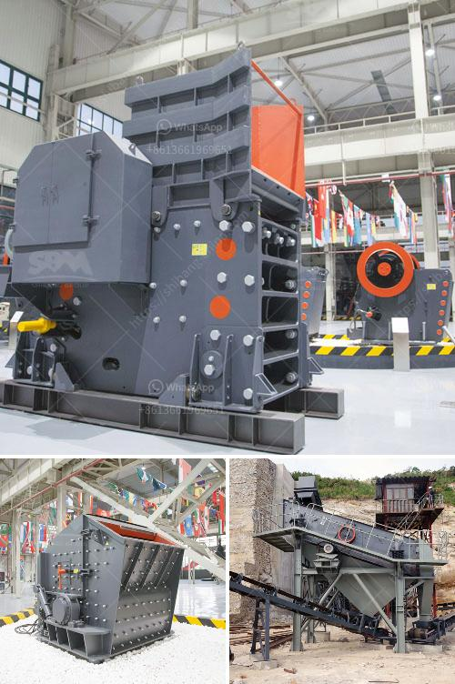

<h3>تكلفة الحزام الناقل لكل متر</h3>
تكلفة الحزام الناقل لكل متر هي عبارة عن التكلفة الإجمالية لشراء وتركيب وصيانة الحزام الناقل وتقسم على طول الحزام الناقل بالمتر للحصول على التكلفة لكل متر. تختلف تكلفة الحزام الناقل لكل متر بناءً على عدة عوامل مختلفة.

أحد العوامل التي تؤثر في تكلفة الحزام الناقل لكل متر هي نوعية المواد المستخدمة في صناعته. تختلف مادة الحزام بناءً على طبيعة العمل التي سيتم استخدام الحزام فيها. وبالتالي، يختلف سعر المادة المستخدمة في الحزام الناقل ويؤثر ذلك في تكلفته. 

علاوة على ذلك، يعد حجم الحزام الناقل أيضًا من العوامل المؤثرة في تكلفته. قد يكون هناك حاجة لحزام طويل وعر لتنقل كميات كبيرة من المواد، أو حاجة لحزام صغير وضيق لتنقل كميات صغيرة من المواد. إجمالاً، يمتدح الحزام الناقل بشكل مباشر بتكلفته، حيث يزداد تكلفة الحزام مع زيادة طوله وعرضه.

وبصورة مماثلة، تؤثر التعقيدات التقنية في تكلفة الحزام الناقل لكل متر. بعض الحزام الناقل مصمم بتقنيات معقدة مثل ناقلات السرعة العالية أو التقنيات الآلية الأكثر تطورًا، مما قد يزيد من تكلفته بشكل كبير.

دور الصيانة أيضًا لا يمكن تجاهله عند حساب تكلفة الحزام الناقل لكل متر. تتطلب الحزام الناقل صيانة منتظمة لتأكيد على استمرار عمله بكفاءة عالية وضمان عمر أطول. يمكن أن تشمل الصيانة الروتينية عمليات مثل تغيير الأجزاء المهترئة أو التالفة، وتشحيم الأجزاء المتحركة، وضبط التوتر، واختبار الأداء العام للحزام.

بشكل عام، يمكن أن تتراوح تكلفة الحزام الناقل لكل متر بين 200 و 400 دولار. ومع ذلك، يجب أن يتم دراسة العوامل المحددة المذكورة أعلاه بعناية لتحديد التكلفة الفعلية للحزام الناقل في كل حالة. تضاف إلى ذلك، يجب أن يتم اعتبار التكاليف الإضافية مثل تكاليف التركيب والشحن وتكاليف العمل وتكاليف الصيانة للحصول على تقدير شامل ودقيق لتكلفة الحزام الناقل لكل متر.
<h3>Contact us</h3><ul><li><strong>Whatsapp:&nbsp;<a href="https://wa.me/8613661969651">+8613661969651</a></strong></li><li><a href="https://swt.shibang-china.com/?git&amp;zhl&amp;تكلفة الحزام الناقل لكل متر"><strong>Online Service(chat now)</strong></a></li></ul><h3>Related</h3><ul><li><a href='مصنع سحق الحجر في ألمانيا.md'>مصنع سحق الحجر في ألمانيا</a></li><li><a href='مخروط سحق 700 1000.md'>مخروط سحق 700 1000</a></li><li><a href='مطحنة حجر نيجيريا.md'>مطحنة حجر نيجيريا</a></li><li><a href='معدات تعدين الكروم للبيع في جنوب أفريقيا.md'>معدات تعدين الكروم للبيع في جنوب أفريقيا</a></li><li><a href='كسارة المطرقة بسعة ١٠ طن في الساعة وحجمها.md'>كسارة المطرقة بسعة ١٠ طن في الساعة وحجمها</a></li></ul>