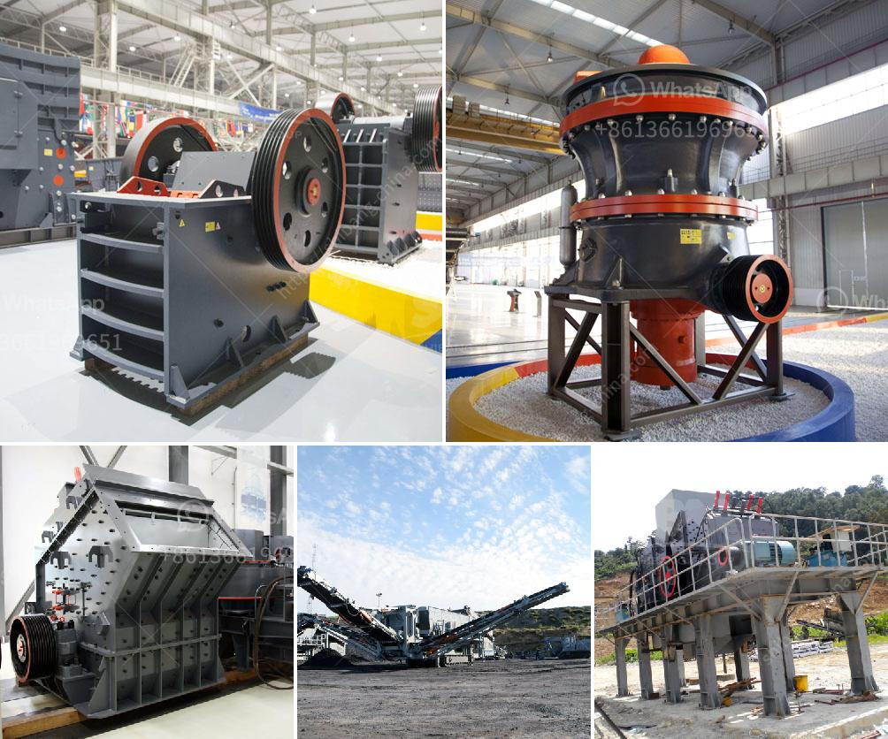

<h3>تكلفة الكسارة المحمولة للساعة الواحدة</h3>
تعتبر الكسارة المحمولة من التجهيزات الهامة في صناعة البناء والتشييد. فهي تقدم عملية سحق المواد الخام بطريقة سهلة ومريحة في الموقع مما يساهم في توفير الكثير من الوقت والجهد. إلا أن سعر الكسارة المحمولة يعد أحد العوامل الرئيسية التي يجب إدراكها عند شراء هذا الجهاز.

يتأثر سعر الكسارة المحمولة بعدة عوامل، بما في ذلك الحجم والطاقة والقدرة. وبشكل عام، تتراوح تكلفتها بين 200 و400 دولار للساعة الواحدة. ومن المهم الإشارة إلى أن هذا الرقم هو مجرد تقدير وقد يختلف من طراز لآخر ويعتمد على السوق وبلد المنشأ.

عند البحث عن شراء كسارة محمولة، يجب أن يكون لديك تفهم شامل للمواصفات التي تحتاجها. يمكن للكسارات المحمولة الكبيرة تكلفة أكثر من النماذج الأصغر حجماً، وذلك بسبب قدرتها على سحق المواد الأكبر. بالإضافة إلى ذلك، تلعب طاقة المحرك وسرعة المعالجة أيضًا دورًا في تحديد التكلفة.

من الجوانب الأخرى التي يجب مراعاتها عند شراء الكسارة المحمولة هي التكلفة الإجمالية للعملية بما في ذلك التكاليف المباشرة وغير المباشرة. فمثلاً، قد تشمل التكاليف المباشرة تكلفة المشتريات الأولية للكسارة بينما تشمل التكاليف غير المباشرة التكاليف المرتبطة بالصيانة والتشغيل والوقود.

علاوة على ذلك، مهمة أخرى تؤثر في تكلفة الكسارة المحمولة هي تكاليف النقل والتركيب. قد يكون لديك حاجة إلى استئجار شاحنات خاصة بالنقل، وأيضاً قد تحتاج إلى شخصين متخصصين لتركيب الكسارة وضمان أنها تعمل بشكل صحيح.

بشكل عام، يمكن القول إن التكلفة الاستثمارية للكسارة المحمولة يكون مرتفعًا نسبيًا، ولكن يمكن أن توفر الكسارة الكثير من الوقت والجهد في العملية الإنتاجية مما يعني أنها ستوفر المزيد من الأموال والارباح في المدى البعيد.

في الختام، فإن تكلفة الكسارة المحمولة للساعة الواحدة تتراوح بين 200 و400 دولار وتعتمد على الحجم والطاقة والقدرة وغيرها من المواصفات. قبل شراء الكسارة، يجب أن تنظر في التكاليف المباشرة وغير المباشرة للعملية وتأخذ في الاعتبار أيضًا تكاليف النقل والتركيب. رغم التكلفة الاستثمارية العالية، فإن الكسارة المحمولة تعد استثماراً جيداً في المدى البعيد وتساهم في تحقيق المزيد من الأرباح.
<h3>Contact us</h3><ul><li><strong>Whatsapp:&nbsp;<a href="https://wa.me/8613661969651">+8613661969651</a></strong></li><li><a href="https://swt.shibang-china.com/?git&amp;zhl&amp;تكلفة الكسارة المحمولة للساعة الواحدة"><strong>Online Service(chat now)</strong></a></li></ul><h3>Related</h3><ul><li><a href='كيفية إنشاء مصنع لتكسير الحجر.md'>كيفية إنشاء مصنع لتكسير الحجر</a></li><li><a href='أفضل وسادات طحن للرخام في باكستان.md'>أفضل وسادات طحن للرخام في باكستان</a></li><li><a href='كسارة حجر مستعملة في أونتاريو.md'>كسارة حجر مستعملة في أونتاريو</a></li><li><a href='آلة تكسير للمواد الكاشطة للبيع.md'>آلة تكسير للمواد الكاشطة للبيع</a></li><li><a href='غسالة مواد خام جرايستون مستعملة.md'>غسالة مواد خام جرايستون مستعملة</a></li></ul>