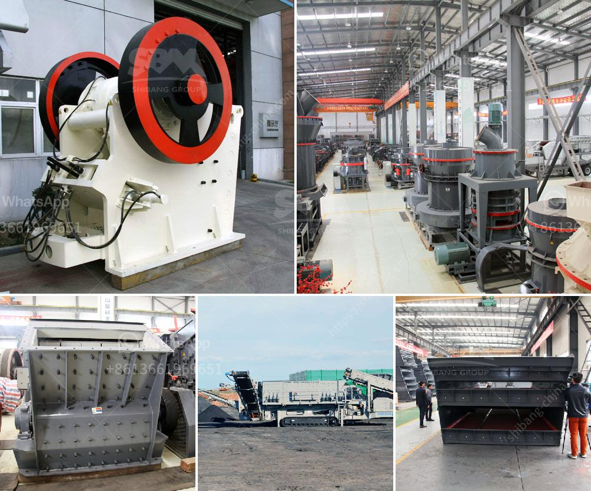

<h3>تكلفة الكسارة المحمولة</h3>
تُعد الكسارة المحمولة من الآلات الهندسية الحديثة التي تُستخدم بكثرة في العديد من المجالات مثل صناعة المحاجر وأعمال البناء وتدوير الخرسانة. تُستخدم هذه الكسارات لتكسير وتحويل الصخور والحجارة الكبيرة إلى حجم أصغر، مما يجعلها سهلة في التنقل والنقل.

تعتبر التكلفة من العوامل الرئيسية التي ينبغي أخذها في الاعتبار عند شراء أي نوع من الآلات. وبالنسبة للكسارة المحمولة، تتأثر تكلفتها بعدة عوامل مثل الحجم والنموذج والقدرة الإنتاجية والجودة ومصدر المنتج وموقع الشراء وتكاليف الصيانة الدورية.

بدايةً، يُعتبر الحجم والنموذج من العوامل الأساسية التي تؤثر في تحديد سعر الكسارة المحمولة. فمن المفهوم أن الكسارات الأكبر حجمًا وأكثر تقنية وتعقيدًا ستكون أغلى من الكسارات الأصغر حجمًا. وفي العادة، تتوفر الكسارات المحمولة في الأحجام المتنوعة من قدرة الإنتاج، مثل 100 طن في الساعة أو 200 طن في الساعة، ويعتمد اختيار الحجم الملائم على الاحتياجات الفعلية للمشروع الذي تُستخدم فيه.

بالإضافة إلى الحجم والنموذج، تؤثر القدرة الإنتاجية بشكل كبير على تكلفة الكسارة المحمولة. تتراوح الكسارات المحمولة في الأسواق بشكل عام بين الكسارات ذات القدرة الانتاجية المنخفضة والمتوسطة والعالية. وبالطبع، كلما زادت القدرة الإنتاجية، زادت التكلفة، ويعتمد اختيار القدرة الملائمة على حجم المواد الأساسية والإنتاجية المطلوبة.

يجب أيضًا مراعاة جودة الكسارة المحمولة عند تحديد تكلفتها، فالجودة تؤثر بشكل كبير على كفاءة العمل وعمر الكسارة وتكاليف الصيانة. يجب اختيار الكسارة المحمولة ذات الجودة الجيدة من مصنع موثوق ومعترف به في السوق.

بصفة عامة، يجب أخذ مصدر المنتج في الاعتبار عند شراء الكسارة المحمولة. قد تتوفر هذه الكسارات من المصنعين المحليين أو المستوردين. وفي بعض الحالات، قد يكون سعر المنتج المحلي أقل من المنتج المستورد بسبب توفر المكونات والخامات المحلية بسعر أقل، ولكن يجب التأكد أيضًا من جودة المنتج قبل الشراء.

أخيرًا، يجب أخذ تكاليف الصيانة الدورية في الاعتبار عند تحديد تكلفة الكسارة المحمولة. فإن الصيانة الدورية الجيدة هي أساسية للحفاظ على عمل الكسارة بكفاءة والاستفادة القصوى منها. يجب ضمان توافر قطع الغيار والمواد الاستهلاكية بسهولة في السوق المحلية وبأسعار معقولة.

في النهاية، تختلف تكلفة الكسارة المحمولة بناءً على الأسعار المختلفة للنماذج والقدرات والجودة ومصدر المنتج وتكاليف الصيانة الدورية. لذا، يجب التواصل مع الشركات المتخصصة وطلب العروض والاستفسارات المالية المحددة لمعرفة التكلفة الدقيقة للعملية المطلوبة واتخاذ القرار المناسب.
<h3>Contact us</h3><ul><li><strong>Whatsapp:&nbsp;<a href="https://wa.me/8613661969651">+8613661969651</a></strong></li><li><a href="https://swt.shibang-china.com/?git&amp;zhl&amp;تكلفة الكسارة المحمولة"><strong>Online Service(chat now)</strong></a></li></ul><h3>Related</h3><ul><li><a href='مطحنة كرات صغيرة لهنان الصين.md'>مطحنة كرات صغيرة لهنان الصين</a></li><li><a href='كيفية إنشاء مصنع لتكسير الحجر.md'>كيفية إنشاء مصنع لتكسير الحجر</a></li><li><a href='شركة تصنيع معدات التعدين في الصين.md'>شركة تصنيع معدات التعدين في الصين</a></li><li><a href='موردين لفات الناقل في جنوب أفريقيا.md'>موردين لفات الناقل في جنوب أفريقيا</a></li><li><a href='كم تكلفة كسارة الفك.md'>كم تكلفة كسارة الفك</a></li></ul>