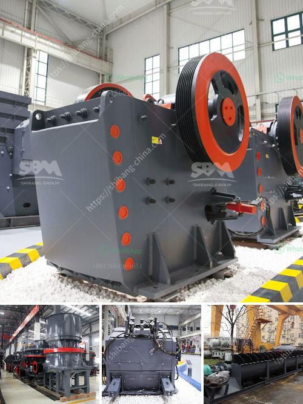

<h3>تكلفة الكسارة المستعملة للجرانيت</h3>
تعتبر الكسارة المستعملة للجرانيت أحد الآلات الحديثة التي تستخدم في صناعة البناء والتشييد. وتلعب دورًا مهمًا في عملية سحق الجرانيت إلى حجم مناسب للاستخدام في الأعمال الإنشائية. يمكن العثور على الكسارات المستعملة بأسعار أقل من الكسارات الجديدة، مما يجعلها خيارًا شائعًا بين المقاولين والمشاريع الصغيرة والمتوسطة.

ومن أهم العوامل التي تؤثر في تكلفة الكسارة المستعملة للجرانيت هي حجم الكسارة وطاقتها. فعندما يكون لديك جرانيت كبيرة ، فإن الكسارة ذات القدرة العالية ستكون ضرورية لتحقيق الإنتاجية المرغوبة. كما أن حالة الكسارة وعمرها يؤثران أيضًا على تكلفتها. يمكن أن تشتمل تكلفة الكسارة المستعملة على تكاليف الصيانة وإصلاح أي مشاكل تقنية قد تواجهها.

عادةً ما تكون تكلفة الكسارة المستعملة للجرانيت أقل بكثير من تكلفة الكسارة الجديدة. هذا يمكن أن يكون مفيدًا بشكل كبير للمقاولين والشركات التي تعمل على ميزانيات محدودة. ومع ذلك، يجب أن يتحلى المشتري بالحذر والانتباه عند شراء الكسارة المستعملة والتأكد من أنها في حالة جيدة وتستوفي المعايير الفنية المطلوبة.

من الضروري أيضًا أن تأخذ في الاعتبار تكاليف التشغيل والصيانة العامة عند شراء الكسارة المستعملة. يجب مراعاة تكاليف تشغيل الكسارة مثل الطاقة والمواد الاستهلاكية وقطع الغيار. قد يكون مفيدًا أيضًا أن تستعين بفني متخصص لتقييم الكسارة المستعملة قبل الشراء.

في الختام، يمكن القول إن الكسارة المستعملة للجرانيت تعتبر خيارًا اقتصاديًا للمشاريع التي لديها ميزانية محدودة. يجب أن يتم الانتباه إلى عوامل مثل حجم الكسارة وطاقتها وحالتها العامة وتكاليف التشغيل الإضافية. بعد إجراء التقييم اللازم والتأكد من جودة الكسارة المستعملة، يمكن للمقاولين الحصول على كسارة عالية الجودة بتكلفة أقل.
<h3>Contact us</h3><ul><li><strong>Whatsapp:&nbsp;<a href="https://wa.me/8613661969651">+8613661969651</a></strong></li><li><a href="https://swt.shibang-china.com/?git&amp;zhl&amp;تكلفة الكسارة المستعملة للجرانيت"><strong>Online Service(chat now)</strong></a></li></ul><h3>Related</h3><ul><li><a href='مصنع غسيل الفحم للبيع في جنوب أفريقيا.md'>مصنع غسيل الفحم للبيع في جنوب أفريقيا</a></li><li><a href='موردين مطاحن الطحن في ججرانوالا.md'>موردين مطاحن الطحن في ججرانوالا</a></li><li><a href='تكلفة طاحونة الكوارتز.md'>تكلفة طاحونة الكوارتز</a></li><li><a href='كسارات الخرسانة الصغيرة للسعة المنخفضة.md'>كسارات الخرسانة الصغيرة للسعة المنخفضة</a></li><li><a href='مطحنة هامر لتعدين الذهب في جنوب أفريقيا.md'>مطحنة هامر لتعدين الذهب في جنوب أفريقيا</a></li></ul>