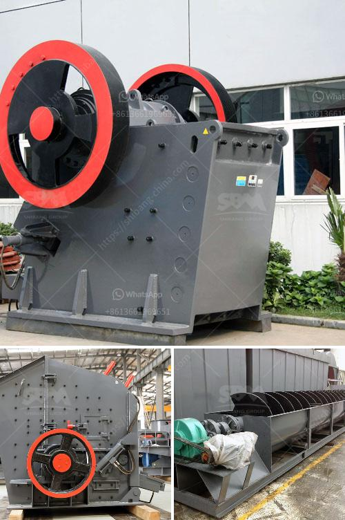

<h3>تكلفة المطحنة من الكسارات</h3>
تعتبر المطحنة جزءًا هامًا في عملية الكسارة، حيث يتم استخدامها لطحن المواد الخام وتحويلها إلى جسيمات أصغر قبل فرزها واستخدامها في العديد من التطبيقات المختلفة. ومع ذلك، قد تؤدي تكلفة المطحنة إلى زيادة تكلفة الإنتاج وتأثيرها على ربحية الكسارة.

تتأثر تكلفة المطحنة بعدة عوامل، بدءًا من حجم الكسارة ومتطلبات الإنتاج. فعلى سبيل المثال، قد تصل تكلفة المطاحن الكبيرة التي تستخدم في الكسارات الكبيرة إلى ملايين الدولارات، وذلك بسبب تكاليف تصنيعها وتثبيتها وصيانتها. ومن الناحية الأخرى، تكون المطاحن الصغيرة ذات التكاليف المنخفضة أكثر ملاءمة للكسارات الصغيرة وأصحاب المشاريع الصغيرة.

علاوة على ذلك، تؤثر جودة المطحنة أيضًا في تكلفتها. فمطاحن الجودة العالية غالبًا ما تكون أكثر متانة وكفاءة، وتوفر تجربة طحن أفضل، وتحتوي على الميزات المتطورة مثل التحكم الآلي والتبريد. وبسبب هذه الخصائص، يترتفع سعر المطاحن العالية الجودة. ومع ذلك، تكون قيمة المطحنة مقابل المال المستثمر فيها أعلى، نظرًا لقدرتها على تحقيق أداء أفضل وتوفير الوقت والطاقة.

علاوة على ذلك، تؤثر تكلفة المطحنة أيضًا في اختيار المورد. فبالنسبة للشركات التي تبحث عن تقليل التكاليف، قد يكون الاهتمام أكثر بالمطاحن الرخيصة، حتى لو كانت جودتها محدودة. وعلى الجانب الآخر، قد يختار البعض المطاحن ذات الجودة العالية التي تكون أغلى، لضمان أداء ممتاز وتقليل تكاليف الصيانة.

بشكل عام، تتراوح تكلفة المطاحن في الكسارات بين 200 و 400 ألف دولار، وذلك يعتمد على عدة عوامل تذكرناها سابقًا. وعند شراء المطحنة، من الأفضل النظر في التوازن بين الجودة والتكلفة ومتطلبات الإنتاج.

باختصار، يتأثر سعر المطحنة في الكسارات بعدة عوامل، بدءًا من حجم الكسارة ومتطلبات الإنتاج، إلى جودة المطحنة وسماتها المختلفة، واختيار المورد. ومع ذلك، فإن الاستثمار في مطحنة عالية الجودة وكفاءة يمكن أن يكون مفيدًا على المدى الطويل، حيث يحسن الأداء ويوفر الوقت والطاقة.
<h3>Contact us</h3><ul><li><strong>Whatsapp:&nbsp;<a href="https://wa.me/8613661969651">+8613661969651</a></strong></li><li><a href="https://swt.shibang-china.com/?git&amp;zhl&amp;تكلفة المطحنة من الكسارات"><strong>Online Service(chat now)</strong></a></li></ul><h3>Related</h3><ul><li><a href='مصنع كرة الاسمنت المواد والطاقة.md'>مصنع كرة الاسمنت المواد والطاقة</a></li><li><a href='كسارات الحجر من السويد.md'>كسارات الحجر من السويد</a></li><li><a href='تأجير سحق وفرز الهاتف المحمول.md'>تأجير سحق وفرز الهاتف المحمول</a></li><li><a href='بيان طريقة لناقلات الحزام.md'>بيان طريقة لناقلات الحزام</a></li><li><a href='كسارة الحجر بوزولانا للبيع.md'>كسارة الحجر بوزولانا للبيع</a></li></ul>