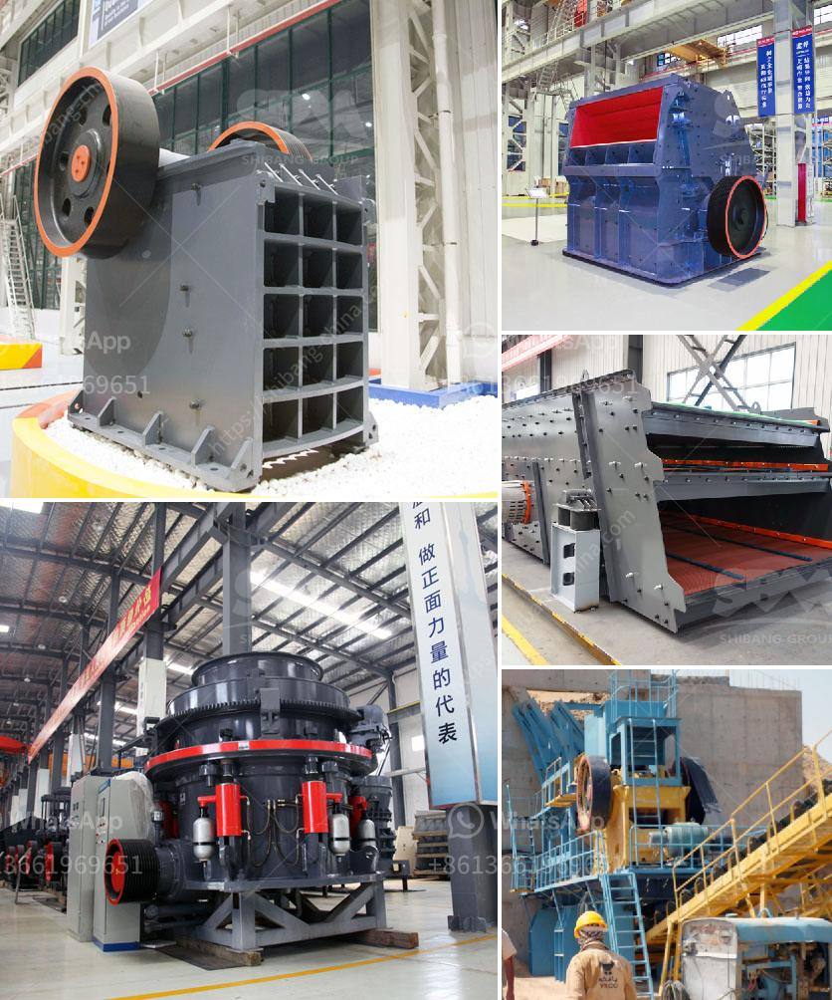

<h3>تكلفة المعدات المستخدمة في تعدين خام الرصاص</h3>
تعتبر صناعة تعدين خام الرصاص من الصناعات الهامة والتي تلعب دوراً رئيسياً في اقتصاد العديد من البلدان. تتكون تكلفة تعدين خام الرصاص من مجموعة متنوعة من العناصر، ومن بين أهم تلك العناصر يأتي تكلفة المعدات المستخدمة في عملية التعدين.

تختلف تكلفة المعدات المستخدمة في تعدين خام الرصاص حسب حجم ونطاق العملية التعدينية والتكنولوجيا المستخدمة. علاوة على ذلك، يتأثر سعر المعدات بحالة السوق والعرض والطلب على المعدات التعدينية. ومع ذلك، يمكن توضيح عناصر التكلفة الرئيسية التي يجب أخذها في الاعتبار:

1. معدات التنقيب: تشمل مثقاب الحفر وآلات التنقيب التي تستخدم لاستكشاف وفحص المناطق المحتملة لاحتواء خام الرصاص. يتفاوت سعر هذه المعدات وفقًا لحجمها وطاقتها وتكنولوجيتها.

2. معدات الحفر والنقل: تتضمن معدات الحفر والنقل المختلفة التي تستخدم في إزالة ونقل الصخور الكبيرة والتربة في عملية التعدين. تتأثر تكلفة هذه المعدات بالحجم والمدى والتكنولوجيا الضرورية لإجراء عملية الحفر والنقل.

3. معدات السحق والطحن: يستخدم الرصاص عادة في صورة خام، ومن الضروري سحقه وطحنه للحصول على الدقة المطلوبة قبل استخراج الفلز. وتتضمن المعدات المستخدمة في هذه العملية الكسارات والمطاحن والمناخل ومصانع المعالجة، وتتأثر تكلفتها بتصميمها وحجمها وكفاءتها.

4. المعدات اللازمة للاستخلاص: تستخدم في عملية استخلاص الرصاص، مثل المعدات اللازمة لفصل الرصاص عن الشوائب الأخرى وتكريره. تختلف تكلفة هذه المعدات بناءً على حجم الاستخلاص المطلوب والتكنولوجيا المستخدمة.

5. الصيانة والتشغيل: يجب أخذ تكلفة صيانة المعدات وتشغيلها في الاعتبار أيضاً. تتضمن هذه العناصر تكاليف صيانة المعدات المختلفة وتدريب العمال وتوظيف الخبراء الفنيين.

على الرغم من التكاليف العالية المرتبطة بالمعدات المستخدمة في تعدين خام الرصاص، إلا أن الصناعة لا تزال تستفيد من عائد جيد على الاستثمار نظراً لقيمة الرصاص في السوق العالمية واستخداماته الواسعة في العديد من الصناعات مثل البطاريات والصهاريج والأسلاك الكهربائية.

في النهاية، يمكن القول بأن تكلفة المعدات المستخدمة في تعدين خام الرصاص تتأثر بالعوامل المذكورة أعلاه وغيرها. يعد الاستثمار الجيد في المعدات وتكنولوجيا التعدين الحديثة أمرًا حاسمًا لزيادة الإنتاجية وتقليل التكلفة في عمليات التعدين، مما يساهم في تحقيق الاستدامة والنجاح الاقتصادي في صناعة تعدين خام الرصاص.
<h3>Contact us</h3><ul><li><strong>Whatsapp:&nbsp;<a href="https://wa.me/8613661969651">+8613661969651</a></strong></li><li><a href="https://swt.shibang-china.com/?git&amp;zhl&amp;تكلفة المعدات المستخدمة في تعدين خام الرصاص"><strong>Online Service(chat now)</strong></a></li></ul><h3>Related</h3><ul><li><a href='مطحنة الكرة الثقيلة الوزن في الهند.md'>مطحنة الكرة الثقيلة الوزن في الهند</a></li><li><a href='عصابات كسارة الحجر في جامايكا.md'>عصابات كسارة الحجر في جامايكا</a></li><li><a href='موردين رمل السيليكا في زيمبابوي.md'>موردين رمل السيليكا في زيمبابوي</a></li><li><a href='مصنع كسارة للفحم.md'>مصنع كسارة للفحم</a></li><li><a href='كوماتسو بي آر كسارة للبيع.md'>كوماتسو بي آر كسارة للبيع</a></li></ul>