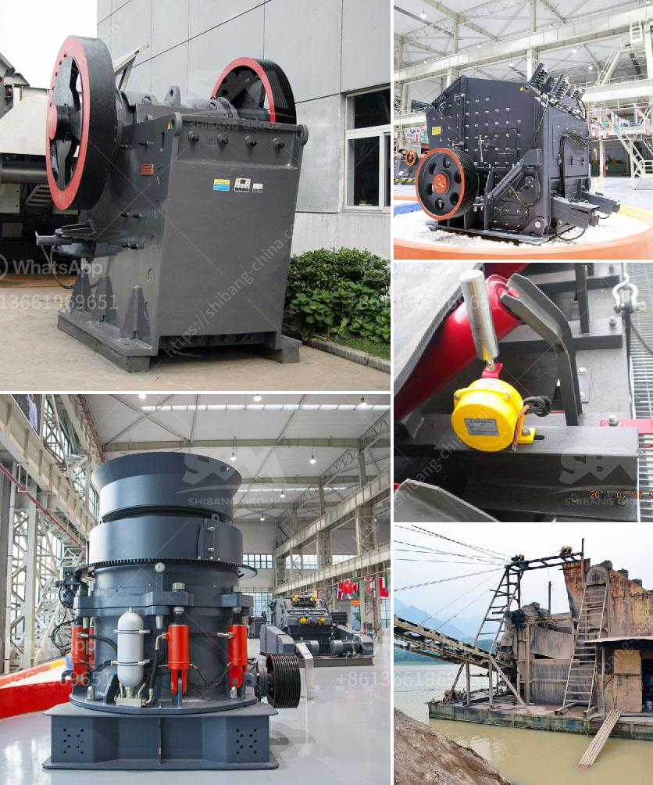

<h3>تكلفة بناء مصنع كربونات الكالسيوم</h3>
يعتبر بناء مصنع لإنتاج كربونات الكالسيوم من أهم المشاريع الصناعية التي تتطلب استثمارًا كبيرًا ودراسة دقيقة للتكلفة. يستخدم الكربونات الكالسيوم في العديد من الصناعات مثل الصناعة الدوائية، وصناعة البلاستيك، والورق، والتقنيات البنائية، والألوان والدهانات، والأسمدة، وصناعة الزجاج، والأكسجين، ولوازم النجارة، وغيرها.

قبل البدء في بناء المصنع، يتعين دراسة سوق المنتج ومنافسيه، وتقدير الإمكانيات التشغيلية وتكاليف تشغيل المصنع، وتقدير التكلفة الرأسمالية المطلوبة لإنشاء وإقامة المصنع. تتكون التكلفة الرأسمالية من عدة عوامل رئيسية مثل:

1- تكلفة الأراضي وتأجيرها: حيث يجب تحديد الموقع وشراء الأرض أو تأجيرها للقيام بعمليات الإنتاج. قد يؤثر الموقع الجغرافي على التكاليف، حيث مثلاً قد يتطلب وجود مصدر قريب للكالسيوم والكربونات، والتوفر الجيد للمناخ والمياه العذبة.

2- تكلفة شراء المعدات والآلات: يجب شراء وتركيب المعدات والآلات اللازمة لعملية الإنتاج، وهي تشمل آلات الطحن والفرز والمزج والتحميص والتجفيف.

3- تكلفة البنية التحتية: تشمل تكاليف البناء والهندسة المعمارية والأعمال المدنية والنجارة والكهرباء والصحة والسلامة والتبريد ونظم الطاقة والماء والصرف الصحي، والمراجل وأجهزة التكييف.

4- تكلفة العمالة: يجب دفع رواتب الموظفين والفنيين والعمال، وتكاليف التأمين الاجتماعي والصحة والسلامة والضمانات.

5- تكاليف الطاقة: حيث يحتاج مصنع كربونات الكالسيوم إلى طاقة كهربائية وحرارية لعملية التحضير والإنتاج، ويجب تقدير هذه التكاليف بناءً على استهلاك المصنع المقدر للطاقة.

6- تكاليف الخامات والمواد الأولية: يجب شراء المواد الخام والكيماويات اللازمة لعملية الإنتاج.

7- تكاليف التوزيع والتسويق: يجب توفير وسائل النقل والتسويق لمنتجات المصنع وترويجها في الأسواق.

يجب أن يتم إعداد دراسة جدوى اقتصادية لتقدير كلفة المشروع وتقدير الإيرادات المتوقعة والتكاليف المستخدمة في عملية الإنتاج. يمكن للعوامل المذكورة أعلاه أن تؤثر بشكل كبير على تكاليف بناء مصنع كربونات الكالسيوم. وبالتالي، يفضل تعاقدات ومفاوضات جيدة مع الموردين والمقاولين للحصول على أفضل العروض والخيارات التي تساعد على تقليل التكاليف المطلوبة.

عمومًا، تتراوح تكلفة بناء وإقامة مصنع كربونات الكالسيوم بين 200 إلى 400 ألف دولار أمريكي، وهذا يعتمد بشكل كبير على حجم المصنع المطلوب والتكنولوجيا المستخدمة في عملية الإنتاج. إضافةً إلى ذلك، يجب أخذ في الاعتبار تكاليف الصيانة والتشغيل المستمرة للمصنع في المستقبل.
<h3>Contact us</h3><ul><li><strong>Whatsapp:&nbsp;<a href="https://wa.me/8613661969651">+8613661969651</a></strong></li><li><a href="https://swt.shibang-china.com/?git&amp;zhl&amp;تكلفة بناء مصنع كربونات الكالسيوم"><strong>Online Service(chat now)</strong></a></li></ul><h3>Related</h3><ul><li><a href='كسارة الحجر في الفلبين للبيع.md'>كسارة الحجر في الفلبين للبيع</a></li><li><a href='آلة سحق كبيرة.md'>آلة سحق كبيرة</a></li><li><a href='مطحنة طحن للكوارتز في الهند.md'>مطحنة طحن للكوارتز في الهند</a></li><li><a href='عملية تشكيل الأسمنت.md'>عملية تشكيل الأسمنت</a></li><li><a href='مطحنة كرات صغيرة لهنان الصين.md'>مطحنة كرات صغيرة لهنان الصين</a></li></ul>