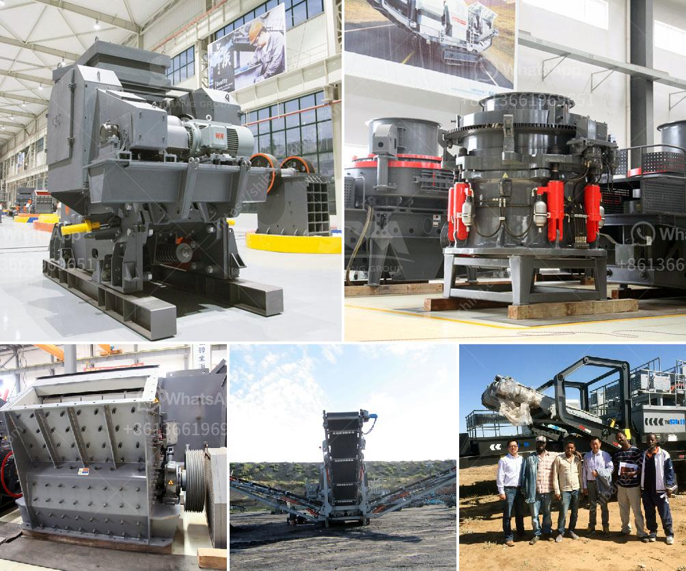

<h3>تكلفة تركيب السيور الناقلة</h3>
تتعدد استخدامات السيور الناقلة في العديد من الصناعات المختلفة مثل الصناعات التعدينية والزراعية والغذائية والمستودعات والمطارات وغيرها. وعندما يتعلق الأمر بتركيب السيور الناقلة، يجب النظر في عدة عوامل تؤثر على تكلفة التركيب وتشمل:

1- طول السيور: يعد طول السيور الناقلة أحد العوامل الرئيسية في تحديد التكلفة. كلما زاد طول السيور، زادت تكلفتها. يتطلب تركيب السيور الطويلة وجود معدات خاصة لرفع ونقل السيور للمسافات البعيدة.

2- اختيار المواد المناسبة: تختلف تكلفة المواد المستخدمة في السيور الناقلة حسب نوعها وجودتها. يتعين اختيار المواد المناسبة التي تتوافق مع طبيعة العمل والبيئة التي ستتعرض لها السيور، وهذا يتطلب النظر في عوامل مثل مقاومة التآكل، الشد والبرودة.

3- الملحقات والتجهيزات: تشمل الملحقات والتجهيزات عناصر مثل الأحزمة الناقلة، والأسطوانات، والبكرات، والإطارات، والمحركات والتروس. يعتمد سعر هذه الملحقات على الجودة والمواصفات المطلوبة.

4- تكاليف العمالة: يتطلب تركيب السيور الناقلة وجود فريق مختص من الفنيين والعمالة المهرة. تكلفة العمالة تؤثر بشكل كبير على تكلفة التركيب وقد يتطلب ذلك توظيف فريق عمل خارجي محترف.

5- التكلفة الإجمالية: ينبغي ألا ننسى أن السيور الناقلة ليست فقط عبارة عن تكلفة التركيب بل تشمل أيضًا تكاليف الصيانة المستقبلية وتكاليف التشغيل اليومية.

بشكل عام، فإن تكلفة تركيب السيور الناقلة تتفاوت بشكل كبير وتعتمد على العديد من العوامل المذكورة أعلاه. يجب أن يتم تقييم المتطلبات الفنية والتشغيلية المحددة للمشروع بدقة لتحديد التكلفة الأمثل وضمان عملية تركيب وتشغيل سلسة وفعالة من السيور الناقلة.
<h3>Contact us</h3><ul><li><strong>Whatsapp:&nbsp;<a href="https://wa.me/8613661969651">+8613661969651</a></strong></li><li><a href="https://swt.shibang-china.com/?git&amp;zhl&amp;تكلفة تركيب السيور الناقلة"><strong>Online Service(chat now)</strong></a></li></ul><h3>Related</h3><ul><li><a href='مطاحن الكرة في فيزاج.md'>مطاحن الكرة في فيزاج</a></li><li><a href='معدات فحص الرمال للبيع في جنوب أفريقيا.md'>معدات فحص الرمال للبيع في جنوب أفريقيا</a></li><li><a href='تصنيع آلات السحق في بوليفيا.md'>تصنيع آلات السحق في بوليفيا</a></li><li><a href='كسارة مخروطية جديدة تمامًا للبيع في الهند.md'>كسارة مخروطية جديدة تمامًا للبيع في الهند</a></li><li><a href='مصنع تعدين الدولوميت في إثيوبيا.md'>مصنع تعدين الدولوميت في إثيوبيا</a></li></ul>