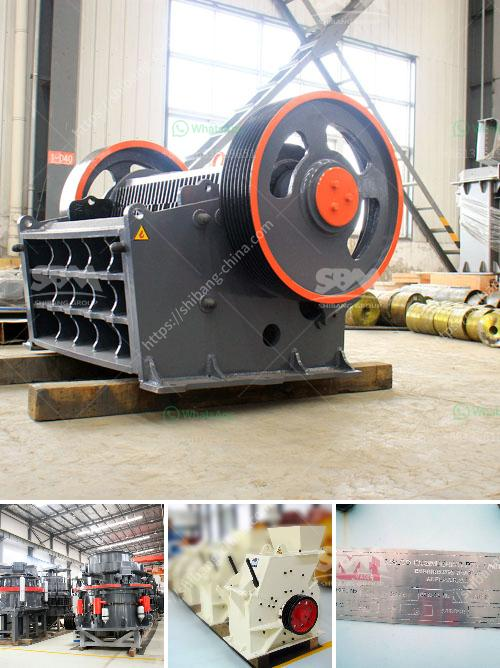

<h3>تكلفة تشغيل الكسارة في لاس فيغاس</h3>
تعد لاس فيغاس واحدة من أكثر المدن رواجًا في العالم، حيث يقصدها الملايين من السياح سنويًا للاستمتاع بتجربة فريدة من نوعها. ولكن القليلون يدركون التكلفة الضخمة والمطلوبة لتشغيل الكسارة في تلك المدينة الرائعة.

عندما نتحدث عن تكلفة تشغيل الكسارة في لاس فيغاس، فإننا نواجه تحديات متعددة. أولاً وقبل كل شيء، يجب علينا أن نأخذ في الاعتبار تكلفة العمالة. يحتاج الكسارة إلى فريق عمل مؤهل ومتفانٍ يتعامل مع معدات الكسارة ويدير عملية الإنتاج بكل فاعلية. يشمل الفريق المطلوب في الكسارة عمال المعادن والمشغلين والفنيين، وغيرهم الكثير. تكلفة توظيف وتدريب العمال المؤهلين وتوفيرهم بمستودع وسكن جيد للعيش تكون عالية للغاية، مما يؤدي إلى زيادة التكاليف العامة لتشغيل الكسارة.

ثانيًا، تكلفة الطاقة تلعب دورًا مهمًا في تشغيل الكسارة. تحتاج الكسارة إلى الكهرباء لتشغيل المعدات والآلات التي تستخدم في عملية الكسر والطحن. وعلى الرغم من أن لاس فيغاس تعتبر واحدة من المدن التي تتمتع بتوفر الطاقة، إلا أن تكلفة الكهرباء للأعمال الصناعية غالبًا تكون عالية. هذا يعني أن الكسارة يجب أن تكون مستعدة لتخصيص جزء كبير من ميزانيتها لدفع فواتير الكهرباء.

ثالثًا، الصيانة والإصلاح تشكل تكلفة أخرى لتشغيل الكسارة. يتطلب الحفاظ على معدات الكسارة وإجراء الإصلاحات والتحديثات اللازمة جهودًا وموارد مالية كبيرة. يجب تجديد قطع الغيار والأدوات البديلة بشكل مستمر، واصلاح الأعطال الطارئة التي يمكن أن تحدث في أي وقت. كما يجب على الكسارة أن تتقدم بطلب للحصول على التراخيص اللازمة والتأكد من التزامها باللوائح البيئية وتنفيذ التدابير اللازمة للمحافظة على البيئة المحيطة.

باختصار، تشغيل الكسارة في لاس فيغاس هو عملية مكلفة. يجب على أصحاب الكسارة أن يأخذوا في الاعتبار جميع التكاليف المذكورة أعلاه والعديد من العوامل الأخرى لضمان تشغيل مستدام وناجح. على الرغم من التكلفة العالية، إلا أن الكسارة مهمة لمدينة لاس فيغاس، حيث توفر المواد اللازمة للبناء والبنية التحتية، وتلبي الطلب المتزايد على المواد الخام في هذه المدينة النابضة بالحياة والمزدهرة.
<h3>Contact us</h3><ul><li><strong>Whatsapp:&nbsp;<a href="https://wa.me/8613661969651">+8613661969651</a></strong></li><li><a href="https://swt.shibang-china.com/?git&amp;zhl&amp;تكلفة تشغيل الكسارة في لاس فيغاس"><strong>Online Service(chat now)</strong></a></li></ul><h3>Related</h3><ul><li><a href='آلات إنتاج الجبس.md'>آلات إنتاج الجبس</a></li><li><a href='اتصالات أحزمة الناقلات.md'>اتصالات أحزمة الناقلات</a></li><li><a href='مطحنة الطحن الصينية.md'>مطحنة الطحن الصينية</a></li><li><a href='طاحونة عمودية للفحم.md'>طاحونة عمودية للفحم</a></li><li><a href='مصنع غسيل محمول للفحم.md'>مصنع غسيل محمول للفحم</a></li></ul>