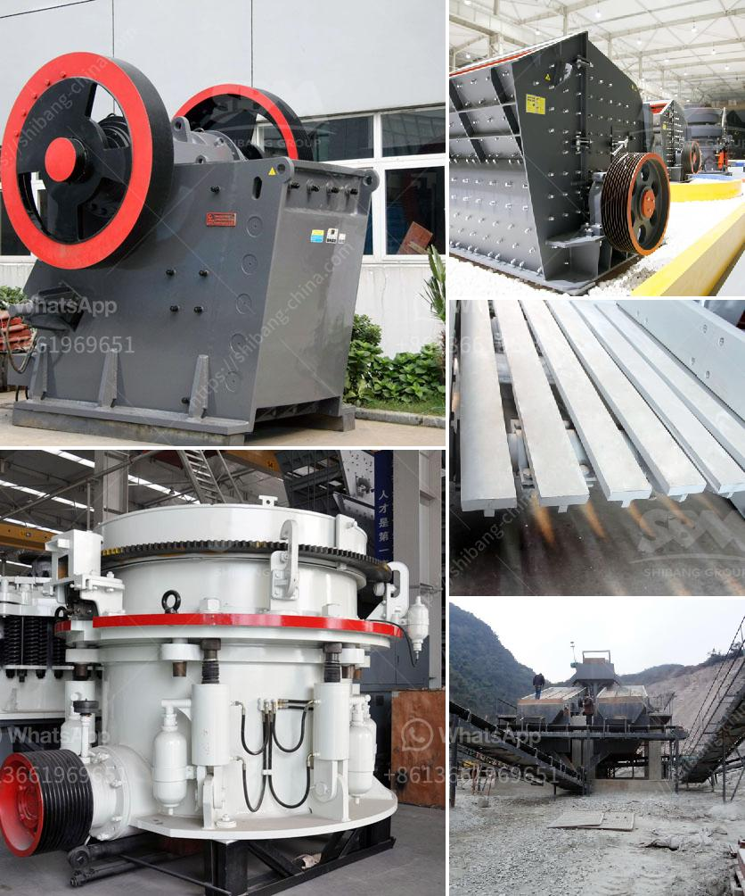

<h3>تكلفة تعدين الفحم في جنوب أفريقيا للطن الواحد</h3>
تعد جمهورية جنوب أفريقيا واحدة من أكبر المنتجين والمصدرين للفحم في العالم. يعود تاريخ تعدين الفحم في جنوب أفريقيا إلى أكثر من قرن من الزمان، وقد ساهمت هذه الصناعة بشكل كبير في نمو الاقتصاد الوطني وتوفير فرص العمل للآلاف من السكان المحليين.

تعد تكلفة تعدين الفحم في جنوب أفريقيا من العوامل المؤثرة في مستوى الإنتاج وربحية الشركات المعدنية. يختلف مستوى التكلفة بين منجم وآخر بناءً على عدة عوامل مثل حجم المنجم ونوعية الفحم المستخرج وطرق التعدين المستخدمة.

تشهد تكلفة تعدين الفحم في جنوب أفريقيا تقلبات كبيرة، ويرجع ذلك جزئياً إلى تقلب أسعار الفحم في الأسواق العالمية. يتأثر سعر الفحم بعوامل مثل العرض والطلب العالميين، وسياسات الطاقة في العديد من الدول، وتطور التكنولوجيا في مجال الطاقة البديلة.

عادةً ما تتراوح تكلفة تعدين الفحم في جنوب أفريقيا بين 200-400 دولار للطن الواحد، ولكن هذه الأرقام غير ثابتة وقد تختلف باختلاف ظروف السوق والتكنولوجيا المستخدمة. يجب الإشارة إلى أن تكلفة تعدين الفحم في جنوب أفريقيا تتضمن عدة عناصر مثل تكاليف العمالة والمعدات وإدارة المنجم والتصدير والضرائب والرسوم الحكومية.

علاوةً على ذلك، يواجه قطاع تعدين الفحم في جنوب أفريقيا تحديات كبيرة في مجال الاستدامة البيئية وتكاليف مكافحة التلوث واحترام المعايير البيئية العالمية. لذا، يحتاج القطاع إلى استثمارات كبيرة في تحديث التكنولوجيا وتحسين عمليات التعدين البيئية للتأقلم مع المعايير المستدامة الحديثة.

بصفة عامة، يعتبر تعدين الفحم في جنوب أفريقيا قطاعًا هامًا في الاقتصاد الوطني ويوفر فرص عمل مهمة للسكان المحليين. وعلى الرغم من تكلفة التعدين العالية والتحديات البيئية، يواصل القطاع تحقيق أرباح جيدة والاستفادة من الطلب العالمي على الفحم.
<h3>Contact us</h3><ul><li><strong>Whatsapp:&nbsp;<a href="https://wa.me/8613661969651">+8613661969651</a></strong></li><li><a href="https://swt.shibang-china.com/?git&amp;zhl&amp;تكلفة تعدين الفحم في جنوب أفريقيا للطن الواحد"><strong>Online Service(chat now)</strong></a></li></ul><h3>Related</h3><ul><li><a href='آلات غسيل الفحم.md'>آلات غسيل الفحم</a></li><li><a href='خدمة تأجير الكسارة والغربال.md'>خدمة تأجير الكسارة والغربال</a></li><li><a href='كسارات مسحوق التلك.md'>كسارات مسحوق التلك</a></li><li><a href='كسارة لفة معدات مستخدمة tph الفحم الروسية.md'>كسارة لفة معدات مستخدمة tph الفحم الروسية</a></li><li><a href='مبدأ عمل مطحنة الهامر.md'>مبدأ عمل مطحنة الهامر</a></li></ul>