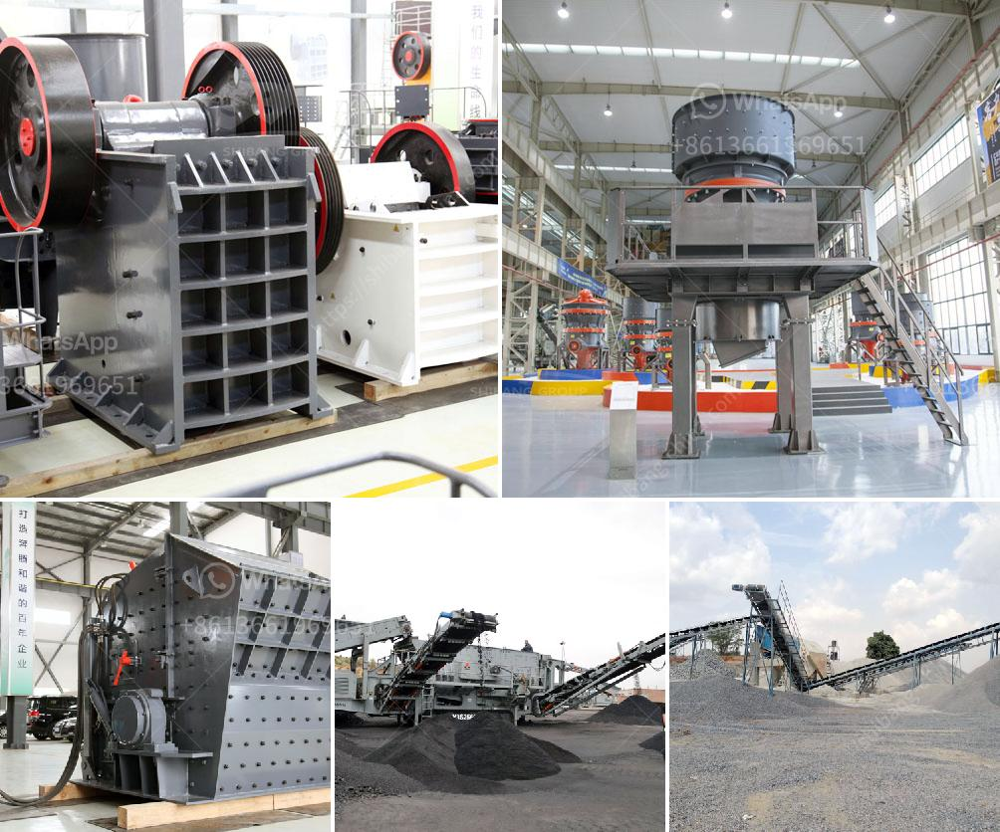

<h3>تكلفة تعدين وتكرير النحاس</h3>
تعدين وتكرير النحاس هو عملية هامة لاستخراج وتصفية خام النحاس الذي يستخدم في العديد من الصناعات. من الناحية العامة، يتكلف تعدين وتكرير النحاس مبالغ كبيرة نظرًا للمعدات اللازمة والتقنيات المطلوبة لهذه العملية المعقدة.

تكلفة تعدين النحاس تختلف اعتمادًا على العديد من العوامل، بما في ذلك مقدار النحاس الموجود في الموقع ونوعية الخام. عمومًا، يتطلب تعدين النحاس استخراج الصخور التي تحتوي على النحاس وطحنها إلى قطع صغيرة. يتم استخدام المواد الكيميائية والماء لفصل النحاس عن باقي المواد الصخرية، وهذه العملية تحتاج إلى استخدام الطاقة والموارد المائية.

ومن جهة أخرى، تكلفة تكرير النحاس تعتمد على طريقة التكرير المستخدمة. هناك طرق مختلفة لتكرير النحاس، مثل تقطير الإنفجار البريتوني أو الترسيب الكهروكيميائي. تتطلب هذه العمليات معدات خاصة وكميات كبيرة من المواد الكيميائية المستخدمة في التكرير.

بشكل عام، يمكن أن تتراوح تكلفة تعدين وتكرير النحاس بين 5,000 و 20,000 دولار للطن الواحد من خام النحاس، وقد تزيد أو تنخفض هذه التكلفة اعتمادًا على العوامل المحددة لكل موقع. تكون تكلفة تعدين النحاس مرتفعة بشكل عام نظرًا للمعدات الثقيلة والمواد الكيميائية المطلوبة.

بالنسبة لتكلفة تكرير النحاس، يمكن أن تكون هذه العملية أكثر تكلفة بسبب التكنولوجيا المتقدمة المستخدمة فيها. بالإضافة إلى ذلك، يتم استخدام الكثير من المواد الكيميائية والمياه في عملية التكرير، وهو ما يزيد من التكلفة الإجمالية.

لا يمكن النظر إلى تكلفة تعدين وتكرير النحاس على حدها فحسب، بل يجب أيضًا مراعاة تكلفة العمالة والصيانة والإجراءات البيئية المتخذة في عمليتي التعدين والتكرير. يجب الاهتمام بالتكلفة الشاملة والاستدامة في هذه الصناعة الهامة.

باختصار، تكلفة تعدين وتكرير النحاس تختلف وفقًا للعوامل المتعددة، بما في ذلك مقدار النحاس الموجود وطريقة التعدين والتكرير المستخدمة. مع ذلك، فإن هذه العملية تعتبر مكلفة نظرًا للاستثمارات المطلوبة في المعدات والطاقة والمواد الكيميائية والموارد المائية.
<h3>Contact us</h3><ul><li><strong>Whatsapp:&nbsp;<a href="https://wa.me/8613661969651">+8613661969651</a></strong></li><li><a href="https://swt.shibang-china.com/?git&amp;zhl&amp;تكلفة تعدين وتكرير النحاس"><strong>Online Service(chat now)</strong></a></li></ul><h3>Related</h3><ul><li><a href='حجم طحن البنتونيت.md'>حجم طحن البنتونيت</a></li><li><a href='آلة كسارة حجر الجرانيت في تايلاند.md'>آلة كسارة حجر الجرانيت في تايلاند</a></li><li><a href='رسم مصنع غسيل الفحم.md'>رسم مصنع غسيل الفحم</a></li><li><a href='آلة سحق الطين.md'>آلة سحق الطين</a></li><li><a href='تجار الكسارات المتنقلة المستخدمة في غانا.md'>تجار الكسارات المتنقلة المستخدمة في غانا</a></li></ul>