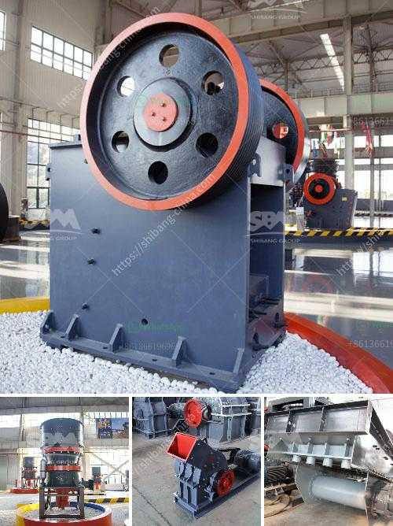

<h3>تكلفة تقديرية لمصنع التعدين</h3>
تعتبر صناعة التعدين من الصناعات التي تتطلب استثمارات ضخمة وتكاليف عالية من أجل إنشاء وتشغيل المصانع. وتختلف التكلفة التقديرية لإنشاء مصنع التعدين بناءً على عدة عوامل مختلفة.

أحد العوامل الرئيسية التي تؤثر في تكلفة إنشاء مصنع التعدين هي نوع المعدن الثمين الذي يتم استخراجه. فقد تختلف تكاليف استخراج الذهب عن تلك المتعلقة بالنحاس أو الفحم على سبيل المثال. تعتمد هذه التكاليف على عوامل مثل التكنولوجيا المستخدمة، والكمية المقدرة من المعدن الموجود في المنجم، وطرق الاستخراج المستخدمة.

تكلفة تقديرية أخرى يجب أن ننظر إليها هي تكلفة شراء وتثبيت المعدات اللازمة لعملية التعدين. وتشمل هذه التكاليف تكلفة شراء المعدات الثقيلة مثل حفارات الحفر وآلات النقل، بالإضافة إلى المعدات الأخرى مثل الشاحنات والآلات المستخدمة في التكسير وفصل المعادن. بالإضافة إلى ذلك، فإن تكاليف الصيانة والإصلاح الدورية لهذه المعدات يجب أخذها في الاعتبار.

عوامل أخرى تؤثر على التكلفة التقديرية لمصنع التعدين تشمل تكلفة شراء الأراضي وتطوير المناجم الموجودة عليها، وتكاليف البناء والهندسة المدنية للمصنع، وتكاليف الطاقة والمياه المطلوبة لعملية التعدين. كما يجب أيضاً أن نأخذ في الاعتبار تكاليف التشغيل والصيانة اليومية للمصنع وأجور العمال والموظفين.

تكلفة إنشاء مصنع التعدين تتفاوت بشكل كبير بناءً على حجم المشروع ونطاق الإنتاج المتوقع. فقد تتراوح تكلفة إنشاء مصنع تعدين صغير من حوالي 2-5 مليون دولار، بينما يمكن أن تصل تكلفة إنشاء مصانع تعدين عملاقة إلى مئات الملايين من الدولارات.

بشكل عام، يجب أن يقوم المستثمرون والمهندسون بدراسات جدوى مفصلة لتحديد تكلفة الإنشاء والتشغيل المتوقعة لمصنع التعدين. يجب مراعاة جميع العوامل المذكورة أعلاه والاستفادة من البحوث والتقنيات الحديثة لتقدير التكاليف بدقة.

وفي النهاية، يجب أن يتم التعامل مع تكلفة إنشاء مصنع التعدين كاستثمار طويل الأمد يتطلب تخطيطًا جيدًا وإدارة فعالة لتحقيق العائد المستدام وزيادة القدرة التنافسية في صناعة التعدين.
<h3>Contact us</h3><ul><li><strong>Whatsapp:&nbsp;<a href="https://wa.me/8613661969651">+8613661969651</a></strong></li><li><a href="https://swt.shibang-china.com/?git&amp;zhl&amp;تكلفة تقديرية لمصنع التعدين"><strong>Online Service(chat now)</strong></a></li></ul><h3>Related</h3><ul><li><a href='وكيل وارد ريموند مطحنة إندونيسيا.md'>وكيل وارد ريموند مطحنة إندونيسيا</a></li><li><a href='وحدة إنتاج مطحنة الرمل في كيرالا.md'>وحدة إنتاج مطحنة الرمل في كيرالا</a></li><li><a href='آلات الفحم للبيع في جنوب أفريقيا.md'>آلات الفحم للبيع في جنوب أفريقيا</a></li><li><a href='سعر مطحنة الكرة لطحن الأسمنت.md'>سعر مطحنة الكرة لطحن الأسمنت</a></li><li><a href='كسارة الحجر ديربان.md'>كسارة الحجر ديربان</a></li></ul>